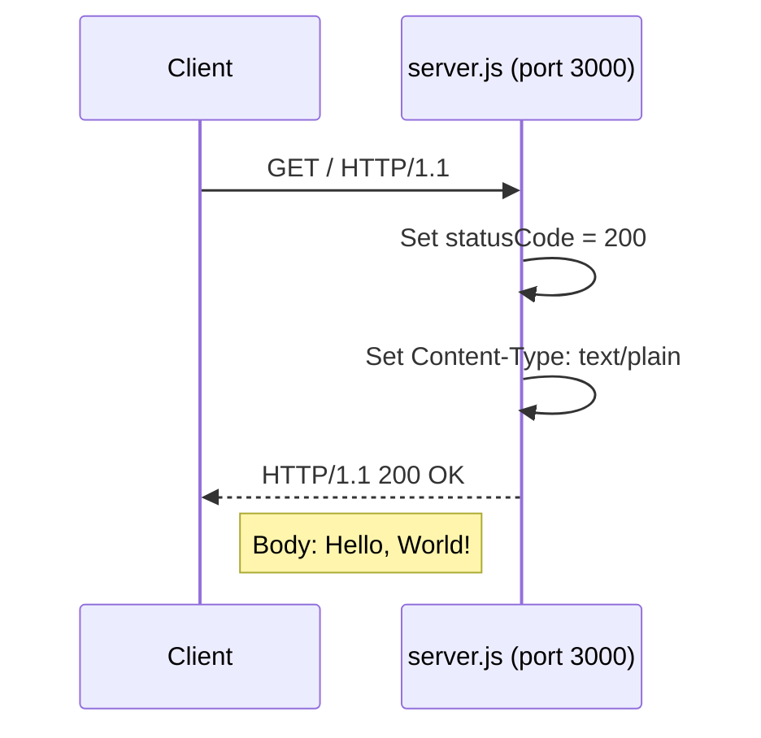
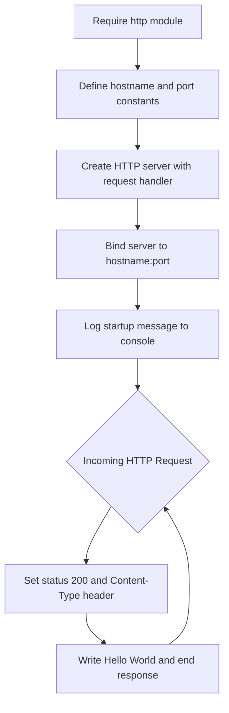

# hao-backprop-test

A minimal Node.js HTTP "Hello World" server designed as a test fixture for Backprop integration testing. This project uses only the built-in Node.js `http` module with zero external dependencies.

## Table of Contents

- [Project Overview](#project-overview)
- [Prerequisites](#prerequisites)
- [Installation and Setup](#installation-and-setup)
- [Running the Server](#running-the-server)
- [API Documentation](#api-documentation)
- [Code Walkthrough](#code-walkthrough)
- [Project Structure](#project-structure)
- [Deployment Guide](#deployment-guide)
- [License](#license)

## Project Overview

**hao-backprop-test** is a self-contained, minimal HTTP server built with Node.js. It serves a single purpose: responding with `"Hello, World!\n"` to every incoming HTTP request. The project exists as a test fixture for Backprop integration testing and is intentionally kept as simple as possible.

**Key characteristics:**

- **Package name:** `hello_world` (version `1.0.0`) *(Source: package.json:2-3)*
- **Author:** `hxu` *(Source: package.json:9)*
- **License:** MIT *(Source: package.json:10)*
- **Dependencies:** Zero external npm dependencies — only the built-in `http` module is used *(Source: package.json, package-lock.json)*
- **Entry point note:** The `package.json` declares `"main": "index.js"` but no `index.js` file exists in the repository; the actual entry point is `server.js` *(Source: package.json:5)*
- **Test fixture structure:** The repository contains several duplicate files (e.g., `server - Copy.js`, `LoginTest - Copy.java`, `industry - Copy.csv`) that are part of the test fixture and serve as integration testing inputs

## Prerequisites

Before running the server, ensure you have the following:

- **Node.js** — The project was developed with Node.js v20.20.0, but any recent LTS version (v18 or later) should work. Verify your installation with:

```bash
node --version
```

- **No external npm dependencies** — This is a zero-dependency project. There is no `npm install` step required since the server relies exclusively on the Node.js built-in `http` module.

## Installation and Setup

Follow these steps to set up the project locally:

**Step 1:** Clone the repository.

```bash
git clone <repository-url> hao-backprop-test
```

**Step 2:** Navigate into the project directory.

```bash
cd hao-backprop-test
```

**Step 3:** Verify that Node.js is available.

```bash
node --version
```

You should see a version number (e.g., `v20.20.0`). If not, install Node.js from [https://nodejs.org](https://nodejs.org).

> **Note:** No `npm install` is needed — the project has zero external dependencies. The `package.json` and `package-lock.json` confirm an empty dependency tree. *(Source: package.json, package-lock.json)*

## Running the Server

Start the server with the following command:

```bash
node server.js
```

**Expected console output** *(Source: server.js:71-74)*:

```
Server running at http://127.0.0.1:3000/
```

**Verify the server is working** by opening a new terminal and running:

```bash
curl http://127.0.0.1:3000/
```

**Expected response:**

```
Hello, World!
```

**To stop the server**, press `Ctrl+C` in the terminal where the server is running.

### Full Startup-Verify-Stop Workflow

```bash
# Start the server in the background
node server.js &

# Wait briefly for the server to initialize
sleep 1

# Send a test request to verify the server is responding
curl http://127.0.0.1:3000/

# Stop the background server process
kill %1
```

## API Documentation

The server exposes a single HTTP endpoint. Because there is no routing logic, the server responds identically to **all** HTTP methods and **all** URL paths. *(Source: server.js:51-58)*

### Endpoint Reference

| Property | Value |
|----------|-------|
| **Method** | `GET` (responds to all HTTP methods identically) |
| **URL** | `/` (responds to all paths identically) |
| **Status Code** | `200 OK` |
| **Response Headers** | `Content-Type: text/plain` |
| **Response Body** | `Hello, World!\n` |

### Example Requests

```bash
# Standard GET request
curl -i http://127.0.0.1:3000/

# POST request (same response — no routing logic)
curl -i -X POST http://127.0.0.1:3000/

# Request to a different path (same response — no path matching)
curl -i http://127.0.0.1:3000/any/path/here
```

All three requests above return the same response:

```
HTTP/1.1 200 OK
Content-Type: text/plain
...

Hello, World!
```

### Request-Response Flow



## Code Walkthrough

This section provides an annotated walkthrough of `server.js`, explaining every logical block of the source code. The server is 14 lines long and consists of four distinct blocks.

### Block 1: Module Import (Line 17)

```javascript
const http = require('http');
```

This line imports the built-in Node.js `http` module using the CommonJS `require()` syntax. The `http` module provides all the functionality needed to create an HTTP server and handle requests and responses. No external packages are needed — `http` ships with every Node.js installation. *(Source: server.js:17)*

### Block 2: Server Configuration Constants (Lines 28, 36)

```javascript
const hostname = '127.0.0.1';
const port = 3000;
```

These two constants define the server's network configuration:

- **`hostname`** (`'127.0.0.1'`) — The bind address is set to the IPv4 loopback address. This means the server is accessible **only from the local machine**. External machines on the network cannot connect to it. This is intentional for a test fixture. *(Source: server.js:28)*
- **`port`** (`3000`) — The TCP listen port. The server will listen for incoming connections on port 3000. This is a common development port choice that avoids requiring elevated privileges (ports below 1024 require root/admin on most systems). *(Source: server.js:36)*

Both values are hardcoded constants — they are not configurable via environment variables or command-line arguments. To change them, you must edit `server.js` directly.

### Block 3: HTTP Server Creation with Request Handler (Lines 51–58)

```javascript
const server = http.createServer((req, res) => {
  res.statusCode = 200;
  res.setHeader('Content-Type', 'text/plain');
  res.end('Hello, World!\n');
});
```

This block creates the HTTP server and defines its request handler:

- **`http.createServer(callback)`** — Creates a new `http.Server` instance. The callback (an arrow function) is invoked for **every** incoming HTTP request. *(Source: server.js:51)*
- **`req`** (type: `http.IncomingMessage`) — The incoming request object. Contains details about the client's request (method, URL, headers, body). In this server, the request is completely ignored — the handler does not inspect any request properties.
- **`res`** (type: `http.ServerResponse`) — The server response object. Used to construct and send the HTTP response back to the client.
- **`res.statusCode = 200`** — Sets the HTTP response status code to `200 OK`, indicating a successful request. *(Source: server.js:53)*
- **`res.setHeader('Content-Type', 'text/plain')`** — Sets the `Content-Type` response header to `text/plain`, telling the client that the response body is plain text (not HTML, JSON, or other formats). *(Source: server.js:55)*
- **`res.end('Hello, World!\n')`** — Writes the string `"Hello, World!\n"` as the response body and signals that the response is complete. The `end()` method both writes data and closes the response stream. *(Source: server.js:57)*

The request handler ignores the request method, URL path, headers, and body. Every request receives the exact same `200 OK` plain-text response regardless of how it was made.

### Block 4: Server Startup (Lines 71–74)

```javascript
server.listen(port, hostname, () => {
  console.log(`Server running at http://${hostname}:${port}/`);
});
```

This block starts the server and logs a readiness message:

- **`server.listen(port, hostname, callback)`** — Binds the HTTP server to the specified `hostname` (`127.0.0.1`) and `port` (`3000`), then begins listening for incoming TCP connections. *(Source: server.js:71)*
- **The callback function** — Executes once, after the server has successfully bound to the address and is ready to accept connections. It logs the server URL to the console (`stdout`), producing the output: `Server running at http://127.0.0.1:3000/`. *(Source: server.js:71-74)*
- The callback does **not** fire for each incoming request — it fires only once at startup. Request handling is performed by the callback passed to `http.createServer()` in Block 3.

### Server Architecture Flowchart



## Project Structure

The repository has a **flat structure** with no subdirectories. All 12 files reside in the root directory:

| File | Description |
|------|-------------|
| `server.js` | Main Node.js HTTP server — the primary application file |
| `server - Copy.js` | Duplicate of `server.js` — test fixture copy |
| `package.json` | npm project manifest (name: `hello_world`, v1.0.0) |
| `package-lock.json` | npm lockfile — confirms zero external dependencies |
| `README.md` | Project documentation (this file) |
| `LoginTest.java` | Java test stub with intentional syntax errors — non-functional test fixture |
| `LoginTest - Copy.java` | Duplicate of `LoginTest.java` — test fixture copy |
| `industry.csv` | CSV data file with 43 industry category labels |
| `industry - Copy.csv` | Duplicate of `industry.csv` — test fixture copy |
| `test.py.txt` | Empty placeholder file — test fixture artifact |
| `test.py - Copy.txt` | Empty placeholder file — test fixture copy |
| `test.txt.txt` | Empty placeholder file — test fixture artifact |

> **Note:** The repository has a flat structure with no subdirectories. Several files with " - Copy" suffixes are intentional duplicates that serve as test fixture inputs for Backprop integration testing.

## Deployment Guide

### Local Development Only

> **⚠️ This server is designed for LOCAL DEVELOPMENT AND TESTING ONLY.**

The server binds exclusively to `127.0.0.1` (the IPv4 loopback address), making it accessible only from the local machine. It is **not** accessible from other devices on the network. *(Source: server.js:28)*

This project is a **test fixture** for Backprop integration testing and is **NOT intended for production deployment**.

### Why This Server Is Not Production-Ready

The server intentionally lacks the following production requirements:

- **No HTTPS/TLS support** — All communication is over unencrypted HTTP
- **No environment variable configuration** — The bind address and listen port are hardcoded constants
- **No error handling or logging** — Beyond the startup message, no errors are caught or logged
- **No routing or middleware** — Every request receives the same response regardless of method or path
- **Hardcoded hostname and port** — Cannot be configured without editing source code
- **No process management** — No graceful shutdown handling, no clustering, no restart capability

### Changing the Bind Address or Listen Port

If you need to modify the server's network configuration, edit the constants directly in `server.js` *(Source: server.js:28, server.js:36)*:

```javascript
// server.js — Lines 28, 36
const hostname = '127.0.0.1';  // Change to '0.0.0.0' to accept external connections
const port = 3000;             // Change to any available port number
```

> **Warning:** Changing the bind address to `0.0.0.0` will expose the server to all network interfaces. Do not do this in untrusted environments.

## License

This project is licensed under the **MIT** license. *(Source: package.json:10)*
