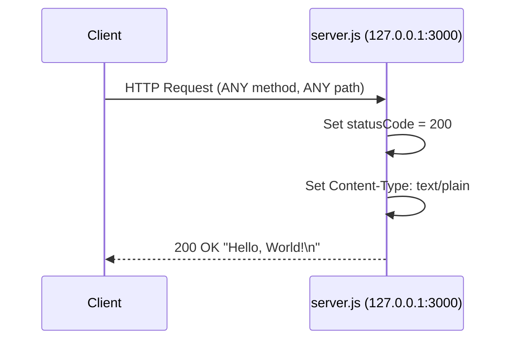
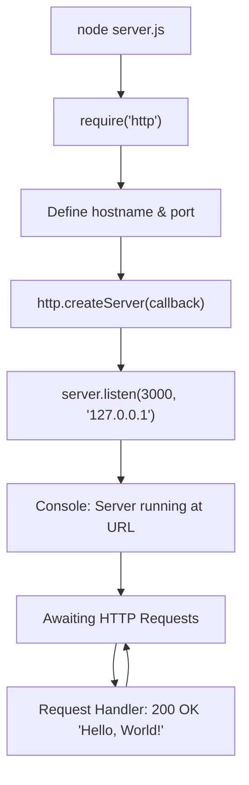

# hello_world

A minimal Node.js HTTP server that responds with "Hello, World!" — built as a test fixture for Backprop integration.


## Table of Contents

- [Prerequisites](#prerequisites)
- [Installation](#installation)
- [Quick Start](#quick-start)
- [API Reference](#api-reference)
- [Code Walkthrough](#code-walkthrough)
- [Deployment Guide](#deployment-guide)
- [Configuration](#configuration)
- [Project Structure](#project-structure)
- [Troubleshooting](#troubleshooting)
- [License](#license)
- [Author](#author)

## Prerequisites

Before running this project, ensure you have the following installed:

- **Node.js** — v12.0.0 or later (tested on v20.20.0). Download from [https://nodejs.org/](https://nodejs.org/).
- **npm** — v7 or later (the `package-lock.json` uses lockfileVersion 3, which requires npm 7+). npm is bundled with the Node.js installer.

No third-party packages are required. The server relies exclusively on the built-in Node.js `http` module.

## Installation

Clone the repository and install dependencies:

```bash
git clone <repository-url>
cd hello_world
npm install
```

> **Note:** `npm install` currently installs zero dependencies (the project has none), but running it follows the standard Node.js project setup workflow and ensures the `node_modules` directory and lockfile are consistent.

## Quick Start

Start the server:

```bash
node server.js
```

You should see the following output in your terminal:

```
Server running at http://127.0.0.1:3000/
```

Verify the server is working by sending a request:

```bash
curl http://127.0.0.1:3000/
```

Expected response:

```
Hello, World!
```

## API Reference

### Endpoint Specification

The server responds to **any** HTTP method at **any** path. There is no routing logic — every request is handled identically by the same request handler callback.

### Request Handling

| Aspect | Behavior |
|--------|----------|
| Supported Methods | ALL (GET, POST, PUT, DELETE, PATCH, etc.) |
| Supported Paths | ALL (/, /foo, /bar/baz, etc.) |
| Routing | None — all requests receive the same response |
| Authentication | None |
| Middleware | None |

### Response Format

Every response from the server has the following structure:

| Field | Value |
|-------|-------|
| Status Code | `200 OK` |
| Content-Type | `text/plain` |
| Body | `Hello, World!\n` |

### Examples

**Using `curl` with response headers:**

```bash
curl -i http://127.0.0.1:3000/
```

Sample output:

```
HTTP/1.1 200 OK
Content-Type: text/plain
Date: Thu, 01 Jan 2025 00:00:00 GMT
Connection: keep-alive
Keep-Alive: timeout=5
Transfer-Encoding: chunked

Hello, World!
```

**Programmatic request using Node.js `http.get()`:**

```js
const http = require('http');

http.get('http://127.0.0.1:3000/', (res) => {
  let data = '';
  res.on('data', (chunk) => {
    data += chunk;
  });
  res.on('end', () => {
    console.log(`Status: ${res.statusCode}`);
    console.log(`Body: ${data}`);
  });
});
```

### Request Flow Diagram



## Code Walkthrough

The entire application lives in `server.js` (14 lines). Below is a line-by-line explanation of each construct.

### Line 1 — Module Import

```js
const http = require('http');
```

Imports the built-in Node.js `http` module using CommonJS `require()` syntax. This module provides the APIs needed to create an HTTP server. No third-party packages are needed.

### Line 3 — Hostname Configuration

```js
const hostname = '127.0.0.1';
```

Defines the network address the server binds to. The value `'127.0.0.1'` is the IPv4 loopback address (localhost), meaning the server is **only** accessible from the local machine. External clients on other machines cannot connect to this address. *(Source: `server.js:3`)*

### Line 4 — Port Configuration

```js
const port = 3000;
```

Sets the TCP port number the server listens on. Port `3000` is a common convention for Node.js development servers. *(Source: `server.js:4`)*

### Lines 6–10 — Server Creation and Request Handler

```js
const server = http.createServer((req, res) => {
  res.statusCode = 200;
  res.setHeader('Content-Type', 'text/plain');
  res.end('Hello, World!\n');
});
```

`http.createServer()` creates a new HTTP server and returns an `http.Server` instance. The callback function is invoked for every incoming HTTP request and receives two arguments:

- **`req`** (`http.IncomingMessage`) — the incoming request object containing method, URL, headers, and body stream.
- **`res`** (`http.ServerResponse`) — the response object used to send data back to the client.

Inside the callback:

1. `res.statusCode = 200` — sets the HTTP status code to `200 OK`.
2. `res.setHeader('Content-Type', 'text/plain')` — sets the response content type to plain text.
3. `res.end('Hello, World!\n')` — sends the response body and signals that the response is complete.

*(Source: `server.js:6-10`)*

### Lines 12–14 — Server Startup

```js
server.listen(port, hostname, () => {
  console.log(`Server running at http://${hostname}:${port}/`);
});
```

`server.listen()` binds the server to the specified `port` and `hostname` and begins accepting connections. The callback function executes once the server is successfully listening, logging the server URL to standard output. *(Source: `server.js:12-14`)*

### Application Architecture



## Deployment Guide

### Local Development

Run the server in the foreground:

```bash
node server.js
```

The server runs until you stop it with **Ctrl+C**. All log output goes to standard output (`stdout`).

### Production Considerations

The current implementation uses hardcoded constants for hostname and port. For production deployments, consider the following adjustments:

- **Accept external connections** — Change `hostname` from `'127.0.0.1'` to `'0.0.0.0'` in `server.js` to bind to all available network interfaces, allowing connections from external machines.
- **Environment variable configuration** — Replace hardcoded constants with environment variable lookups (e.g., `process.env.HOST || '0.0.0.0'` and `process.env.PORT || 3000`) for flexible deployment configuration. Note: the current codebase does **not** support environment variables.
- **Reverse proxy** — Place the Node.js server behind a reverse proxy (e.g., Nginx, Caddy) for TLS termination, load balancing, and static asset serving.

### Process Management

For long-running server deployments, use a process manager to handle restarts, logging, and monitoring:

**Using PM2:**

```bash
npm install -g pm2
pm2 start server.js --name hello-world
pm2 status
pm2 logs hello-world
```

**Using systemd (Linux):**

Create a service file at `/etc/systemd/system/hello-world.service` and configure it to run `node /path/to/server.js` with appropriate user permissions.

### Network Binding

The default hostname `127.0.0.1` restricts the server to the **loopback interface** only. This means:

- ✅ Accessible via `localhost` or `127.0.0.1` on the same machine
- ❌ **Not** accessible from other machines on the local network
- ❌ **Not** accessible from the internet

To accept connections from other machines, change the hostname to `'0.0.0.0'` (binds to all interfaces) in `server.js`.

## Configuration

The server behavior is controlled by two constants defined in `server.js`:

| Constant | Type | Default Value | File Location | Description |
|----------|------|---------------|---------------|-------------|
| `hostname` | `string` | `'127.0.0.1'` | `server.js:3` | Server bind address (loopback interface — localhost only) |
| `port` | `number` | `3000` | `server.js:4` | Server listening port |

> **⚠️ Important:** The `package.json` field `"main": "index.js"` does **not** match the actual entry point `server.js`. If this package is consumed as a module, the `"main"` field should be corrected to `"main": "server.js"`.

> **Note:** The `package.json` test script is a placeholder — running `npm test` will output `"Error: no test specified"` and exit with code 1. This is expected behavior.

## Project Structure

| File | Description |
|------|-------------|
| `server.js` | Main HTTP server application |
| `server - Copy.js` | Duplicate copy of `server.js` |
| `package.json` | npm package manifest |
| `package-lock.json` | npm dependency lockfile |
| `README.md` | Project documentation (this file) |
| `LoginTest.java` | Java test stub (placeholder) |
| `LoginTest - Copy.java` | Duplicate Java test stub |
| `industry.csv` | Industry labels reference data |
| `industry - Copy.csv` | Duplicate industry data |
| `test.py.txt` | Empty placeholder file |
| `test.py - Copy.txt` | Empty placeholder file |
| `test.txt.txt` | Empty placeholder file |

## Troubleshooting

### Port 3000 already in use

**Error:**

```
Error: listen EADDRINUSE: address already in use 127.0.0.1:3000
```

**Solution:** Another process is using port 3000. Either stop the existing process or change the `port` constant in `server.js` to a different value (e.g., `3001`).

```bash
# Find the process using port 3000
lsof -i :3000
# Or on Windows
netstat -ano | findstr :3000
```

### Cannot connect from another machine

**Cause:** The server binds to `127.0.0.1` (localhost only), which does not accept external connections.

**Solution:** Change the `hostname` constant in `server.js` from `'127.0.0.1'` to `'0.0.0.0'` to listen on all network interfaces.

### `npm test` fails

**Cause:** This is expected behavior. The test script in `package.json` is a placeholder that outputs an error message and exits with code 1.

**Solution:** No action needed. Implement actual tests if test coverage is required.

### `require` is not defined

**Cause:** The code is being run in a browser environment or an ES module context where CommonJS `require()` is not available.

**Solution:** Ensure you are running the file with Node.js:

```bash
node server.js
```

## License

This project is licensed under the **MIT License**.

See [https://opensource.org/licenses/MIT](https://opensource.org/licenses/MIT) for full license text.

*(Source: `package.json` — `"license": "MIT"`)*

## Author

**hxu**

*(Source: `package.json` — `"author": "hxu"`)*
