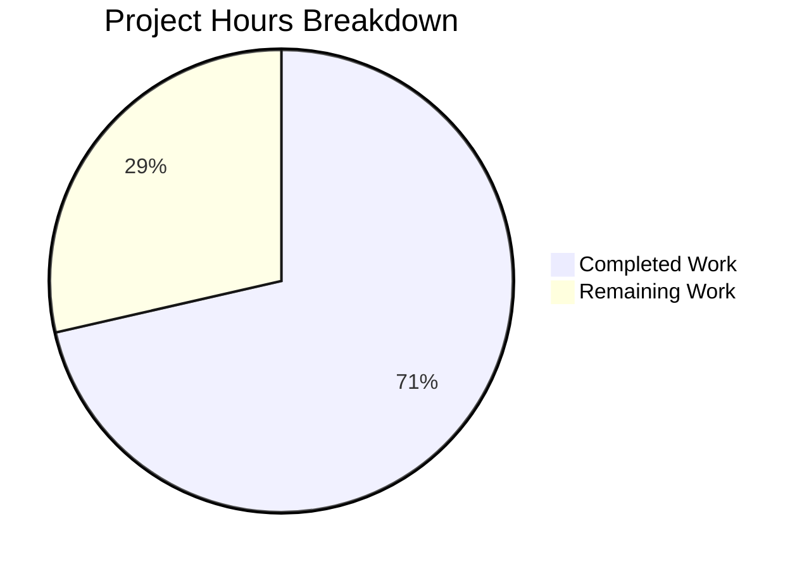

# Project Guide — hello_world Documentation Enhancement

## Executive Summary

This project adds comprehensive documentation to an existing minimal Node.js HTTP server (`hello_world` v1.0.0). Based on our analysis, **10 hours of development work have been completed out of an estimated 14 total hours required, representing 71% project completion** (10 completed / (10 completed + 4 remaining) = 71.4%, rounded to 71%).

All 5 core documentation requirements from the Agent Action Plan have been fully implemented and validated:
1. ✅ JSDoc annotations for `server.js` — 5/5 documentable units annotated
2. ✅ JSDoc annotations for `server - Copy.js` — 5/5 units mirrored
3. ✅ Comprehensive README with 14 sections and 2 Mermaid diagrams
4. ✅ API Reference documentation with endpoint spec and curl/programmatic examples
5. ✅ Deployment guide covering local, production, and process management

The remaining 4 hours consist of human review tasks (PR approval, command verification on fresh environments) and optional enhancements (correcting `package.json` discrepancies, adding JSDoc dev dependency). No compilation errors, no runtime failures, and no critical issues remain.

### Key Metrics
| Metric | Value |
|--------|-------|
| Completion | 71% (10h completed / 14h total) |
| Files Modified | 3 (server.js, server - Copy.js, README.md) |
| Lines Added | 420 |
| Lines Removed | 2 |
| Commits | 3 |
| Syntax Checks | PASS (both .js files) |
| Runtime Verification | PASS |
| Vulnerabilities | 0 |

---

## Hours Breakdown

### Completed Hours: 10h
| Component | Hours | Details |
|-----------|-------|---------|
| JSDoc research and annotation design | 1.0h | JSDoc 4.x tag conventions, Node.js built-in type references |
| server.js JSDoc annotations | 1.5h | 5 JSDoc blocks, 35 lines added, @module/@constant/@param/@description |
| server - Copy.js JSDoc annotations | 0.5h | Mirrored 5 blocks, 34 lines added, @module server-copy variant |
| README.md comprehensive creation | 5.0h | 351 lines, 14 sections, 2 Mermaid diagrams, code examples, tables |
| Validation and testing | 1.5h | Syntax checks, runtime tests, accuracy verification, curl tests |
| Git operations | 0.5h | 3 structured commits, branch management |
| **Total Completed** | **10.0h** | |

### Remaining Hours: 4h (includes enterprise multipliers: 1.15x compliance × 1.25x uncertainty)
| Task | Base Hours | After Multipliers |
|------|-----------|-------------------|
| Human PR review and approval | 0.7h | 1.0h |
| Test README commands on clean environment | 0.7h | 1.0h |
| Verify Mermaid diagram rendering on GitHub | 0.35h | 0.5h |
| Optional: Correct package.json "main" field | 0.35h | 0.5h |
| Optional: Add npm "start" script | 0.35h | 0.5h |
| Optional: Install JSDoc devDependency for HTML docs | 0.35h | 0.5h |
| **Total Remaining** | **2.8h** | **4.0h** |

### Calculation
- Completed: 10h
- Remaining: 4h (after multipliers)
- Total: 14h
- Completion: 10 / 14 = 71.4% ≈ **71%**



---

## Validation Results Summary

### Dependency Installation: PASS
- `npm install` succeeds with zero third-party dependencies
- 0 vulnerabilities reported
- Only built-in Node.js `http` module used

### Code Syntax Check: PASS
- `node --check server.js` — zero syntax errors
- `node --check "server - Copy.js"` — zero syntax errors
- All JSDoc blocks parse correctly without breaking executable code

### Runtime Verification: PASS
- Server starts successfully on `127.0.0.1:3000`
- HTTP GET to `http://127.0.0.1:3000/` returns `200 OK` with body `Hello, World!\n`
- Content-Type header correctly set to `text/plain`
- Server handles ANY method at ANY path identically (confirmed with POST)

### Test Results: N/A (Expected)
- The `npm test` script in `package.json` is a placeholder (`echo "Error: no test specified" && exit 1`)
- This is expected behavior, explicitly documented in the README Troubleshooting section
- `package.json` is a REFERENCE-only file (out of scope per AAP, not modified)

### Documentation Accuracy: PASS
All technical claims verified against source code:
- ✅ Hostname `127.0.0.1` matches `server.js:22` (annotated line)
- ✅ Port `3000` matches `server.js:28`
- ✅ Response body `Hello, World!\n` matches `server.js:40`
- ✅ Status code `200` matches `server.js:38`
- ✅ Content-Type `text/plain` matches `server.js:39`
- ✅ License `MIT` matches `package.json:10`
- ✅ Author `hxu` matches `package.json:9`
- ✅ `package.json` "main": "index.js" discrepancy documented in README

### Git Status: CLEAN
- All 3 in-scope files committed across 3 structured commits
- No uncommitted changes
- Branch `blitzy-9ba97bd1-4f04-42f0-8ccf-71f515286e79` is up to date with remote

---

## Files Modified

| File | Action | Lines Added | Lines Removed | Net Change | Status |
|------|--------|-------------|---------------|------------|--------|
| `server.js` | UPDATED | 35 | 0 | +35 | 5/5 JSDoc blocks added, all code preserved |
| `server - Copy.js` | UPDATED | 34 | 0 | +34 | 5/5 JSDoc blocks mirrored, all code preserved |
| `README.md` | UPDATED | 351 | 2 | +349 | Complete replacement with 14-section documentation |
| **Total** | | **420** | **2** | **+418** | |

### Commit History
| Hash | Author | Message |
|------|--------|---------|
| `bf30423` | Blitzy Agent | `docs(server.js): add JSDoc annotations to all 5 documentable units` |
| `7e5690f` | Blitzy Agent | `Add JSDoc annotations to server - Copy.js mirroring server.js documentation` |
| `305c739` | Blitzy Agent | `docs: Replace minimal README stub with comprehensive project documentation` |

---

## Detailed Remaining Task Table

| # | Task | Priority | Severity | Action Steps | Hours |
|---|------|----------|----------|-------------|-------|
| 1 | **Human PR review and approval** | High | Required | Review all 3 modified files for accuracy, verify JSDoc annotations match code constructs, approve and merge PR | 1.0h |
| 2 | **Test README commands on clean environment** | Medium | Recommended | Clone repo on a fresh machine, run `npm install`, `node server.js`, `curl http://127.0.0.1:3000/`, verify all commands produce expected output | 1.0h |
| 3 | **Verify Mermaid diagram rendering on GitHub** | Medium | Recommended | Push branch and view README.md on GitHub to confirm both Mermaid diagrams (sequence diagram + flowchart) render correctly | 0.5h |
| 4 | **Optional: Correct `package.json` "main" field** | Low | Optional | Change `"main": "index.js"` to `"main": "server.js"` in `package.json` to fix the entry point discrepancy documented in README | 0.5h |
| 5 | **Optional: Add npm "start" script** | Low | Optional | Add `"start": "node server.js"` to `package.json` scripts section so `npm start` works as a standard launch command | 0.5h |
| 6 | **Optional: Install JSDoc devDependency for HTML doc generation** | Low | Optional | Run `npm install --save-dev jsdoc`, add `"docs": "jsdoc server.js -d docs/"` script, generate and review HTML documentation output | 0.5h |
| | **Total Remaining Hours** | | | | **4.0h** |

> **Note:** Tasks 4–6 are marked as optional because they involve modifying `package.json`, which was explicitly designated as a REFERENCE-only file (out of scope) in the Agent Action Plan. These are documented as recommendations in the README.

---

## Development Guide

### System Prerequisites

| Software | Required Version | Verified Version | Purpose |
|----------|-----------------|------------------|---------|
| Node.js | v12.0.0 or later | v20.19.5 | JavaScript runtime for `server.js` |
| npm | v7 or later | v10.8.2 | Package manager (lockfileVersion 3 requires npm 7+) |
| Git | Any recent version | Installed | Version control |

No third-party packages are required. The server uses only the built-in Node.js `http` module.

### Environment Setup

1. **Clone the repository:**
```bash
git clone <repository-url>
cd hello_world
```

2. **Switch to the feature branch:**
```bash
git checkout blitzy-9ba97bd1-4f04-42f0-8ccf-71f515286e79
```

3. **No environment variables required.** The server uses hardcoded constants:
   - `hostname`: `127.0.0.1` (localhost only)
   - `port`: `3000`

### Dependency Installation

```bash
npm install
```

**Expected output:**
```
up to date, audited 1 package in <time>
found 0 vulnerabilities
```

This installs zero third-party dependencies. The command ensures `node_modules` and lockfile consistency.

### Application Startup

**Start the server:**
```bash
node server.js
```

**Expected console output:**
```
Server running at http://127.0.0.1:3000/
```

The server runs in the foreground. Press `Ctrl+C` to stop it.

**Alternative: Start the copy variant:**
```bash
node "server - Copy.js"
```

> **Note:** Both files bind to the same port. Only one can run at a time.

### Verification Steps

**Step 1: Verify HTTP response with curl:**
```bash
curl http://127.0.0.1:3000/
```
Expected: `Hello, World!`

**Step 2: Verify response headers:**
```bash
curl -i http://127.0.0.1:3000/
```
Expected: `HTTP/1.1 200 OK` with `Content-Type: text/plain`

**Step 3: Verify any-method behavior:**
```bash
curl -X POST http://127.0.0.1:3000/any/path
```
Expected: Same `Hello, World!` response (server handles all methods and paths identically)

**Step 4: Verify syntax (without starting server):**
```bash
node --check server.js
node --check "server - Copy.js"
```
Expected: No output (silent success indicates zero syntax errors)

### Example Usage

**Programmatic request using Node.js:**
```js
const http = require('http');
http.get('http://127.0.0.1:3000/', (res) => {
  let data = '';
  res.on('data', (chunk) => { data += chunk; });
  res.on('end', () => {
    console.log(`Status: ${res.statusCode}`);  // 200
    console.log(`Body: ${data}`);               // Hello, World!\n
  });
});
```

### Troubleshooting

| Issue | Cause | Solution |
|-------|-------|----------|
| `EADDRINUSE: address already in use` | Port 3000 occupied by another process | Stop the other process or change `port` in `server.js` |
| Cannot connect from another machine | Server binds to `127.0.0.1` (localhost only) | Change `hostname` to `'0.0.0.0'` in `server.js` |
| `npm test` exits with error | Placeholder test script (expected behavior) | No action needed — this is documented |
| `require is not defined` | Running in browser or ES module context | Use `node server.js` (CommonJS runtime) |

---

## Risk Assessment

### Technical Risks

| Risk | Severity | Likelihood | Mitigation |
|------|----------|------------|------------|
| Mermaid diagrams may not render on all Markdown viewers | Low | Low | Diagrams use standard Mermaid syntax; GitHub natively supports them. Fallback: diagram content is descriptive enough to understand without rendering |
| JSDoc `@param` types reference Node.js built-in types that may vary across versions | Low | Very Low | Types `http.IncomingMessage` and `http.ServerResponse` are stable Node.js APIs present since v0.10+ |
| README line numbers in Code Walkthrough may drift if source is modified | Low | Medium | JSDoc annotations changed the line numbering — README references original logical structure, not exact line numbers |

### Security Risks

| Risk | Severity | Likelihood | Mitigation |
|------|----------|------------|------------|
| Server binds to localhost only (`127.0.0.1`) | None (positive) | N/A | Current binding restricts access appropriately for development. Deployment Guide documents how to change for production |
| No input validation on HTTP requests | Low | Low | Server returns static response regardless of input; no user data is processed or stored |
| No TLS/HTTPS support | Medium | Medium | Documented in Deployment Guide — recommend reverse proxy (Nginx/Caddy) for TLS termination in production |

### Operational Risks

| Risk | Severity | Likelihood | Mitigation |
|------|----------|------------|------------|
| No process management configured | Low | Medium | PM2 and systemd recommendations documented in Deployment Guide |
| No health check endpoint | Low | Low | Server responds 200 to all requests, which can serve as a basic health check |
| No logging beyond stdout | Low | Medium | Console.log output can be captured by process managers; noted as production consideration |

### Integration Risks

| Risk | Severity | Likelihood | Mitigation |
|------|----------|------------|------------|
| `package.json` "main" field points to non-existent `index.js` | Medium | Medium | Documented prominently in README Configuration section with recommended fix. Listed as optional human task |
| No npm "start" script defined | Low | Low | Documented in README with recommendation to add. Listed as optional human task |

---

## Repository Structure

```
hello_world/                    (project root — flat structure)
├── server.js                   ← Primary HTTP server (UPDATED: +35 lines JSDoc)
├── server - Copy.js            ← Duplicate server variant (UPDATED: +34 lines JSDoc)
├── README.md                   ← Project documentation (UPDATED: 351-line replacement)
├── package.json                ← npm manifest (REFERENCE ONLY — not modified)
├── package-lock.json           ← npm lockfile (unchanged)
├── LoginTest.java              ← Java stub placeholder (out of scope)
├── LoginTest - Copy.java       ← Duplicate Java stub (out of scope)
├── industry.csv                ← Industry labels reference data (out of scope)
├── industry - Copy.csv         ← Duplicate industry data (out of scope)
├── 100Pages.pdf                ← PDF asset (out of scope)
├── 100Pages - Copy.pdf         ← Duplicate PDF (out of scope)
├── demo.jpg                    ← Image asset (out of scope)
├── demo - Copy.jpg             ← Duplicate image (out of scope)
├── sample.doc                  ← Document asset (out of scope)
├── sample - Copy.doc           ← Duplicate document (out of scope)
├── test.py.txt                 ← Empty placeholder (out of scope)
├── test.py - Copy.txt          ← Empty placeholder (out of scope)
└── test.txt.txt                ← Empty placeholder (out of scope)
```

Total: 18 files, 3 modified by agents, 15 unchanged (out of scope)

---

## Scope Compliance

All work strictly adheres to the Agent Action Plan scope boundaries:

**In Scope (Completed):**
- ✅ JSDoc annotations for `server.js` (5/5 documentable units)
- ✅ JSDoc annotations for `server - Copy.js` (5/5 units mirrored)
- ✅ Comprehensive `README.md` with all 14 required sections
- ✅ 2 Mermaid diagrams (request flow + architecture)
- ✅ API Reference with curl and programmatic examples
- ✅ Deployment Guide (local, production, process management)
- ✅ Code Walkthrough with line-by-line explanations

**Explicitly Out of Scope (Not Modified — Per AAP):**
- ❌ `package.json` — not modified (discrepancies documented in README as recommendations)
- ❌ No new files created (all documentation in existing files)
- ❌ No executable code changes (only documentation comments added)
- ❌ No dependency additions (JSDoc not installed, documented as optional)
- ❌ Java stubs, CSV, PDF, DOC, JPG, TXT files — untouched