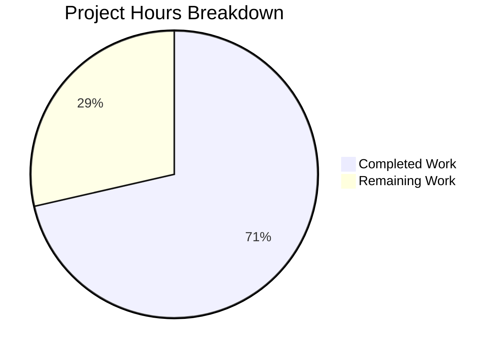

# Project Guide — hao-backprop-test Backprop Integration Readiness

## 1. Executive Summary

**Project:** hao-backprop-test — Minimal Node.js Hello World HTTP server serving as a Backprop integration test fixture.

**Completion:** 10 hours completed out of 14 total hours = **71% complete**

Based on comprehensive analysis, 10 hours of development work have been completed out of an estimated 14 total hours required, representing 71% project completion. All 6 explicitly planned file operations from the Agent Action Plan are complete and fully validated. The remaining 4 hours cover optional enhancements (configuration externalization, extended testing) and human code review tasks that were mentioned in the AAP discovery section but not in the core execution plan.

### Key Achievements
- All 3 modified files (server.js, package.json, README.md) updated successfully
- Both new files (index.js, server.test.js) created and fully functional
- 5/5 tests pass with zero failures using Node.js built-in test runner
- 3/3 JavaScript files pass syntax validation
- Server starts and responds correctly (HTTP 200, text/plain, "Hello, World!\n")
- Zero-dependency architecture maintained (no external npm packages)
- All 14 test fixture files verified byte-for-byte unchanged
- Working tree clean — all changes committed across 5 commits (286 lines added, 5 removed)

### Critical Unresolved Issues
- **None.** All planned work is complete and all validation gates pass.

### Recommended Next Steps
1. Human code review of the 5 changed files
2. Consider optional configuration externalization (server.config.js, .env.example)
3. Evaluate need for extended test coverage (HTTP methods, concurrent requests)

---

## 2. Validation Results Summary

### 2.1 Final Validator Accomplishments

The Final Validator agent verified all changes across 5 commits on branch `blitzy-167c9357-d934-4648-b8f7-555a5450d2b3`:

| Commit | Description |
|--------|-------------|
| `1d94099` | Update package.json scripts: add start script, replace placeholder test |
| `5f0d350` | feat: make server.js exportable with require.main guard |
| `749d6e7` | Expand README.md with comprehensive project documentation |
| `1fd5d1e` | Create index.js — canonical entry point resolving package.json main field |
| `70765ce` | Create server.test.js — HTTP server test suite using Node.js built-in test runner |

### 2.2 Dependency Status: ✅ 100% SUCCESS

```
$ npm install
up to date, audited 1 package in 482ms
found 0 vulnerabilities
```

Zero external dependencies by design. Only Node.js built-in modules used: `http`, `node:test`, `node:assert`.

### 2.3 Compilation/Syntax Results: ✅ 100% SUCCESS (3/3 files)

| File | Syntax Check | Result |
|------|-------------|--------|
| `server.js` | `node -c server.js` | ✅ PASS |
| `index.js` | `node -c index.js` | ✅ PASS |
| `server.test.js` | `node -c server.test.js` | ✅ PASS |

### 2.4 Test Results: ✅ 100% SUCCESS (5/5 tests)

```
$ npm test
> node --test server.test.js

# Hello World HTTP Server
  ✓ should respond with status code 200
  ✓ should respond with Content-Type text/plain
  ✓ should respond with Hello, World! body
  ✓ should respond consistently to multiple requests
  ✓ should respond to requests on any path

# tests 5 | pass 5 | fail 0 | cancelled 0 | skipped 0
```

### 2.5 Runtime Validation: ✅ 100% SUCCESS

```
$ node server.js
Server running at http://127.0.0.1:3000/

$ curl http://127.0.0.1:3000/
HTTP Status: 200
Content-Type: text/plain
Body: Hello, World!
```

### 2.6 Test Fixture Integrity: ✅ All 14 fixture files unchanged

All "- Copy" duplicates, Java stubs, CSV data, PDF, JPEG, DOC, and empty placeholder files confirmed byte-for-byte identical via `git diff` against the base branch.

### 2.7 Fixes Applied During Validation

No fixes were required. All code passed validation on first verification.

---

## 3. Visual Representation — Hours Breakdown



**Calculation:**
- Completed: 10 hours
- Remaining: 4 hours (after enterprise multipliers)
- Total: 14 hours
- Completion: 10 / 14 = **71%**

---

## 4. Completed Work — Detailed Breakdown

### 4.1 Hours Completed by Component (10 hours total)

| Component | Hours | Description |
|-----------|-------|-------------|
| server.js modification | 1.0h | Added `module.exports` and `require.main === module` guard for testability |
| index.js creation | 1.5h | 31-line canonical entry point with imports, server.listen, re-export |
| server.test.js creation | 3.0h | 128-line test suite: 5 tests, before/after lifecycle, HTTP assertions |
| package.json modification | 0.5h | Added `start` and `test` scripts in scripts block |
| package-lock.json regeneration | 0.25h | Verified and regenerated lock file for consistency |
| README.md expansion | 2.0h | Expanded from 2 to 117 lines of comprehensive documentation |
| Validation and runtime testing | 1.5h | Syntax checks, test execution, HTTP response verification, fixture integrity |
| Git operations | 0.25h | 5 structured commits with descriptive messages |
| **Total Completed** | **10.0h** | |

### 4.2 Files Changed Summary

| File | Action | Lines Before | Lines After | Net Change |
|------|--------|-------------|-------------|------------|
| server.js | MODIFIED | 14 | 20 | +9 / -3 |
| index.js | CREATED | 0 | 31 | +31 |
| server.test.js | CREATED | 0 | 128 | +128 |
| package.json | MODIFIED | 11 | 12 | +2 / -1 |
| README.md | MODIFIED | 2 | 117 | +116 / -1 |
| **Total** | | | | **+286 / -5** |

### 4.3 AAP Requirements Completion Matrix

| AAP Requirement | Status | Evidence |
|----------------|--------|----------|
| MODIFY server.js — exports and require.main guard | ✅ Complete | module.exports = server + hostname/port exports |
| CREATE index.js — resolve package.json main field | ✅ Complete | Requires server.js, calls server.listen(), re-exports |
| MODIFY package.json — add start/test scripts | ✅ Complete | `"start": "node server.js"`, `"test": "node --test server.test.js"` |
| MODIFY package-lock.json — regenerate | ✅ Complete | lockfileVersion 3, zero dependency tree |
| CREATE server.test.js — HTTP server tests | ✅ Complete | 5 tests, all passing, Node.js built-in runner |
| MODIFY README.md — expand documentation | ✅ Complete | 117 lines with setup, structure, Backprop notes |
| Preserve 14 test fixture files | ✅ Complete | All confirmed byte-for-byte identical |
| Zero-dependency architecture | ✅ Complete | No external npm packages |
| Localhost-only networking (127.0.0.1) | ✅ Complete | Verified via curl and test suite |
| CommonJS module format | ✅ Complete | All files use require()/module.exports |

---

## 5. Remaining Work — Detailed Task Table

### 5.1 Remaining Hours Calculation

**Base remaining hours:** 2.8 hours
- Enterprise compliance multiplier: × 1.15 = 3.22h
- Uncertainty buffer: × 1.25 = 4.02h
- **Rounded: 4 hours remaining**

### 5.2 Task Table (Total: 4.0 hours)

| # | Task | Description | Action Steps | Hours | Priority | Severity | Confidence |
|---|------|-------------|-------------|-------|----------|----------|------------|
| 1 | Code review and acceptance testing | Human developer reviews all 5 changed files for correctness, style, and adherence to project conventions | 1. Review server.js exports and require.main guard logic; 2. Verify index.js entry point behavior; 3. Review server.test.js test completeness; 4. Verify package.json scripts; 5. Review README.md accuracy | 1.0 | High | Medium | High |
| 2 | Configuration externalization module | Create `server.config.js` to externalize hardcoded hostname/port values, as mentioned in AAP Section 0.2.3 | 1. Create server.config.js exporting hostname and port with env var fallbacks; 2. Update server.js to import config; 3. Update index.js to use config; 4. Verify backward-compatible defaults (127.0.0.1:3000) | 1.5 | Low | Low | Medium |
| 3 | Environment variable documentation | Create `.env.example` documenting configurable environment variables, conditional on config externalization | 1. Create .env.example with PORT and HOSTNAME examples; 2. Add .env to .gitignore if needed; 3. Update README.md with env var documentation | 0.5 | Low | Low | Medium |
| 4 | Extended test coverage | Add edge case tests for HTTP methods (POST, PUT), concurrent requests, and malformed request handling | 1. Add tests for non-GET methods; 2. Add concurrent request stress test; 3. Add test for various URL paths and query strings; 4. Verify all tests pass | 1.0 | Low | Low | Low |
| | **Total Remaining Hours** | | | **4.0** | | | |

---

## 6. Development Guide

### 6.1 System Prerequisites

| Requirement | Version | Purpose |
|-------------|---------|---------|
| Node.js | v18+ (v20.x recommended) | Runtime for HTTP server and built-in test runner |
| npm | v7+ | Package manager (lockfileVersion 3 compatibility) |
| curl (optional) | Any | HTTP response verification |

### 6.2 Environment Setup

```bash
# Clone the repository and switch to the feature branch
git clone <repository-url>
cd hao-backprop-test
git checkout blitzy-167c9357-d934-4648-b8f7-555a5450d2b3

# Verify Node.js and npm versions
node --version    # Expected: v18.x or v20.x
npm --version     # Expected: 7.x or later
```

### 6.3 Dependency Installation

```bash
npm install
```

**Expected output:**
```
up to date, audited 1 package in <time>ms
found 0 vulnerabilities
```

> This project has zero external dependencies. `npm install` confirms an empty dependency tree.

### 6.4 Application Startup

**Option A — Via npm script:**
```bash
npm start
```

**Option B — Direct execution:**
```bash
node server.js
```

**Option C — Via canonical entry point:**
```bash
node index.js
```

**Expected output (all options):**
```
Server running at http://127.0.0.1:3000/
```

### 6.5 Verification Steps

**Step 1 — Verify server responds:**
```bash
curl http://127.0.0.1:3000/
```
Expected: `Hello, World!`

**Step 2 — Verify headers:**
```bash
curl -s -o /dev/null -w "Status: %{http_code}\nContent-Type: %{content_type}\n" http://127.0.0.1:3000/
```
Expected:
```
Status: 200
Content-Type: text/plain
```

**Step 3 — Run test suite:**
```bash
npm test
```
Expected: 5 tests pass, 0 fail.

**Step 4 — Syntax validation:**
```bash
node -c server.js && node -c index.js && node -c server.test.js
```
Expected: No output (silent success).

### 6.6 Example Usage

```bash
# Start the server in the background
node server.js &

# Make a request
curl http://127.0.0.1:3000/
# Output: Hello, World!

# Request any path (server responds identically to all routes)
curl http://127.0.0.1:3000/any/path
# Output: Hello, World!

# Stop the server
kill %1
```

### 6.7 Troubleshooting

| Issue | Cause | Resolution |
|-------|-------|------------|
| `EADDRINUSE: address already in use 127.0.0.1:3000` | Port 3000 already occupied | Stop the existing process or use `index.js` which binds via the same port |
| `node --test` not recognized | Node.js version below 18 | Upgrade to Node.js v18+ for built-in test runner support |
| `npm test` exits with code 1 | Tests failing | Run `node --test server.test.js` directly for detailed output |

---

## 7. Risk Assessment

### 7.1 Technical Risks

| Risk | Severity | Likelihood | Impact | Mitigation |
|------|----------|-----------|--------|------------|
| Port 3000 conflict on developer machines | Low | Medium | Server fails to start | Document in README; consider adding EADDRINUSE error handler or configurable port |
| Node.js version incompatibility (< v18) | Low | Low | Built-in test runner unavailable | README specifies v18+ prerequisite; `engines` field could be added to package.json |
| No graceful shutdown handling | Low | Low | Possible resource leaks in testing | Acceptable for test fixture; server.close() used in test lifecycle |

### 7.2 Security Risks

| Risk | Severity | Likelihood | Impact | Mitigation |
|------|----------|-----------|--------|------------|
| No HTTPS/TLS | N/A | N/A | N/A | Localhost-only binding; TLS unnecessary per AAP scope |
| No authentication | N/A | N/A | N/A | Internal test fixture; access control not required per AAP |
| No input validation | Low | Low | Server responds 200 to all requests | Acceptable by design; intentionally omitted per AAP |

### 7.3 Operational Risks

| Risk | Severity | Likelihood | Impact | Mitigation |
|------|----------|-----------|--------|------------|
| No monitoring/logging beyond startup message | Low | Low | Difficult to diagnose issues in long-running scenarios | Acceptable for test fixture; not a production service |
| No health check endpoint | Low | Low | Cannot verify liveness programmatically | Add `/health` route if needed in future |
| No CI/CD pipeline | Medium | Medium | No automated test execution on push | Out of scope per AAP; recommend adding GitHub Actions for `npm test` |

### 7.4 Integration Risks

| Risk | Severity | Likelihood | Impact | Mitigation |
|------|----------|-----------|--------|------------|
| Backprop API changes may affect fixture expectations | Low | Low | Test baselines may need updating | Test fixture files are version-controlled; changes tracked via git |
| New file additions may affect Backprop scan surface | Low | Medium | Backprop analysis results may change | Document all file additions in README; maintain fixture integrity |

---

## 8. Repository Statistics

| Metric | Value |
|--------|-------|
| Total files in repository | 20 |
| Files changed by agents | 5 (3 modified + 2 created) |
| Test fixture files preserved | 14 (all unchanged) |
| Total commits on feature branch | 5 |
| Lines added | 286 |
| Lines removed | 5 |
| Net lines changed | +281 |
| JavaScript source files | 4 (.js) |
| Test files | 1 (server.test.js) |
| Tests passing | 5/5 (100%) |
| External dependencies | 0 |
| Repository size | 23 MB (includes PDF, JPEG, DOC test fixtures) |
| Node.js version | v20.19.5 |
| npm version | 10.8.2 |
