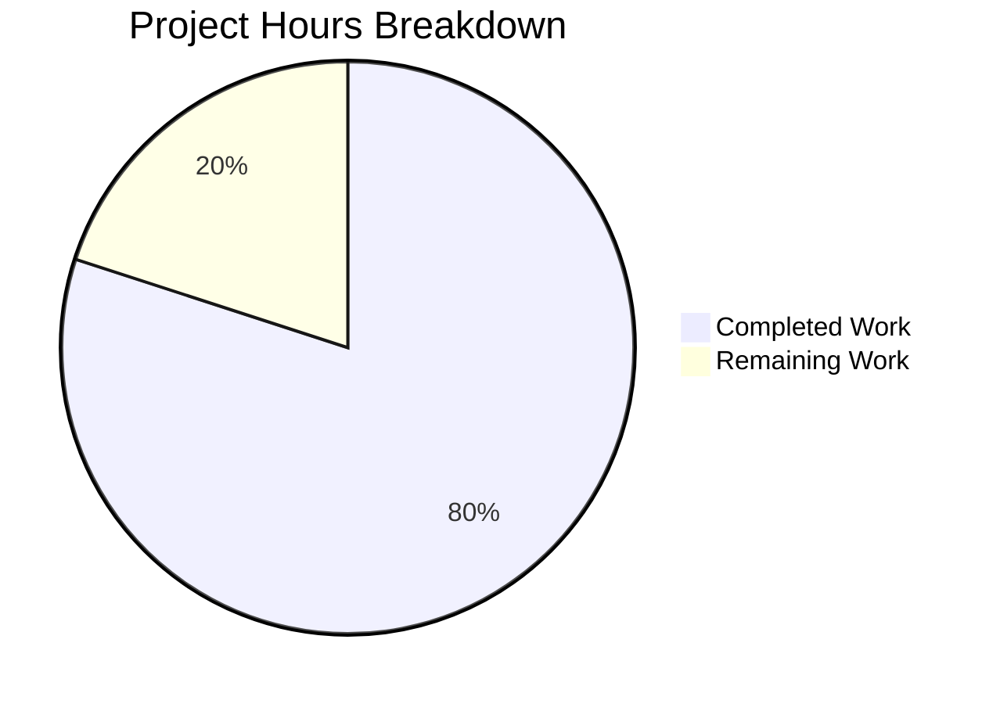

# Project Guide — Express.js Integration for Hello World Server

## 1. Executive Summary

**Project Completion: 80% (4 hours completed out of 5 total hours)**

This project successfully migrates a minimal Node.js HTTP server (`hello_world` v1.0.0) from the built-in `http` module to Express.js v5.2.1 and adds a new `/evening` endpoint. All five core objectives from the Agent Action Plan have been implemented, validated, and committed:

1. ✅ Express.js v5.2.1 installed as the project's first npm dependency
2. ✅ `server.js` refactored from `http.createServer` to Express.js with explicit route definitions
3. ✅ Existing `GET /` endpoint preserved — returns `"Hello, World!\n"` (200, text/plain)
4. ✅ New `GET /evening` endpoint added — returns `"Good evening"` (200, text/plain)
5. ✅ `server - Copy.js` synchronized as identical duplicate per repository convention

**Remaining work (1 hour):** Add a `.gitignore` file and perform final human code review before merge.

---

## 2. Validation Results Summary

### 2.1 Dependency Installation
- `npm install` completed successfully: 66 packages installed, 0 vulnerabilities
- Express.js v5.2.1 confirmed installed via `npm ls`
- Node.js v20.19.5 satisfies Express 5 requirement (>= 18)
- `npm audit` reports 0 vulnerabilities

### 2.2 Compilation / Syntax Checks
| File | Command | Result |
|------|---------|--------|
| `server.js` | `node -c server.js` | ✅ PASS |
| `server - Copy.js` | `node -c "server - Copy.js"` | ✅ PASS |

### 2.3 Runtime Validation (All Endpoints Verified)
| Endpoint | Expected Response | Actual Response | Status | Result |
|----------|-------------------|-----------------|--------|--------|
| `GET /` | `Hello, World!\n` (200, text/plain) | `Hello, World!\n` (200, text/plain) | ✅ PASS | Backward compatible |
| `GET /evening` | `Good evening` (200, text/plain) | `Good evening` (200, text/plain) | ✅ PASS | New endpoint working |
| `GET /nonexistent` | 404 response | 404 (Express default HTML) | ✅ PASS | Proper route isolation |

### 2.4 Server Binding
- Server binds to `127.0.0.1:3000` as required — confirmed via startup log and curl tests

### 2.5 Test Suite
- `npm test` exits with code 1 — this is **by design**. The test script is a placeholder (`echo "Error: no test specified" && exit 1`). No test infrastructure exists, and adding one is explicitly out of scope per the AAP.

### 2.6 File Synchronization
- `diff server.js "server - Copy.js"` confirms both files are **identical** ✅

### 2.7 Fixes Applied During Validation
- Improved formatting and readability of `server.js` per PR review instructions:
  - Added file-level description comments
  - Added section separator comments (Server configuration, Route definitions, Start the server)
  - Added inline comments explaining each route handler
  - Renamed `hostname` → `HOSTNAME` and `port` → `PORT` for UPPER_CASE constant naming convention
- Mirrored all changes to `server - Copy.js`

---

## 3. Hours Breakdown and Completion Calculation

### 3.1 Completed Work: 4 hours

| Component | Hours | Description |
|-----------|-------|-------------|
| Express.js installation + package.json configuration | 0.5h | Installed express@5.2.1, updated main field, added start script, regenerated lockfile |
| server.js Express migration + route definitions | 1.0h | Replaced http.createServer with Express app, defined GET / and GET /evening routes |
| server - Copy.js synchronization | 0.25h | Mirrored server.js changes to maintain repository duplicate-file convention |
| README.md comprehensive rewrite | 0.75h | Prerequisites, install/startup instructions, endpoint table, curl examples |
| Code formatting and inline documentation | 0.5h | Comments, section separators, UPPER_CASE naming convention |
| Validation and runtime testing | 0.5h | Syntax checks, endpoint verification, 404 testing, dependency audit |
| Technical specifications documentation | 0.5h | Generated project documentation artifacts |
| **Total Completed** | **4.0h** | |

### 3.2 Remaining Work: 1 hour

| Task | Raw Hours | With Multipliers (×1.15 compliance × 1.25 buffer) | Description |
|------|-----------|---------------------------------------------------|-------------|
| Add .gitignore file | 0.25h | 0.5h | Exclude node_modules/ from version control |
| Final code review and merge approval | 0.25h | 0.5h | Human developer review of all changes |
| **Total Remaining** | **0.5h** | **1.0h** | |

### 3.3 Completion Calculation

```
Completed Hours:  4h
Remaining Hours:  1h (after enterprise multipliers)
Total Hours:      5h
Completion:       4 / 5 = 80%
```

### 3.4 Visual Representation



---

## 4. Git Repository Analysis

### 4.1 Branch Commits (8 total on feature branch)
| Commit | Date | Description |
|--------|------|-------------|
| `84351a7` | 2026-02-17 | chore: install express@5.2.1 as production dependency |
| `968b276` | 2026-02-17 | Update package.json: fix main entry point to server.js and add start script |
| `bbc6268` | 2026-02-17 | Migrate server.js from http module to Express.js |
| `c93ec1c` | 2026-02-17 | Migrate server - Copy.js from http module to Express.js |
| `ea65913` | 2026-02-17 | Update README.md with Express.js integration documentation |
| `984ba56` | 2026-02-17 | Adding Blitzy Project Guide |
| `676fa78` | 2026-02-17 | Adding Blitzy Technical Specifications |
| `463aa6a` | 2026-02-17 | Improve server.js formatting and readability |

### 4.2 File Change Summary
| File | Lines Added | Lines Removed | Net Change |
|------|-------------|---------------|------------|
| `server.js` | 29 | 9 | +20 |
| `server - Copy.js` | 29 | 9 | +20 |
| `package.json` | 7 | 3 | +4 |
| `package-lock.json` | 814 | 0 | +814 |
| `README.md` | 63 | 2 | +61 |
| **Total (source files)** | **1,597** | **23** | **+1,574** |

### 4.3 Repository Structure (20 files, flat layout)
```
hello_world/
├── server.js              ← Primary Express.js application (MODIFIED)
├── server - Copy.js       ← Synchronized duplicate (MODIFIED)
├── package.json           ← npm manifest with express dependency (MODIFIED)
├── package-lock.json      ← Regenerated lockfile — 827 lines (MODIFIED)
├── README.md              ← Comprehensive project documentation (MODIFIED)
├── node_modules/          ← Express.js + 66 transitive packages (GENERATED)
├── blitzy/documentation/  ← Blitzy-generated specs and guides
├── LoginTest.java         ← Unrelated Java stub (UNCHANGED)
├── LoginTest - Copy.java  ← Duplicate Java stub (UNCHANGED)
├── industry.csv           ← Static CSV data (UNCHANGED)
├── industry - Copy.csv    ← Duplicate CSV data (UNCHANGED)
├── 100Pages.pdf           ← PDF test fixture (UNCHANGED)
├── 100Pages - Copy.pdf    ← Duplicate PDF (UNCHANGED)
├── demo.jpg               ← Image test fixture (UNCHANGED)
├── demo - Copy.jpg        ← Duplicate image (UNCHANGED)
├── sample.doc             ← Doc test fixture (UNCHANGED)
├── sample - Copy.doc      ← Duplicate doc (UNCHANGED)
├── test.py.txt            ← Empty placeholder (UNCHANGED)
├── test.py - Copy.txt     ← Empty placeholder (UNCHANGED)
└── test.txt.txt           ← Empty placeholder (UNCHANGED)
```

---

## 5. Detailed Human Task Table

All remaining tasks for human developers, summing to exactly **1 hour** (matching the pie chart "Remaining Work" value):

| # | Task | Priority | Severity | Hours | Description and Action Steps |
|---|------|----------|----------|-------|------------------------------|
| 1 | Add `.gitignore` file | High | Low | 0.5h | Create a `.gitignore` at repo root containing `node_modules/` (and optionally `.env`, `*.log`). Currently `node_modules/` shows as untracked in `git status`, risking accidental commit of 66+ dependency packages. **Steps:** Create `.gitignore` → add `node_modules/` entry → commit. |
| 2 | Final code review and merge | Medium | Low | 0.5h | Human developer reviews all 5 modified files, verifies endpoint behavior matches expectations, and approves the PR for merge into the target branch. **Steps:** Review diff → test locally with `npm install && node server.js` → approve and merge PR. |
| | **Total Remaining Hours** | | | **1.0h** | |

---

## 6. Comprehensive Development Guide

### 6.1 System Prerequisites

| Requirement | Minimum Version | Verified Version |
|-------------|----------------|------------------|
| Node.js | >= 18.0.0 | v20.19.5 ✅ |
| npm | >= 7.0.0 (for lockfileVersion 3) | v10.8.2 ✅ |
| Operating System | Any (Linux, macOS, Windows) | Windows (validated) |

### 6.2 Environment Setup

No virtual environments or environment variables are required. This is a zero-config tutorial project.

```bash
# Clone the repository and switch to the feature branch
git clone <repository-url>
cd hello_world
git checkout blitzy-71cdec2c-75fa-4bfd-9287-815f6ce09c81
```

### 6.3 Dependency Installation

```bash
# Install Express.js and all transitive dependencies
npm install
```

**Expected output:**
```
added 66 packages, and audited 67 packages in Xs
found 0 vulnerabilities
```

**Verification:**
```bash
# Confirm Express.js is installed
npm ls
# Expected: hello_world@1.0.0 └── express@5.2.1

# Confirm no security vulnerabilities
npm audit
# Expected: found 0 vulnerabilities
```

### 6.4 Application Startup

```bash
# Option 1: Direct node command
node server.js

# Option 2: npm start script
npm start
```

**Expected startup output:**
```
Server running at http://127.0.0.1:3000/
```

The server binds to `127.0.0.1` (localhost only) on port `3000`.

### 6.5 Verification Steps

After starting the server, verify both endpoints in a separate terminal:

```bash
# Test Hello World endpoint
curl http://127.0.0.1:3000/
# Expected: Hello, World!

# Test Good Evening endpoint
curl http://127.0.0.1:3000/evening
# Expected: Good evening

# Test 404 handling (any non-defined route)
curl http://127.0.0.1:3000/nonexistent
# Expected: Cannot GET /nonexistent (HTML 404 response)
```

**Syntax validation (without starting the server):**
```bash
node -c server.js
# Expected: no output (silent success)

node -c "server - Copy.js"
# Expected: no output (silent success)
```

### 6.6 Example Usage

**Browser:** Navigate to `http://127.0.0.1:3000/` or `http://127.0.0.1:3000/evening`

**curl with full headers:**
```bash
curl -i http://127.0.0.1:3000/
# HTTP/1.1 200 OK
# Content-Type: text/plain; charset=utf-8
# Hello, World!

curl -i http://127.0.0.1:3000/evening
# HTTP/1.1 200 OK
# Content-Type: text/plain; charset=utf-8
# Good evening
```

### 6.7 Stopping the Server

Press `Ctrl+C` in the terminal where the server is running.

---

## 7. Risk Assessment

### 7.1 Technical Risks

| Risk | Severity | Likelihood | Mitigation |
|------|----------|------------|------------|
| No `.gitignore` — `node_modules/` could be accidentally committed | Low | Medium | Create `.gitignore` with `node_modules/` entry (Task #1) |
| No test infrastructure — regressions cannot be caught automatically | Low | Low | Out of scope per AAP; add Jest/Mocha if project grows beyond tutorial |
| `npm test` exits with code 1 — CI pipelines may flag this as failure | Low | Low | Expected behavior; document in CI config or replace placeholder script |

### 7.2 Security Risks

| Risk | Severity | Likelihood | Mitigation |
|------|----------|------------|------------|
| `X-Powered-By: Express` header exposes framework | Very Low | Low | Acceptable for tutorial; add `app.disable('x-powered-by')` if deploying publicly |
| No rate limiting, CORS, or helmet middleware | Very Low | Very Low | Explicitly out of scope per AAP; add if project evolves beyond tutorial |
| Server binds to localhost only (`127.0.0.1`) | N/A (positive) | N/A | This is a security feature — prevents external network access by default |

### 7.3 Operational Risks

| Risk | Severity | Likelihood | Mitigation |
|------|----------|------------|------------|
| No health check endpoint | Very Low | Low | Tutorial project — not intended for production deployment |
| Logging limited to `console.log` startup message | Very Low | Low | Adequate for tutorial; add structured logging if project evolves |
| No process manager (pm2, nodemon) | Very Low | Low | Not needed for tutorial; add if continuous uptime is required |

### 7.4 Integration Risks

| Risk | Severity | Likelihood | Mitigation |
|------|----------|------------|------------|
| No external service integrations | None | None | The project is self-contained with no external dependencies beyond Express.js |

**Overall Risk Assessment: LOW** — This is a tutorial-level project with no database, no authentication, no external integrations, and no sensitive data handling. All identified risks are cosmetic or preventive in nature.

---

## 8. Feature Comparison — AAP Requirements vs. Implementation

| AAP Requirement | Status | Evidence |
|-----------------|--------|----------|
| Install Express.js as production dependency | ✅ Complete | `express@5.2.1` in `package.json` dependencies; `npm ls` confirms installation |
| Refactor server.js from http to Express.js | ✅ Complete | `const express = require('express')` + `app.get()` routes replace `http.createServer` |
| Preserve GET / returning "Hello, World!\n" | ✅ Complete | `curl http://127.0.0.1:3000/` returns `Hello, World!\n` (200, text/plain) |
| Add GET /evening returning "Good evening" | ✅ Complete | `curl http://127.0.0.1:3000/evening` returns `Good evening` (200, text/plain) |
| Update server - Copy.js to mirror server.js | ✅ Complete | `diff` confirms files are identical |
| Update package.json with dependency and scripts | ✅ Complete | `main` → `server.js`, `start` script added, `express` dependency added |
| Regenerate package-lock.json | ✅ Complete | 827-line lockfile with full Express dependency tree |
| Update README.md documentation | ✅ Complete | Comprehensive docs with prerequisites, endpoints, install/startup instructions |
| Maintain localhost binding (127.0.0.1:3000) | ✅ Complete | Server startup log and curl tests confirm binding |
| CommonJS module format (require) | ✅ Complete | All files use `const express = require('express')` |
| Tutorial-level simplicity | ✅ Complete | Clean, well-commented code with no unnecessary complexity |
