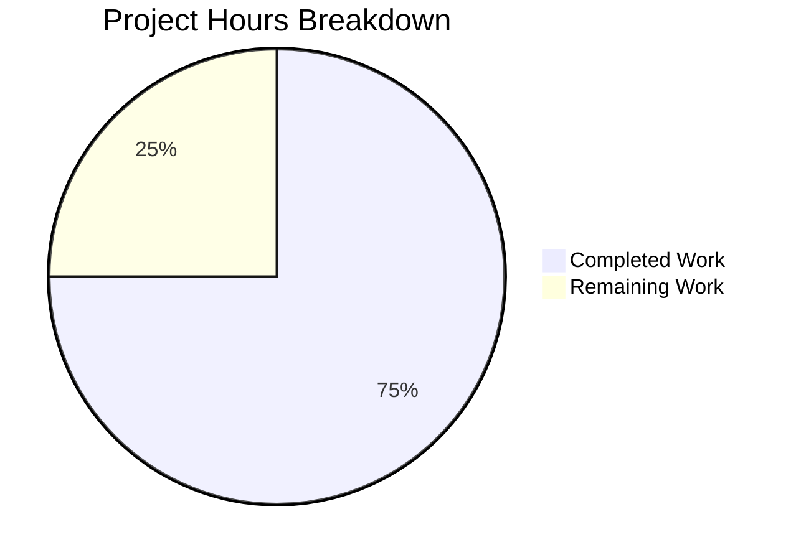

# Project Guide: Express.js Integration for Node.js Tutorial Server

## 1. Executive Summary

**Project Completion: 75% (6 hours completed out of 8 total hours)**

This project successfully migrated the `hello_world` Node.js tutorial server from the built-in `http` module to Express.js v5.2.1 and added a new `GET /evening` endpoint. All five in-scope files have been modified, all validation gates passed at 100%, and both endpoints respond correctly at runtime.

### Key Achievements
- Express.js v5.2.1 installed as the project's first npm dependency (0 vulnerabilities)
- `server.js` fully refactored from raw `http.createServer` to Express.js app with two explicit routes
- `server - Copy.js` synchronized as an identical duplicate of `server.js`
- `package.json` updated with dependency, corrected `main` field, and added `start` script
- `package-lock.json` regenerated (827 lines covering full Express.js dependency tree)
- `README.md` comprehensively rewritten with endpoint reference, installation, and startup instructions
- Full runtime validation confirms: `GET /` → 200 `"Hello, World!\n"`, `GET /evening` → 200 `"Good evening"`, unknown paths → 404

### Remaining Work (2 hours)
Minor production-readiness items remain: adding a `.gitignore` file, human code review, deployment verification, and a final documentation pass. No compilation errors, test failures, or runtime issues exist.

### Hours Calculation
- **Completed:** 6 hours (research + dependency setup + server refactoring + copy sync + package config + documentation + validation)
- **Remaining:** 2 hours (`.gitignore` + code review + deployment verification + docs review, with 1.25x enterprise uncertainty multiplier applied)
- **Total:** 8 hours
- **Completion:** 6 / 8 = **75%**

---

## 2. Validation Results Summary

### 2.1 Dependencies (100% ✅)
| Check | Result |
|-------|--------|
| `express@5.2.1` installed | ✅ Pass |
| `require('express')` resolves | ✅ Pass |
| `npm audit` — 0 vulnerabilities | ✅ Pass |
| `npm ls --depth=0` shows express@5.2.1 | ✅ Pass |
| `package.json` contains `"express": "^5.2.1"` | ✅ Pass |
| `package-lock.json` — 827 lines, full tree | ✅ Pass |

### 2.2 Compilation (100% ✅)
| File | Command | Result |
|------|---------|--------|
| `server.js` | `node -c server.js` | ✅ Syntax OK |
| `server - Copy.js` | `node -c "server - Copy.js"` | ✅ Syntax OK |

### 2.3 Tests (As Designed)
The `npm test` script is a placeholder by design (`echo "Error: no test specified" && exit 1`). Per the AAP: the project has no test infrastructure, and adding test frameworks is explicitly out of scope.

### 2.4 Runtime Validation (100% ✅)
| Endpoint | Expected | Actual | Status |
|----------|----------|--------|--------|
| `GET /` | `Hello, World!\n` (200, text/plain) | `Hello, World!\n` (200, text/plain; charset=utf-8) | ✅ Pass |
| `GET /evening` | `Good evening` (200, text/plain) | `Good evening` (200, text/plain; charset=utf-8) | ✅ Pass |
| `GET /nonexistent` | 404 | 404 | ✅ Pass |
| Server startup log | `Server running at http://127.0.0.1:3000/` | Matches | ✅ Pass |
| Server stops on SIGTERM | Clean exit | Clean exit | ✅ Pass |

### 2.5 Git Status (Clean ✅)
- **5 commits** on branch `blitzy-71cdec2c-75fa-4bfd-9287-815f6ce09c81` (vs `origin/17-Feb-Env`)
- **5 files changed**: 904 insertions, 17 deletions
- `node_modules/` correctly untracked (not committed)
- No uncommitted in-scope changes remain

### 2.6 File Synchronization (✅)
`diff server.js "server - Copy.js"` returns no output — the files are byte-identical.

---

## 3. Visual Representation



**Breakdown:**
- Completed Work: 6 hours (75%)
- Remaining Work: 2 hours (25%)

---

## 4. Completed Work Breakdown

| Component | Work Done | Hours |
|-----------|-----------|-------|
| Research & planning (Express 5 compatibility, migration strategy) | Confirmed Express 5.2.1 compatible with Node.js 20, planned migration approach | 0.5 |
| Express.js dependency installation | `npm install express@^5.2.1`, package-lock.json regeneration | 0.5 |
| `server.js` refactoring | Replaced `http.createServer` with Express app, added `GET /` and `GET /evening` routes | 1.0 |
| `server - Copy.js` synchronization | Mirrored all server.js changes, verified byte-identical | 0.5 |
| `package.json` updates | Added dependency, corrected `main` to `server.js`, added `start` script | 0.5 |
| `README.md` rewrite | 65 new lines: endpoints table, install/startup instructions, dependency docs | 1.5 |
| Validation & runtime testing | Syntax checks, endpoint testing, 404 verification, git status review | 1.0 |
| **Total Completed** | | **6.0** |

---

## 5. Remaining Work — Detailed Task Table

| # | Task | Description | Priority | Severity | Hours |
|---|------|-------------|----------|----------|-------|
| 1 | Add `.gitignore` file | Create `.gitignore` with `node_modules/` entry to prevent accidental commit of dependencies. Include common Node.js patterns (`.env`, `*.log`, `.DS_Store`). | High | Medium | 0.5 |
| 2 | Human code review and merge approval | Review all 5 modified files for correctness, style consistency, and adherence to project conventions. Approve and merge the PR. | Medium | Low | 0.5 |
| 3 | Production deployment verification | Deploy to target environment, run smoke tests against live endpoints (`GET /` and `GET /evening`), confirm server binds correctly. | Medium | Medium | 0.5 |
| 4 | Documentation final review | Proofread README.md for accuracy, verify all curl examples work, confirm endpoint table matches implementation. | Low | Low | 0.5 |
| | **Total Remaining Hours** | | | | **2.0** |

**Verification:** Task table sum (0.5 + 0.5 + 0.5 + 0.5) = **2.0 hours** = Pie chart "Remaining Work" value ✅

---

## 6. Development Guide

### 6.1 System Prerequisites

| Requirement | Minimum Version | Verified Version |
|-------------|----------------|-----------------|
| Node.js | >= 18.0.0 | v20.19.5 |
| npm | >= 7.0.0 (for lockfileVersion 3) | 10.8.2 |
| Operating System | Windows, macOS, or Linux | Any |

### 6.2 Environment Setup

No environment variables are required. The server uses hardcoded values appropriate for a tutorial project:
- **Host:** `127.0.0.1`
- **Port:** `3000`

No `.env` file, database, cache, or external services are needed.

### 6.3 Dependency Installation

From the repository root directory:

```bash
cd /tmp/blitzy/05-jan-existing-projects-qa-test-1/blitzy71cdec2c7
npm install
```

**Expected output:** `added 69 packages` (Express.js and transitive dependencies)

**Verification:**
```bash
npm ls --depth=0
```
Expected: `hello_world@1.0.0` with `express@5.2.1` listed.

### 6.4 Application Startup

Start the server using either method:

```bash
node server.js
```

Or:

```bash
npm start
```

**Expected output:**
```
Server running at http://127.0.0.1:3000/
```

The server runs in the foreground. Press `Ctrl+C` to stop.

### 6.5 Verification Steps

With the server running, open a new terminal and run:

```bash
# Test Hello World endpoint
curl http://127.0.0.1:3000/
# Expected: Hello, World!

# Test Good Evening endpoint
curl http://127.0.0.1:3000/evening
# Expected: Good evening

# Test 404 for unknown paths
curl -s -o /dev/null -w "%{http_code}" http://127.0.0.1:3000/nonexistent
# Expected: 404
```

### 6.6 Example Usage

**Hello World endpoint:**
```bash
curl -i http://127.0.0.1:3000/
```
Response:
```
HTTP/1.1 200 OK
Content-Type: text/plain; charset=utf-8
...

Hello, World!
```

**Good Evening endpoint:**
```bash
curl -i http://127.0.0.1:3000/evening
```
Response:
```
HTTP/1.1 200 OK
Content-Type: text/plain; charset=utf-8
...

Good evening
```

### 6.7 Troubleshooting

| Issue | Cause | Fix |
|-------|-------|-----|
| `Cannot find module 'express'` | `node_modules/` missing | Run `npm install` |
| `EADDRINUSE: address already in use` | Port 3000 occupied | Kill the process using port 3000, or change the `port` constant in `server.js` |
| `node: command not found` | Node.js not installed | Install Node.js >= 18 from https://nodejs.org/ |

---

## 7. Risk Assessment

### 7.1 Technical Risks

| Risk | Severity | Likelihood | Mitigation |
|------|----------|------------|------------|
| Missing `.gitignore` — `node_modules/` could be accidentally committed | Medium | Medium | Add `.gitignore` with `node_modules/` before merging (Task #1) |
| No test infrastructure — regressions cannot be caught automatically | Low | Low | Acceptable for tutorial scope; add tests if project grows |
| `package.json` `main` field references `server.js` but no programmatic import exists | Low | Low | Cosmetic; correct for documentation purposes, no functional impact |

### 7.2 Security Risks

| Risk | Severity | Likelihood | Mitigation |
|------|----------|------------|------------|
| No CORS, Helmet, or rate-limiting middleware | Low | Low | Explicitly out of scope per AAP; add if server is exposed beyond localhost |
| Server binds to `127.0.0.1` only (not `0.0.0.0`) | N/A (by design) | N/A | Correct for tutorial project — localhost-only prevents external access |
| Express.js 5.2.1 — 0 known vulnerabilities | None | None | `npm audit` clean; monitor for future advisories |

### 7.3 Operational Risks

| Risk | Severity | Likelihood | Mitigation |
|------|----------|------------|------------|
| No process manager (PM2, systemd) for production | Low | Low | Tutorial project; add PM2 if production deployment needed |
| No health check endpoint | Low | Low | `GET /` effectively serves as a health check for this simple server |
| No logging beyond `console.log` | Low | Low | Sufficient for tutorial; add Winston/Morgan if project grows |

### 7.4 Integration Risks

| Risk | Severity | Likelihood | Mitigation |
|------|----------|------------|------------|
| No external service dependencies | None | None | Self-contained server with no integrations |
| Express 5 breaking changes vs Express 4 guides | Low | Low | Code uses standard Express 5 patterns; no deprecated APIs used |

---

## 8. Feature Completion Matrix

| AAP Requirement | Status | Evidence |
|----------------|--------|----------|
| Install Express.js as production dependency | ✅ Complete | `express@5.2.1` in `package.json`, 827-line lockfile |
| Refactor `server.js` from `http` to Express.js | ✅ Complete | `require('express')`, `app.get()` routes, `app.listen()` |
| Preserve `GET /` returning `"Hello, World!\n"` | ✅ Complete | Runtime test: 200, text/plain, correct body |
| Add `GET /evening` returning `"Good evening"` | ✅ Complete | Runtime test: 200, text/plain, correct body |
| Update `server - Copy.js` to mirror `server.js` | ✅ Complete | `diff` confirms byte-identical files |
| Update `package.json` (dependency, main, start) | ✅ Complete | All three fields updated correctly |
| Regenerate `package-lock.json` | ✅ Complete | 827 lines with full dependency tree |
| Update `README.md` documentation | ✅ Complete | 65 lines added: endpoints, install, startup |
| Express default 404 for unmatched routes | ✅ Complete | Runtime test: `GET /nonexistent` → 404 |

**All 9 AAP requirements fulfilled.** No missing features or incomplete implementations.

---

## 9. Git Commit History

| Hash | Author | Description |
|------|--------|-------------|
| `84351a7` | Blitzy Agent | chore: install express@5.2.1 as production dependency |
| `968b276` | Blitzy Agent | Update package.json: fix main entry point to server.js and add start script |
| `bbc6268` | Blitzy Agent | Migrate server.js from http module to Express.js |
| `c93ec1c` | Blitzy Agent | Migrate server - Copy.js from http module to Express.js |
| `ea65913` | Blitzy Agent | Update README.md with Express.js integration documentation |

**Total changes:** 5 files modified, 904 lines added, 17 lines removed.

---

## 10. Consistency Verification Checklist

- [x] Completion percentage calculated using hours formula: 6 / (6 + 2) = 6 / 8 = 75%
- [x] Executive Summary states: "75% (6 hours completed out of 8 total hours)"
- [x] Pie chart uses: "Completed Work: 6" and "Remaining Work: 2"
- [x] Pie chart automatically shows: 75% and 25%
- [x] Task table sums to: 0.5 + 0.5 + 0.5 + 0.5 = 2.0 hours = Pie chart remaining ✅
- [x] All prose references use 75% and 6/8 hours consistently
- [x] No conflicting or ambiguous percentage statements exist