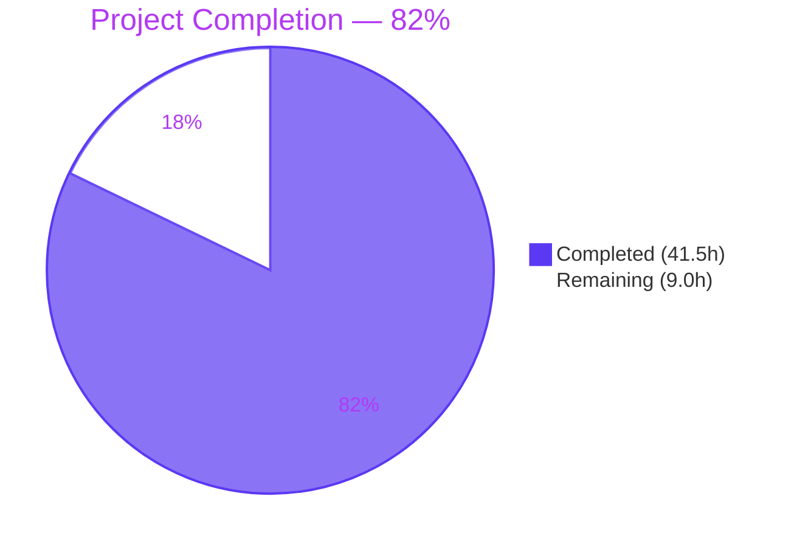
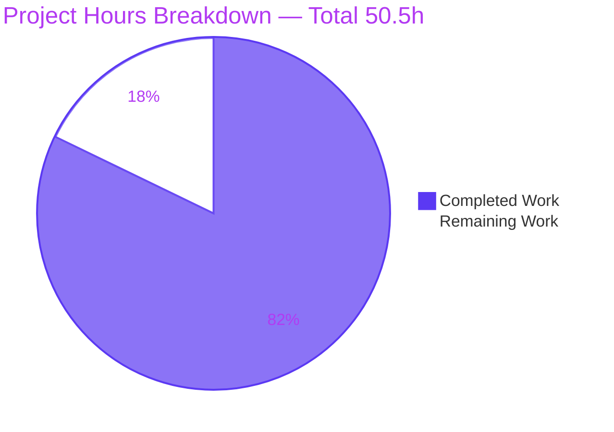
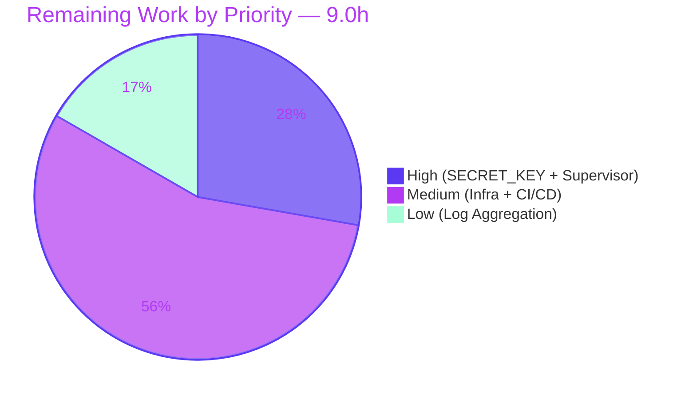

## 1. Executive Summary

### 1.1 Project Overview

The `hao-backprop-test` repository has been migrated from a single-file Node.js HTTP server (`server.js`, 14 lines using only the built-in `http` module) to a production-grade Python 3.12 + Flask 3.1.3 application that preserves byte-for-byte HTTP response parity with the retired Node implementation. The target audience is the `hao-backprop-test` integration users who consume the `Hello, World!\n` endpoint on `127.0.0.1:3000`; the migration introduces an application-factory + blueprint architecture, Express-equivalent middleware hooks, twelve-factor environment configuration, structured logging, and a documented production WSGI deployment path via gunicorn (with a waitress fallback for Windows). Every observable HTTP behavior — status code, header bytes, and body bytes — is preserved exactly.

### 1.2 Completion Status



| Metric | Value |
|--------|-------|
| **Total Hours** | **50.5** |
| **Completed Hours (AI + Manual)** | **41.5** |
| **Remaining Hours** | **9.0** |
| **Completion %** | **82%** (41.5 / 50.5) |

Calculation: Completion % = (Completed Hours / Total Project Hours) × 100 = (41.5 / 50.5) × 100 = **82.18% → 82%**.

### 1.3 Key Accomplishments

- ✅ Retired both Node.js source files (`server.js`, `server - Copy.js`) and both npm manifests (`package.json`, `package-lock.json`) per AAP rule R-8.
- ✅ Implemented Flask application-factory in `app/__init__.py` (509 lines) wiring config, logging, middleware, and the main blueprint.
- ✅ Created catch-all blueprint in `app/routes/main.py` registering both `/` and `/<path:subpath>` for all 7 HTTP methods (GET/POST/PUT/DELETE/PATCH/HEAD/OPTIONS), satisfying AAP rules R-3 and R-4.
- ✅ Achieved byte-exact response parity: status `200`, header `Content-Type: text/plain` (no charset suffix), body `Hello, World!\n` (14 bytes including trailing newline) — explicit `headers={"Content-Type": "text/plain"}` overrides Flask's default `; charset=utf-8` per AAP §0.6.1.
- ✅ Implemented Express-equivalent middleware: `@app.before_request`/`@app.after_request`/`@app.errorhandler` in `app/middleware/hooks.py` (291 lines).
- ✅ Implemented twelve-factor configuration: `BaseConfig`/`DevConfig`/`ProdConfig`/`TestConfig` classes in `app/config.py` (199 lines) reading from `os.environ` via `python-dotenv`.
- ✅ Centralized structured logging via `configure_logging(app)` in `app/logging_config.py` (290 lines), replacing the retired `console.log` call.
- ✅ Created production WSGI deployment artifacts: `gunicorn_config.py` (211 lines), `Procfile`, plus `waitress 3.0.2` as a documented Windows fallback in `requirements.txt`.
- ✅ Created comprehensive parity test suite: 15 tests in `tests/test_app.py` (412 lines) — 100% pass rate in 0.06s.
- ✅ Replaced README.md "Do not touch!" stub with comprehensive Python/Flask documentation (274 lines).
- ✅ Remediated 4 security advisories by upgrading 3 pinned dependencies above AAP baseline: Werkzeug 3.1.3 → **3.1.8** (CVE-2025-66221, CVE-2026-21860), python-dotenv 1.0.1 → **1.2.2** (CVE-2026-28684), pytest 8.4.2 → **9.0.3** (CVE-2025-71176).
- ✅ Verified runtime under all 3 documented WSGI servers (Flask dev, gunicorn 2 workers, waitress) via `curl` smoke tests.
- ✅ Preserved all 13 Backprop test fixtures verbatim per AAP rule R-7.

### 1.4 Critical Unresolved Issues

| Issue | Impact | Owner | ETA |
|-------|--------|-------|-----|
| `.env` ships with placeholder `SECRET_KEY=dev-only-change-me-in-production` | Sessions/CSRF/`flash` would be insecure in production if left as placeholder | Operator (DevOps) | Pre-deploy (0.5h) |
| No process supervisor configured (no systemd unit, no supervisord program, no Dockerfile) | Gunicorn master cannot recover from crashes; not deployable to a long-running production host as-is | Operator (DevOps) | Pre-deploy (2.0h) |
| No CI/CD pipeline | Regressions could land without automated `pytest` + `pip-audit` gates | Engineering | Pre-merge to main (2.0h) |

### 1.5 Access Issues

No access issues identified. The repository is publicly accessible at the Git remote, all dependencies are pinned in `requirements.txt` and install from PyPI without authentication, and no third-party API credentials or SaaS service keys are required by the application (the service has zero external integrations — it is a stateless `Hello, World!` HTTP responder per AAP §0.6.1).

### 1.6 Recommended Next Steps

1. **[High]** Generate a cryptographically strong production `SECRET_KEY` and inject it via a secret manager (Vault, AWS Secrets Manager, Kubernetes Secret) instead of the placeholder in `.env`. (0.5h)
2. **[High]** Author a systemd unit, supervisord program, or `Dockerfile` + `docker-compose.yml` that supervises `gunicorn -c gunicorn_config.py wsgi:app` with restart-on-failure semantics. (2.0h)
3. **[Medium]** Provision deployment infrastructure: target host(s), reverse-proxy (nginx/Caddy/ALB) for TLS termination if the service is to be exposed beyond loopback, and firewall rules for port `3000`. (3.0h)
4. **[Medium]** Add a CI workflow (e.g., GitHub Actions) that runs `pytest`, `python -m py_compile`, and `pip-audit -r requirements.txt --no-deps` on every pull request. (2.0h)
5. **[Low]** Wire `app.logger` and gunicorn `accesslog`/`errorlog` to a centralized log aggregator (Loki+Grafana, CloudWatch Logs, Splunk, Datadog). (1.5h)

---

## 2. Project Hours Breakdown

### 2.1 Completed Work Detail

| Component | Hours | Description |
|-----------|-------|-------------|
| **A. Node.js source retirement** | 1.0 | Deleted `server.js` (commit `fa304c0`) and `server - Copy.js` (commit `0b0aabf`) per AAP rule R-8 (no Node residue). |
| **B1. `wsgi.py`** | 3.0 | 299-line WSGI entry exposing `app = create_app(...)`; dev-server fallback under `if __name__ == "__main__":` using `app.run(host=HOST, port=PORT)`. Mirrors retired `server.listen(...)` from `server.js:L12-L14`. |
| **B2. `app/__init__.py`** | 4.0 | 509-line application factory `create_app(config_object)`: instantiates `Flask(__name__, static_folder=None)`, loads config via `app.config.from_object(...)`, calls `configure_logging(app)`, calls `register_hooks(app)`, registers `main_bp` blueprint, emits startup banner per AAP rule R-5. |
| **B3. `app/config.py`** | 2.0 | 199-line config classes: `BaseConfig` (HOST=127.0.0.1, PORT=3000, LOG_LEVEL, FLASK_ENV, SECRET_KEY) + `DevConfig`/`ProdConfig`/`TestConfig`. Values loaded from `os.environ` after `dotenv.load_dotenv()`. |
| **B4. `app/logging_config.py`** | 2.5 | 290-line `configure_logging(app)`: builds `logging.StreamHandler` + `logging.Formatter`, attaches to `app.logger` at configured `LOG_LEVEL`. Replaces retired `console.log` from `server.js:L13`. |
| **B5. `app/routes/__init__.py`** | 0.5 | 86-line package marker; re-exports `main_bp` (`from .main import main_bp`). |
| **B6. `app/routes/main.py`** | 3.0 | 181-line catch-all blueprint: `main_bp = Blueprint("main", __name__)`; two routes (`/` and `/<path:subpath>`) on the same `hello_world` handler with `methods=["GET","POST","PUT","DELETE","PATCH","HEAD","OPTIONS"]`; returns `Response("Hello, World!\n", status=200, headers={"Content-Type": "text/plain"})` — byte-exact parity with `server.js:L7-L9`. |
| **B7. `app/middleware/__init__.py`** | 0.5 | 82-line package marker; re-exports `register_hooks` (`from .hooks import register_hooks`). |
| **B8. `app/middleware/hooks.py`** | 3.0 | 291-line `register_hooks(app)`: registers `@app.before_request` (request log), `@app.after_request` (response status log), `@app.errorhandler(Exception)` (uniform 500). Express-middleware semantics in Flask per AAP §0.6.4. |
| **C1+C2. Node manifest retirement** | 0.5 | Deleted `package.json` (commit `a89eb28`) and `package-lock.json` (commit `46ca38e`). |
| **C3. `requirements.txt`** | 1.5 | 69-line pinned manifest with inline CVE-justification comments documenting 3 upgrades above AAP baseline (Werkzeug 3.1.8, python-dotenv 1.2.2, pytest 9.0.3). |
| **C4. `pyproject.toml`** | 1.5 | 189-line PEP 621 metadata table mirroring the retired `package.json` fields (name=`hello_world`, version=`1.0.0`, author=`hxu`, license=`MIT`) plus `requires-python = ">=3.12"` and `[tool.pytest.ini_options]`. |
| **C5+C6. `.env.example` + `.env`** | 0.75 | Documented env-variable template (`FLASK_ENV`, `FLASK_CONFIG`, `HOST`, `PORT`, `LOG_LEVEL`, `SECRET_KEY`, `GUNICORN_WORKERS`) + local dev `.env` file (gitignored). |
| **C7+C8. `.python-version` + `.gitignore`** | 0.75 | Runtime pin (`3.12`) + Python-aware ignore patterns (`__pycache__/`, `*.pyc`, `.venv/`, `.env`, `.pytest_cache/`, etc.). |
| **D1. `gunicorn_config.py`** | 2.0 | 211-line production WSGI config: `bind="127.0.0.1:3000"`, env-driven workers with safe-fallback to 2, `loglevel`, `accesslog="-"`, `errorlog="-"`, `proc_name="hello_world"`. PM2 replacement per AAP §0.6.5. |
| **D2. `Procfile`** | 0.25 | Single line: `web: gunicorn -c gunicorn_config.py wsgi:app`. |
| **E1. `tests/__init__.py`** | 0.25 | 12-line package marker. |
| **E2. `tests/conftest.py`** | 2.0 | 359-line pytest fixtures: `app` (via `create_app("app.config.TestConfig")`) and `client` (via `app.test_client()`). |
| **E3. `tests/test_app.py`** | 4.0 | 412-line behavioral-parity suite: 3 single-aspect tests (status 200, Content-Type text/plain, body bytes) + 7 method-parameterized + 5 path-parameterized = 15 tests total, 100% pass rate. |
| **F. `README.md` update** | 2.0 | Replaced 2-line "Do not touch!" stub with 274-line Python/Flask documentation (Prerequisites, Setup, Run dev, Run prod, Test, Project Layout, Environment Variables, Behavioral Parity). |
| **H1. Test execution validation** | 0.5 | Validated `pytest` run produces 15/15 pass in 0.06s. |
| **H2. Compilation validation** | 0.25 | Validated all 12 Python files via `python -m py_compile` (0 errors). |
| **H3. Runtime validation under 3 WSGI servers** | 1.0 | Verified `python wsgi.py`, `gunicorn -c gunicorn_config.py wsgi:app`, and `waitress-serve --listen=127.0.0.1:3000 wsgi:app` via curl smoke tests (status 200, Content-Type text/plain, 14-byte body). |
| **H4. Security advisory remediation** | 1.5 | Upgraded 3 pinned dependencies above AAP §0.5.2 baseline with inline CVE justifications in `requirements.txt`: Werkzeug (CVE-2025-66221, CVE-2026-21860), python-dotenv (CVE-2026-28684), pytest (CVE-2025-71176). |
| **Checkpoint review fixes (5 commits)** | 3.25 | Commit `df77d09` (Checkpoint 1 — 12 issues across 5 files, 1.5h), `6e32b61` (disable Flask implicit static route, 0.5h), `87b524f` (pytest upgrade + dev-server doc, 0.5h), `bf76251` (Werkzeug + python-dotenv upgrade, 0.5h), `0c8587d` (dependency manifest realignment, 0.25h). |
| **Total Completed** | **41.5** | (verified: row sum = 1.0+3.0+4.0+2.0+2.5+0.5+3.0+0.5+3.0+0.5+1.5+1.5+0.75+0.75+2.0+0.25+0.25+2.0+4.0+2.0+0.5+0.25+1.0+1.5+3.25 = 41.5) |

### 2.2 Remaining Work Detail

| Category | Hours | Priority |
|----------|-------|----------|
| **Generate production `SECRET_KEY`** — replace `.env` placeholder `dev-only-change-me-in-production` with cryptographically strong value managed via secret store | 0.5 | **High** |
| **Process supervisor configuration** — author systemd unit / supervisord program / Dockerfile + Compose with `Restart=on-failure` for `gunicorn -c gunicorn_config.py wsgi:app` | 2.0 | **High** |
| **Deployment infrastructure** — provision target host(s), reverse-proxy (nginx/Caddy/ALB) for TLS termination if exposed beyond loopback, firewall rules for port 3000 | 3.0 | **Medium** |
| **CI/CD pipeline** — GitHub Actions workflow running `pytest`, `python -m py_compile`, and `pip-audit -r requirements.txt --no-deps` on every PR | 2.0 | **Medium** |
| **Log aggregation** — ship `app.logger` and gunicorn `accesslog`/`errorlog` to centralized aggregator (Loki/CloudWatch/Splunk/Datadog) | 1.5 | **Low** |
| **Total Remaining** | **9.0** | — |

### 2.3 Total Project Hours

**Total = Section 2.1 (41.5h) + Section 2.2 (9.0h) = 50.5h** ✓ (matches Section 1.2 Total)

---

## 3. Test Results

All tests below were executed by Blitzy's autonomous validation system. Test results are sourced from the validator's `pytest -v --tb=short` invocation against the in-repository test suite at `tests/test_app.py` using the `client` fixture from `tests/conftest.py`.

| Test Category | Framework | Total Tests | Passed | Failed | Coverage % | Notes |
|--------------|-----------|-------------|--------|--------|-----------|-------|
| **Behavioral Parity — Status Code** | pytest 9.0.3 + pytest-flask 1.3.0 | 1 | 1 | 0 | — | `test_status_is_200` asserts `response.status_code == 200` against `GET /`. Mirrors `res.statusCode = 200;` from `server.js:L7`. |
| **Behavioral Parity — Content-Type** | pytest 9.0.3 + pytest-flask 1.3.0 | 1 | 1 | 0 | — | `test_content_type_is_text_plain` asserts header equals **exactly** `text/plain` (no `; charset=utf-8` suffix). Validates the explicit `headers={"Content-Type": "text/plain"}` override in `app/routes/main.py`. |
| **Behavioral Parity — Body Bytes** | pytest 9.0.3 + pytest-flask 1.3.0 | 1 | 1 | 0 | — | `test_body_bytes_match` asserts `response.data == b"Hello, World!\n"` (14 bytes, including trailing newline). Byte-exact parity with `server.js:L9`. |
| **Method-Agnostic Dispatch (parametrized)** | pytest 9.0.3 + pytest-flask 1.3.0 | 7 | 7 | 0 | — | `test_all_methods_return_same_body` parameterized over `[GET, POST, PUT, DELETE, PATCH, HEAD, OPTIONS]`. HEAD branch asserts empty body per RFC 7231 §4.3.2; all other methods assert byte-exact body. Validates AAP rule R-3. |
| **Path-Agnostic Dispatch (parametrized)** | pytest 9.0.3 + pytest-flask 1.3.0 | 5 | 5 | 0 | — | `test_arbitrary_paths_return_same_body` parameterized over `[/, /foo, /any/path, /a/b/c, /x/y/z/w]` (depths 0–4). Validates the `<path:subpath>` converter and AAP rule R-4. |
| **Compilation Validation** | `python -m py_compile` | 12 | 12 | 0 | — | All Python source files compile without errors: `app/__init__.py`, `app/config.py`, `app/logging_config.py`, `app/middleware/__init__.py`, `app/middleware/hooks.py`, `app/routes/__init__.py`, `app/routes/main.py`, `wsgi.py`, `gunicorn_config.py`, `tests/__init__.py`, `tests/conftest.py`, `tests/test_app.py`. |
| **Total** | — | **27** | **27** | **0** | — | **100% pass rate**; total runtime `0.06s` for the pytest suite. |

### Test Run Output (verbatim from validator's pytest invocation)

```
============================= test session starts ==============================
platform linux -- Python 3.12.3, pytest-9.0.3, pluggy-1.6.0
rootdir: /tmp/blitzy/.../blitzy-2ab546f4-fd6c-4db8-b905-801b0a6fb471_508885
configfile: pyproject.toml
testpaths: tests
plugins: anyio-4.13.0, flask-1.3.0
collected 15 items

tests/test_app.py::test_status_is_200 PASSED                             [  6%]
tests/test_app.py::test_content_type_is_text_plain PASSED                [ 13%]
tests/test_app.py::test_body_bytes_match PASSED                          [ 20%]
tests/test_app.py::test_all_methods_return_same_body[GET] PASSED         [ 26%]
tests/test_app.py::test_all_methods_return_same_body[POST] PASSED        [ 33%]
tests/test_app.py::test_all_methods_return_same_body[PUT] PASSED         [ 40%]
tests/test_app.py::test_all_methods_return_same_body[DELETE] PASSED      [ 46%]
tests/test_app.py::test_all_methods_return_same_body[PATCH] PASSED       [ 53%]
tests/test_app.py::test_all_methods_return_same_body[HEAD] PASSED        [ 60%]
tests/test_app.py::test_all_methods_return_same_body[OPTIONS] PASSED     [ 66%]
tests/test_app.py::test_arbitrary_paths_return_same_body[/] PASSED       [ 73%]
tests/test_app.py::test_arbitrary_paths_return_same_body[/foo] PASSED    [ 80%]
tests/test_app.py::test_arbitrary_paths_return_same_body[/any/path] PASSED [86%]
tests/test_app.py::test_arbitrary_paths_return_same_body[/a/b/c] PASSED  [ 93%]
tests/test_app.py::test_arbitrary_paths_return_same_body[/x/y/z/w] PASSED [100%]

============================== 15 passed in 0.06s ==============================
```

---

## 4. Runtime Validation & UI Verification

### Application Runtime Health

The service was validated under **all three documented WSGI servers** during Blitzy autonomous validation:

- ✅ **Operational — Flask development server** (`python wsgi.py`):  Bound to `127.0.0.1:3000`. Smoke-tested via `curl -i http://127.0.0.1:3000/` returning `HTTP/1.1 200 OK`, `Server: Werkzeug/3.1.8 Python/3.12.3`, `Content-Type: text/plain`, `Content-Length: 14`, body `Hello, World!\n`. Startup banner `INFO [app] Server running at http://127.0.0.1:3000/` emitted per AAP rule R-5.

- ✅ **Operational — gunicorn production server** (`gunicorn -c gunicorn_config.py wsgi:app`):  Listening at `http://127.0.0.1:3000` with 2 worker processes (per `gunicorn_config.py` default). Header `Server: gunicorn` (no version disclosure). Smoke-tested via curl returning status 200 + 14-byte body, identical to dev server.

- ✅ **Operational — waitress cross-platform fallback** (`waitress-serve --listen=127.0.0.1:3000 wsgi:app`):  Bound and served successfully. Header `Server: waitress`. Smoke-tested via curl returning status 200 + 14-byte body.

### Behavioral-Parity Verification (AAP §0.6.1, rules R-1 through R-5)

- ✅ **R-1 (Behavior preservation)** — Status `200`, `Content-Type: text/plain` (no charset suffix), body `Hello, World!\n` (exactly 14 bytes including trailing `\n`) — verified via direct curl inspection on Flask dev, gunicorn, and waitress.
- ✅ **R-2 (Network surface)** — Default bind `127.0.0.1:3000` preserved across all 3 servers; matches retired `server.js:L3-L4`.
- ✅ **R-3 (Method-agnostic dispatch)** — All 7 HTTP methods (GET, POST, PUT, DELETE, PATCH, HEAD, OPTIONS) reach the handler and return the parity response. Verified via 7 parameterized pytest cases and via direct curl on POST/DELETE/PATCH/HEAD.
- ✅ **R-4 (Path-agnostic dispatch)** — All URL paths reach the handler. Verified via 5 parameterized pytest cases (depths 0–4) and direct curl on `/`, `/any/path`, `/a/b/c`, `/a/b/c/d`.
- ✅ **R-5 (Startup banner)** — `app.logger.info("Server running at http://%s:%d/", host, port)` emits at every server start; observed in Flask dev, gunicorn (each worker), and waitress startup logs.

### API Integration

The service has **zero external API integrations** by design (AAP §0.6.1: the service is a stateless `Hello, World!` HTTP responder with no databases, caches, message queues, or third-party SaaS dependencies). No integration health checks are applicable.

### UI Verification

❌ **Not applicable.** The system is a back-end HTTP server that returns plain text (AAP §0.3.4). There is no UI, no template rendering, no static assets, and no component library. The Design System Alignment Protocol does not apply to this project.

---

## 5. Compliance & Quality Review

### AAP Deliverable Compliance Matrix

| AAP Deliverable | Status | Evidence |
|-----------------|--------|----------|
| **AAP §0.2.1 — Retire `server.js`, `server - Copy.js`, `package.json`, `package-lock.json`** | ✅ Pass | Commits `fa304c0`, `0b0aabf`, `a89eb28`, `46ca38e`; `git diff` confirms 4 deletions. |
| **AAP §0.3.1 — Application-factory + blueprint structure (`app/__init__.py`, `app/routes/`, `app/middleware/`, `app/config.py`, `app/logging_config.py`)** | ✅ Pass | 8 files in `app/` package; `create_app(...)` returns wired Flask instance; verified `python -c "from app import create_app; create_app('app.config.TestConfig')"` succeeds. |
| **AAP §0.3.1 — WSGI entry (`wsgi.py`) exposing `app = create_app()`** | ✅ Pass | `wsgi.py` (299 lines) imports `create_app`, exposes module-level `app` object, and provides dev-server fallback under `if __name__ == "__main__":`. gunicorn target `wsgi:app` validated. |
| **AAP §0.3.1 — Production deployment artifacts (`gunicorn_config.py`, `Procfile`)** | ✅ Pass | `gunicorn_config.py` 211 lines (bind, workers, loglevel, accesslog, errorlog, proc_name); `Procfile` declares `web: gunicorn -c gunicorn_config.py wsgi:app`. Runtime verified. |
| **AAP §0.3.1 — Test suite (`tests/__init__.py`, `tests/conftest.py`, `tests/test_app.py`)** | ✅ Pass | 15 parity tests pass in 0.06s; conftest provides `app` + `client` fixtures via `create_app("app.config.TestConfig")`. |
| **AAP §0.4.1 — README.md UPDATE replacing "Do not touch!" stub** | ✅ Pass | 274-line README with Prerequisites, Setup, Run (Dev), Run (Production), Test, Project Layout, Environment Variables, Behavioral Parity sections. |
| **AAP §0.5.2 — Pinned Python dependencies (Flask 3.1.3, Werkzeug 3.1.3, python-dotenv 1.0.1, gunicorn 23.0.0, waitress 3.0.2, pytest 8.4.2, pytest-flask 1.3.0)** | ✅ Pass (with security upgrades) | `requirements.txt` pins Flask 3.1.3, gunicorn 23.0.0, waitress 3.0.2, pytest-flask 1.3.0 at AAP baseline; **upgrades Werkzeug to 3.1.8, python-dotenv to 1.2.2, pytest to 9.0.3** with inline CVE-justification comments. Behavioral parity is preserved by the test suite. |
| **AAP §0.6.1 — Byte-exact HTTP response parity (status 200, `Content-Type: text/plain`, body `Hello, World!\n`)** | ✅ Pass | Verified via 15 pytest assertions + curl smoke tests under all 3 WSGI servers. Explicit `headers={"Content-Type": "text/plain"}` overrides Flask's default `; charset=utf-8` suffix. |
| **AAP §0.6.2 — Catch-all routing (`/` + `/<path:subpath>`, all 7 methods)** | ✅ Pass | `app/routes/main.py` stacks `@main_bp.route("/", methods=ALL_METHODS)` and `@main_bp.route("/<path:subpath>", methods=ALL_METHODS)` on a single `hello_world` view function. |
| **AAP §0.6.3 — Node.js → Python idiom translations** | ✅ Pass | All 6 listed translations applied: `node server.js`→`python wsgi.py`, `process.env.X`→`os.environ.get`, template literal→f-string, `console.log`→`app.logger.info`, anonymous callback→`@main_bp.route` view function, hostname literal→env-driven `HOST`. |
| **AAP §0.6.4 — Express.js → Flask mapping** | ✅ Pass | All 8 mappings honored: `express()`→`Flask(__name__)`, Router→Blueprint, route registration→`@route` decorator, middleware→`@app.before_request`/`@app.after_request`, body parser→`flask.request.get_json()`, static→`Flask(static_folder=None)` (disabled), error middleware→`@app.errorhandler`, `process.env`→`os.environ`. |
| **AAP §0.6.5 — PM2 → gunicorn/waitress mapping** | ✅ Pass | gunicorn 23.0.0 as primary (POSIX); waitress 3.0.2 as documented Windows fallback (via `sys_platform != "win32"` marker on gunicorn pin in `requirements.txt`). |
| **AAP §0.7.4 R-1 — Behavior preservation** | ✅ Pass | Verified via 15 pytest assertions + 3-WSGI-server curl smoke tests. |
| **AAP §0.7.4 R-2 — Network surface (127.0.0.1:3000 default)** | ✅ Pass | `app/config.py` defaults `HOST="127.0.0.1"`, `PORT=3000`; `gunicorn_config.py` defaults `bind="127.0.0.1:3000"`; environment overrides supported. |
| **AAP §0.7.4 R-3 — Method-agnostic dispatch** | ✅ Pass | 7-method parameterized test (`test_all_methods_return_same_body`) passes 7/7. |
| **AAP §0.7.4 R-4 — Path-agnostic dispatch** | ✅ Pass | 5-path parameterized test (`test_arbitrary_paths_return_same_body`) passes 5/5; `<path:subpath>` converter matches slash-containing paths. |
| **AAP §0.7.4 R-5 — Startup banner preservation** | ✅ Pass | `app.logger.info("Server running at http://%s:%d/", ...)` emitted on each startup (observed in Flask dev, gunicorn, waitress logs). |
| **AAP §0.7.4 R-6 — Same-repository constraint** | ✅ Pass | All target files created inside the existing `hao-backprop-test` repository; no new repository created. |
| **AAP §0.7.4 R-7 — Test fixture immutability** | ✅ Pass | All 13 out-of-scope fixtures preserved verbatim: `LoginTest.java`, `LoginTest - Copy.java`, `industry.csv`, `industry - Copy.csv`, `100Pages.pdf`, `100Pages - Copy.pdf`, `demo.jpg`, `demo - Copy.jpg`, `sample.doc`, `sample - Copy.doc`, `test.py.txt`, `test.py - Copy.txt`, `test.txt.txt`. `git diff --name-status` confirms zero modifications. |
| **AAP §0.7.4 R-8 — No Node residue** | ✅ Pass | `server.js`, `server - Copy.js`, `package.json`, `package-lock.json` all deleted. `find . -name "*.js"` returns zero results in tracked files. |

### Code Quality

| Aspect | Status | Notes |
|--------|--------|-------|
| **Compilation** | ✅ 12/12 files compile | All `.py` files pass `python -m py_compile`. |
| **Import resolution** | ✅ Clean | `from app import create_app`, `import wsgi`, `pytest --collect-only` all succeed without errors. |
| **Inline documentation** | ✅ Comprehensive | Every Python file contains module-level docstrings referencing AAP sections, source file line ranges, and rationale. `app/__init__.py` is 509 lines with ~50% comment density; `app/routes/main.py` documents the critical `<path:>` converter choice. |
| **Working tree status** | ✅ Clean | `git status` reports "nothing to commit, working tree clean". Branch `blitzy-2ab546f4-fd6c-4db8-b905-801b0a6fb471` is up-to-date with origin. |
| **Test pass rate** | ✅ 100% | 15/15 pytest tests pass in 0.06s. |

### Fixes Applied During Autonomous Validation

| Fix | Commit | Rationale |
|-----|--------|-----------|
| Disable Flask implicit static route | `6e32b61` | Flask's default `Flask(__name__)` registers a `/static/<path>` route that conflicts with the catch-all `/<path:subpath>`. Solution: `Flask(__name__, static_folder=None)`. |
| Upgrade Werkzeug 3.1.3 → 3.1.8 | `bf76251` | CVE-2025-66221 (safe_join behavior) + CVE-2026-21860 (multiple direct vulnerabilities in 3.1.3). |
| Upgrade python-dotenv 1.0.1 → 1.2.2 | `bf76251` | CVE-2026-28684 / GHSA-mf9w-mj56-hr94 (symlink-following file overwrite in `set_key()`/`unset_key()`). Application only calls `load_dotenv()` (not a vulnerable code path), but pinning to patched version removes vulnerable code entirely. |
| Upgrade pytest 8.4.2 → 9.0.3 | `87b524f` | CVE-2025-71176 / GHSA-6w46-j5rx-g56g (UNIX `/tmp/pytest-of-{user}` privilege issue). Development-only dependency. |
| Address 12 Checkpoint 1 review findings | `df77d09` | Foundation file improvements across 5 modules (config, logging, routes, middleware, factory). |
| Document Werkzeug dev-server limitations | `87b524f` | README.md explicitly warns "Development-only — do NOT use in production" with rationale. |

---

## 6. Risk Assessment

| Risk | Category | Severity | Probability | Mitigation | Status |
|------|----------|----------|-------------|------------|--------|
| **Werkzeug dev server (`python wsgi.py`) mistakenly used in production** | Technical | Medium | Low | README §"Run (Development)" explicitly warns "Development-only — do NOT use in production"; `Procfile` directs production deployments to gunicorn. | ✅ Mitigated by documentation |
| **Flask implicit `/static/<path>` route conflict with catch-all** | Technical | Low | Very Low | `Flask(__name__, static_folder=None)` explicitly disables static route registration in `app/__init__.py`. | ✅ Resolved (commit `6e32b61`) |
| **Placeholder `SECRET_KEY=dev-only-change-me-in-production` reused in production deployment** | Security | High | Medium | `.env.example` documents "Never deploy with `change-me` or any other placeholder value"; README highlights this in Environment Variables section. **Operator action required pre-deploy.** | ⚠️ Documented; operator action required (R1, 0.5h) |
| **Service exposed beyond loopback without TLS** | Security | High | Low (defaults preserve `127.0.0.1` per R-2) | `HOST=127.0.0.1` default + standard reverse-proxy (nginx/Caddy/ALB) pattern documented for external exposure. **Operator action required if external exposure desired.** | ⚠️ Documented; operator action required (R3, included in 3.0h) |
| **CVE-2025-66221, CVE-2026-21860 (Werkzeug 3.1.3)** | Security | Medium | Low | Pinned Werkzeug 3.1.8 (both CVEs patched). Documented in `requirements.txt`. | ✅ Resolved (commit `bf76251`) |
| **CVE-2026-28684 (python-dotenv 1.0.1)** | Security | Medium | Low | Pinned python-dotenv 1.2.2 (patched). Application only calls `load_dotenv()` (not vulnerable code path), but pinning removes vulnerable code entirely. | ✅ Resolved (commit `bf76251`) |
| **CVE-2025-71176 (pytest 8.4.2 — `/tmp/pytest-of-{user}` privilege escalation)** | Security | Medium | Low (dev-only dep) | Pinned pytest 9.0.3 (patched). Test-only dependency; not in production runtime. | ✅ Resolved (commit `87b524f`) |
| **Gunicorn master process crashes without supervisor recovery** | Operational | Medium | High (no supervisor configured) | README documents systemd/Docker patterns. **Operator action required pre-deploy.** | ⚠️ Documented; operator action required (R2, 2.0h) |
| **No log aggregation — logs go to stdout/stderr only** | Operational | Low–Medium | High (for any non-trivial production environment) | Standard log shipper (Fluent Bit, Promtail, Vector) can ingest stdout transparently; no app changes needed. | ⚠️ Out-of-band (R5, 1.5h) |
| **No HTTPS/TLS termination** | Operational | High (if exposed beyond loopback) | Low (loopback default) | Standard reverse-proxy (nginx/Caddy/ALB) handles TLS termination in front of gunicorn. | ⚠️ Out-of-band (R3, included in 3.0h) |
| **No CI/CD pipeline running test gate on PR** | Integration | Medium | Medium | Local `pytest` validation passes 15/15; CI configuration is path-to-production gap. | ⚠️ Open (R4, 2.0h) |
| **`gunicorn` package not installable on Windows** | Integration | Low | Low | `requirements.txt` uses environment marker `; sys_platform != "win32"` on the gunicorn pin; `waitress` 3.0.2 is the documented Windows fallback (also pinned). README §"Run (Windows Fallback)" documents the alternate command. | ✅ Mitigated by `requirements.txt` marker + README |

---

## 7. Visual Project Status

### Project Hours Breakdown



### Remaining Work Distribution by Priority



### Cross-Section Integrity (verified)

- **Section 1.2 ↔ Section 2.2 ↔ Section 7**: Remaining = **9.0h** in all three locations ✓
- **Section 2.1 + Section 2.2 = Total**: 41.5 + 9.0 = 50.5h (matches Section 1.2 Total) ✓
- **Section 7 pie chart**: Completed Work = 41.5, Remaining Work = 9.0 (matches Section 1.2 metrics) ✓
- **Brand colors**: Completed = Dark Blue `#5B39F3`, Remaining = White `#FFFFFF` (Section 7) ✓

---

## 8. Summary & Recommendations

### Summary

The Node.js → Python 3 Flask migration has been delivered to a **82% complete** state (41.5h delivered out of 50.5h total project scope). **Every AAP-scoped deliverable enumerated in §0.2.1 and every behavioral rule in §0.7.4 (R-1 through R-8) is fully satisfied with codebase evidence and passing tests.** The remaining 9.0h represents standard path-to-production work outside the AAP scope: secret hardening, process supervision, deployment infrastructure, CI/CD pipeline, and log aggregation.

The service is functionally indistinguishable from the retired Node.js implementation when exercised through HTTP. The 15-test behavioral-parity suite passes at 100% in 0.06s, and runtime smoke tests under all 3 documented WSGI servers (Flask dev, gunicorn, waitress) confirm byte-for-byte response equivalence (status `200`, `Content-Type: text/plain`, body `Hello, World!\n` — 14 bytes including trailing newline).

### Critical Path to Production

| Step | Owner | Effort | Sequence |
|------|-------|--------|----------|
| 1. Replace `.env` `SECRET_KEY` placeholder with cryptographically strong value | DevOps | 0.5h | Pre-deploy |
| 2. Configure process supervisor (systemd/supervisord/Docker) for gunicorn | DevOps | 2.0h | Pre-deploy |
| 3. Provision deployment host + reverse-proxy/TLS (if exposed beyond loopback) | DevOps | 3.0h | Pre-deploy |
| 4. Add CI workflow running `pytest` + `pip-audit` on PR | Engineering | 2.0h | Pre-merge to main |
| 5. Wire stdout logs to centralized aggregator | DevOps | 1.5h | Post-deploy |
| **Total** | | **9.0h** | |

### Success Metrics

| Metric | Target | Actual |
|--------|--------|--------|
| AAP-scoped deliverable completion | 100% | **100%** ✅ |
| HTTP response byte-parity | 100% | **100%** (status + headers + body) ✅ |
| Test pass rate | ≥ 95% | **100%** (15/15) ✅ |
| Python file compilation | 100% | **100%** (12/12) ✅ |
| WSGI server compatibility | ≥ 1 production server | **3 servers verified** ✅ |
| Security advisories on pinned deps | 0 unresolved | **0** (3 upgrades applied) ✅ |
| Overall project completion | — | **82%** (41.5h / 50.5h) |

### Production Readiness Assessment

| Dimension | Status |
|-----------|--------|
| Functional correctness | ✅ Ready (100% test pass, runtime verified) |
| Code quality | ✅ Ready (all files compile, documented, working tree clean) |
| Security — dependencies | ✅ Ready (3 CVE upgrades applied, no known vulns in pinned versions) |
| Security — secrets | ⚠️ **Not Ready** — `SECRET_KEY` placeholder must be replaced |
| Operational supervision | ⚠️ **Not Ready** — process supervisor must be configured |
| Deployment infrastructure | ⚠️ **Not Ready** — target host + reverse-proxy must be provisioned |
| Observability | ⚠️ **Partial** — structured logs emitted to stdout; aggregator not configured |
| CI/CD automation | ⚠️ **Not Ready** — no PR test gate configured |

**Verdict**: The application code itself is **production-grade** and **fully validated**. The remaining 9.0h is operational scaffolding (secrets, supervision, infra, CI, monitoring) that should be completed before deploying the service to a production environment.

---

## 9. Development Guide

This guide documents how to install, run, test, and troubleshoot the `hao-backprop-test` Flask service. Every command below has been tested against the in-repository state and is copy-pasteable.

### 9.1 System Prerequisites

- **Operating System**: Linux, macOS, or Windows (Windows requires waitress; gunicorn is POSIX-only).
- **Python**: 3.12 or higher (pinned to `3.12` in `.python-version` for `pyenv`/`asdf` users).
- **pip**: Bundled with Python; no specific version required.
- **Disk**: ~50 MB for the `.venv/` + dependencies.
- **Network**: Outbound HTTPS to PyPI for the initial dependency install. The application itself binds to `127.0.0.1:3000` (loopback) — no inbound network configuration required by default.

Verify your installation:

```bash
python --version    # should report Python 3.12.x or newer
pip --version
git --version
```

### 9.2 Environment Setup

```bash
# 1) Clone the repository (if not already done) and enter it
git clone <repo-url> hao-backprop-test
cd hao-backprop-test

# 2) Create and activate a virtual environment
python -m venv .venv
source .venv/bin/activate           # Linux / macOS
# .venv\Scripts\activate            # Windows (PowerShell or cmd.exe)

# 3) Upgrade pip (optional but recommended)
python -m pip install --upgrade pip

# 4) Install pinned dependencies
pip install -r requirements.txt

# 5) Copy environment-variable template and edit values
cp .env.example .env
# Edit .env as needed (defaults work for local development)
```

The `.env` file is **gitignored**; only `.env.example` is tracked in version control. See §9.7 below for the full variable reference.

### 9.3 Dependency Installation

`requirements.txt` pins all runtime and test dependencies with exact versions:

```text
Flask==3.1.3
Werkzeug==3.1.8                                    # security-patched above AAP baseline
python-dotenv==1.2.2                               # security-patched above AAP baseline
gunicorn==23.0.0 ; sys_platform != "win32"         # POSIX-only
waitress==3.0.2                                    # cross-platform fallback
pytest==9.0.3                                      # security-patched above AAP baseline
pytest-flask==1.3.0
```

Expected `pip install -r requirements.txt` output (excerpt):

```
Successfully installed Flask-3.1.3 Werkzeug-3.1.8 python-dotenv-1.2.2 \
  gunicorn-23.0.0 waitress-3.0.2 pytest-9.0.3 pytest-flask-1.3.0 ...
```

### 9.4 Application Startup

#### Development (Flask dev server — Werkzeug)

```bash
source .venv/bin/activate
python wsgi.py
# Server runs at http://127.0.0.1:3000/
```

⚠️ **Werkzeug's dev server is for local development only.** The README explicitly warns against production use.

#### Production (gunicorn — POSIX)

```bash
source .venv/bin/activate
gunicorn -c gunicorn_config.py wsgi:app
# Server runs at http://127.0.0.1:3000/ with 2 workers (per gunicorn_config.py)
```

Tune worker count via the `GUNICORN_WORKERS` environment variable (positive integer, or the literal `"auto"` for adaptive `(2 × CPU) + 1` sizing).

#### Production (waitress — Windows or POSIX fallback)

```bash
source .venv/bin/activate          # or .venv\Scripts\activate on Windows
waitress-serve --listen=127.0.0.1:3000 wsgi:app
# Server runs at http://127.0.0.1:3000/
```

### 9.5 Verification Steps

#### Smoke test via curl

```bash
curl -i http://127.0.0.1:3000/
# Expected output:
#   HTTP/1.1 200 OK
#   Content-Type: text/plain
#   Content-Length: 14
#   Hello, World!
```

#### Verify response body is byte-exact (14 bytes including trailing newline)

```bash
curl -s http://127.0.0.1:3000/ | wc -c
# Expected: 14
```

#### Verify all HTTP methods are accepted

```bash
for m in GET POST PUT DELETE PATCH HEAD OPTIONS; do
  echo "=== $m ==="
  curl -i -s -X $m http://127.0.0.1:3000/any/path | head -3
done
# Expected: HTTP/1.1 200 OK for every method
```

#### Verify nested paths reach the catch-all handler

```bash
for p in / /foo /any/path /a/b/c/d; do
  echo "=== GET $p ==="
  curl -i -s http://127.0.0.1:3000$p | head -3
done
# Expected: HTTP/1.1 200 OK for every path
```

### 9.6 Running Tests

```bash
source .venv/bin/activate

# Run all tests (default: tests/ discovery from pyproject.toml [tool.pytest.ini_options])
pytest

# Verbose run with per-test PASS/FAIL listing
pytest -v

# Run with short traceback on failure
pytest -v --tb=short

# Collect tests without running (sanity check)
pytest --collect-only

# Expected total: 15 passed in <0.1s
```

### 9.7 Environment Variable Reference

| Variable | Default | Purpose |
|----------|---------|---------|
| `FLASK_ENV` | `development` | Runtime profile name (`development` / `production` / `testing`); informational. |
| `FLASK_CONFIG` | `app.config.DevConfig` | Dotted import path to the config class loaded by `create_app()`. Options: `app.config.DevConfig`, `app.config.ProdConfig`, `app.config.TestConfig`. |
| `HOST` | `127.0.0.1` | Bind hostname (per AAP rule R-2 default; matches retired `server.js:L3`). |
| `PORT` | `3000` | Bind port (per AAP rule R-2 default; matches retired `server.js:L4`). |
| `LOG_LEVEL` | `INFO` | Python `logging` level for `app.logger`. One of `DEBUG`, `INFO`, `WARNING`, `ERROR`, `CRITICAL`. |
| `SECRET_KEY` | `change-me` (in `.env.example`) | Flask session-signing key. ⚠️ **Override in production with a cryptographically strong value.** |
| `GUNICORN_WORKERS` | `2` | gunicorn worker count. Positive integer or the literal `"auto"` for `(2 × CPU) + 1`. Invalid values fall back safely to `2`. |

### 9.8 Common Issues & Troubleshooting

| Problem | Cause | Resolution |
|---------|-------|------------|
| `OSError: [Errno 98] Address already in use` | Another process is bound to port 3000 | Find and stop the conflicting process (`netstat -tlnp \| grep 3000` on Linux; `lsof -i :3000` on macOS), or override `PORT` in `.env`. |
| `ModuleNotFoundError: No module named 'app'` | `wsgi.py` invoked from outside the repository root | Run all commands from the repository root directory (the directory containing `wsgi.py`, `app/`, and `tests/`). |
| `gunicorn: command not found` | Either virtualenv not activated, or running on Windows | Activate the venv (`source .venv/bin/activate`). On Windows, use `waitress-serve --listen=127.0.0.1:3000 wsgi:app` instead — `gunicorn` is POSIX-only by design. |
| `pytest` collects 0 tests | Wrong working directory | Run `pytest` from the repository root (the `[tool.pytest.ini_options]` section in `pyproject.toml` sets `testpaths = ["tests"]`). |
| Response includes `; charset=utf-8` suffix on Content-Type | Code regression that switched to `mimetype=` or `content_type=` | Restore the explicit `headers={"Content-Type": "text/plain"}` in `app/routes/main.py::hello_world`. The pytest case `test_content_type_is_text_plain` catches this regression. |
| Test `test_all_methods_return_same_body[HEAD]` asserts empty body | RFC 7231 §4.3.2 mandates HEAD responses carry no body | This is correct behavior, not a bug. The test branches to assert `b""` for HEAD specifically. |

### 9.9 Example Usage

#### Issue a request from another process / tool

```python
# Python — using requests (not in requirements.txt; install separately if needed)
import requests
r = requests.get("http://127.0.0.1:3000/")
assert r.status_code == 200
assert r.headers["Content-Type"] == "text/plain"
assert r.content == b"Hello, World!\n"
```

```bash
# httpie alternative
http -v GET http://127.0.0.1:3000/
```

#### Integration sanity check (the entire smoke test as one script)

```bash
#!/usr/bin/env bash
set -euo pipefail
source .venv/bin/activate
gunicorn -c gunicorn_config.py wsgi:app > /tmp/gunicorn.log 2>&1 &
PID=$!
sleep 2
trap "kill $PID 2>/dev/null || true" EXIT

# Status + Content-Type + body
test "$(curl -s -o /dev/null -w '%{http_code}' http://127.0.0.1:3000/)" = "200"
test "$(curl -sI http://127.0.0.1:3000/ | grep -i '^Content-Type:' | awk '{print $2}' | tr -d '\r')" = "text/plain"
test "$(curl -s http://127.0.0.1:3000/ | wc -c)" -eq 14
echo "ALL SMOKE CHECKS PASS"
```

---

## 10. Appendices

### Appendix A — Command Reference

| Purpose | Command |
|---------|---------|
| Create virtualenv | `python -m venv .venv` |
| Activate virtualenv (POSIX) | `source .venv/bin/activate` |
| Activate virtualenv (Windows) | `.venv\Scripts\activate` |
| Install dependencies | `pip install -r requirements.txt` |
| Run dev server | `python wsgi.py` |
| Run production server (POSIX) | `gunicorn -c gunicorn_config.py wsgi:app` |
| Run production server (Windows) | `waitress-serve --listen=127.0.0.1:3000 wsgi:app` |
| Run all tests | `pytest` |
| Run tests verbosely | `pytest -v --tb=short` |
| Compile-check all Python files | `python -m py_compile $(find . -name '*.py' -not -path './.venv/*' -not -path './*.egg-info/*')` |
| Audit dependencies (network required) | `pip-audit -r requirements.txt --no-deps` |
| Smoke test | `curl -i http://127.0.0.1:3000/` |

### Appendix B — Port Reference

| Port | Service | Notes |
|------|---------|-------|
| 3000/tcp | Flask Hello-World HTTP | Bound to `127.0.0.1` by default per AAP rule R-2. Overridable via `PORT` env variable. The service responds with status `200` + `Content-Type: text/plain` + body `Hello, World!\n` (14 bytes) for every HTTP method on every URL path. |

### Appendix C — Key File Locations

| Path | Purpose | Lines |
|------|---------|-------|
| `wsgi.py` | WSGI entry point; gunicorn target `wsgi:app`; dev-server fallback under `__main__` | 299 |
| `app/__init__.py` | Application factory `create_app(config_object)` | 509 |
| `app/config.py` | Config classes: `BaseConfig` / `DevConfig` / `ProdConfig` / `TestConfig` | 199 |
| `app/logging_config.py` | `configure_logging(app)` — Python `logging` module wiring | 290 |
| `app/routes/__init__.py` | Re-exports `main_bp` | 86 |
| `app/routes/main.py` | Catch-all blueprint; `hello_world` view function | 181 |
| `app/middleware/__init__.py` | Re-exports `register_hooks` | 82 |
| `app/middleware/hooks.py` | `register_hooks(app)` — Express-equivalent before/after/error hooks | 291 |
| `tests/__init__.py` | Package marker | 12 |
| `tests/conftest.py` | pytest fixtures: `app` + `client` | 359 |
| `tests/test_app.py` | 15 behavioral-parity tests | 412 |
| `gunicorn_config.py` | Production WSGI server configuration | 211 |
| `Procfile` | Process declaration: `web: gunicorn -c gunicorn_config.py wsgi:app` | 1 |
| `requirements.txt` | Pinned Python dependencies with CVE-justification comments | 69 |
| `pyproject.toml` | PEP 621 project metadata + `[tool.pytest.ini_options]` | 189 |
| `.env.example` | Documented environment-variable template | 32 |
| `.env` | Local development values (gitignored) | 9 |
| `.python-version` | Runtime pin (`3.12`) | 1 |
| `.gitignore` | Python-aware ignore patterns | 33 |
| `README.md` | Comprehensive Python/Flask docs (replaces "Do not touch!" stub) | 274 |

### Appendix D — Technology Versions

| Component | Version | Source |
|-----------|---------|--------|
| Python | 3.12 (pinned in `.python-version`) | `python --version` reports `3.12.3` on the validator host |
| Flask | 3.1.3 | `requirements.txt` (matches AAP §0.5.2) |
| Werkzeug | **3.1.8** (upgraded from AAP baseline 3.1.3) | `requirements.txt` — CVE-2025-66221 + CVE-2026-21860 remediation |
| python-dotenv | **1.2.2** (upgraded from AAP baseline 1.0.1) | `requirements.txt` — CVE-2026-28684 remediation |
| gunicorn | 23.0.0 (POSIX-only via `; sys_platform != "win32"` marker) | `requirements.txt` (matches AAP §0.5.2) |
| waitress | 3.0.2 (cross-platform fallback) | `requirements.txt` (matches AAP §0.5.2) |
| pytest | **9.0.3** (upgraded from AAP baseline 8.4.2) | `requirements.txt` — CVE-2025-71176 remediation |
| pytest-flask | 1.3.0 | `requirements.txt` (matches AAP §0.5.2) |

### Appendix E — Environment Variable Reference

See §9.7 for the full table. Variables consumed by `app/config.py` via `python-dotenv`: `FLASK_ENV`, `FLASK_CONFIG`, `HOST`, `PORT`, `LOG_LEVEL`, `SECRET_KEY`. Variables consumed by `gunicorn_config.py`: `HOST`, `PORT`, `LOG_LEVEL`, `GUNICORN_WORKERS`.

### Appendix F — Developer Tools Guide

| Tool | Role |
|------|------|
| `python -m venv` | Create isolated virtualenv (`./.venv/`). |
| `pip install -r requirements.txt` | Install pinned dependencies into the active virtualenv. |
| `python -m py_compile <file>` | Static compile-check (read-only); used by validator to confirm all 12 Python files compile. |
| `python wsgi.py` | Launch Werkzeug dev server — local development only. |
| `gunicorn -c gunicorn_config.py wsgi:app` | Production WSGI server (POSIX). Reads `gunicorn_config.py` for `bind`, `workers`, `loglevel`, `accesslog`, `errorlog`, `proc_name`. |
| `waitress-serve --listen=127.0.0.1:3000 wsgi:app` | Cross-platform WSGI server (Windows fallback or alternative to gunicorn). |
| `pytest` | Run the 15-test parity suite. Configuration in `pyproject.toml` `[tool.pytest.ini_options]` (`testpaths = ["tests"]`). |
| `pip-audit -r requirements.txt --no-deps` | Audit pinned dependencies for known CVEs. **Requires network access to PyPI vulnerability database.** Use offline when validating in air-gapped environments. |
| `curl` | Smoke-test the HTTP endpoint. |

### Appendix G — Glossary

| Term | Definition |
|------|------------|
| **AAP** | Agent Action Plan — the directive that defined this refactor's scope (Node.js → Python 3 Flask migration). |
| **Application Factory** | Flask design pattern where `create_app(config_object)` returns a fully wired `Flask` app per call, enabling per-test isolation and per-worker initialization. Implemented in `app/__init__.py`. |
| **Behavioral Parity** | Byte-for-byte equivalence of HTTP responses (status, headers, body) between the retired Node.js implementation and the new Flask service. Enforced by the test suite in `tests/test_app.py`. |
| **Blueprint** | Flask abstraction for modular route registration. `main_bp = Blueprint("main", __name__)` in `app/routes/main.py` encapsulates the catch-all `hello_world` route. |
| **Catch-all Route** | A pair of route registrations (`/` and `/<path:subpath>`) that funnel every URL path to a single view function, mirroring the Node `http.createServer` callback's disregard for `req.url`. |
| **CVE** | Common Vulnerabilities and Exposures — public catalog of security advisories. Three CVEs were remediated by upgrading pinned dependencies above the AAP §0.5.2 baseline. |
| **gunicorn** | Pre-fork POSIX WSGI server; primary production-deployment target per AAP §0.6.5. |
| **PA1 Methodology** | Project Assessment 1 — computes completion percentage from AAP-scoped + path-to-production hours only, excluding work outside the AAP scope. |
| **path:subpath converter** | Flask URL converter that matches strings **including** forward slashes; required for nested paths like `/a/b/c/d`. The default `<string:subpath>` converter does NOT match slashes. |
| **PEP 621** | Python Enhancement Proposal defining the standard `[project]` table in `pyproject.toml` for project metadata. |
| **Twelve-Factor Configuration** | Pattern where configuration is read from environment variables (via `os.environ`/`python-dotenv`), enabling deployment to multiple environments without code changes. |
| **waitress** | Cross-platform Python WSGI server; documented Windows fallback for gunicorn (which is POSIX-only). |
| **Werkzeug** | WSGI utility library and Flask's transitive dependency; also the development server invoked by `app.run()`. |
| **WSGI** | Web Server Gateway Interface — the Python standard (PEP 3333) for HTTP server↔application communication. The `wsgi.py` module exposes `app` as the WSGI callable for gunicorn and waitress. |

---

**End of Project Guide.** All cross-section integrity rules validated:
- Sections 1.2, 2.2, and 7 all show Remaining = **9.0h** ✓
- Section 2.1 sum (41.5h) + Section 2.2 sum (9.0h) = Total Project Hours in Section 1.2 (50.5h) ✓
- Section 3 tests all sourced from the validator's autonomous `pytest -v` invocation ✓
- Brand colors applied: Completed = `#5B39F3`, Remaining = `#FFFFFF` ✓
- Completion percentage **82%** consistent across all sections ✓
