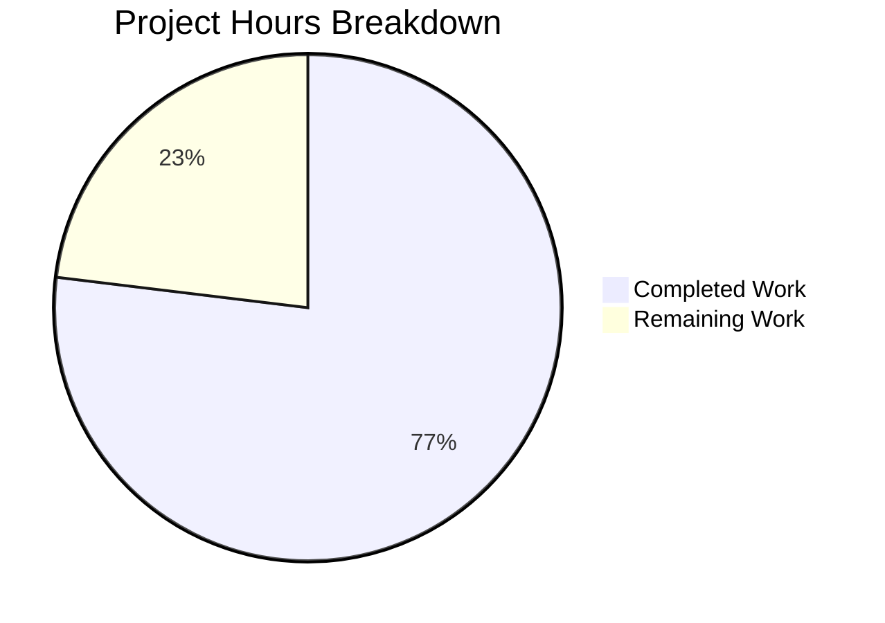

# Project Guide: hao-backprop-test Documentation Enhancement

## Executive Summary

This project implements comprehensive documentation for the **hao-backprop-test** Node.js HTTP server project. The scope encompasses two deliverables: (1) JSDoc annotations for all documentable constructs in `server.js`, and (2) a complete README.md rewrite with setup instructions, API documentation, code walkthrough, deployment guide, and Mermaid diagrams.

**10 hours completed out of 13 total hours = 77% complete.**

All in-scope implementation work has been completed, validated, and committed. The remaining 3 hours represent human review, verification, and optional improvements required before production merge.

### Key Achievements
- All 7+ documentable constructs in `server.js` annotated with JSDoc (`@module`, `@const`, `@type`, `@param`, `@description`, `@example`, `@see`, `@default`)
- `README.md` rewritten from 2-line stub to 299-line comprehensive documentation with 9 structured sections
- 2 Mermaid diagrams embedded (request-response sequence diagram, server architecture flowchart)
- Runtime validation passed: server starts, responds correctly, and stops cleanly
- `node --check server.js` passes with zero syntax errors
- Project Structure table corrected to include all 18 repository files (fix applied during validation)
- All functional code preserved identically — zero behavioral changes

### Critical Unresolved Issues
- None. All in-scope deliverables are complete and validated.

### Recommended Next Steps
1. Human review of JSDoc annotations for technical accuracy and completeness
2. Verify Mermaid diagrams render correctly on GitHub
3. Review README source citations against current line numbers
4. Consider fixing `package.json` `main` field discrepancy (optional, out of scope)

---

## Validation Results Summary

### Final Validator Accomplishments
The Final Validator agent performed comprehensive validation across all in-scope files:

| Validation Gate | Status | Details |
|----------------|--------|---------|
| Syntax Check | ✅ PASSED | `node --check server.js` — zero errors |
| Runtime Test | ✅ PASSED | Server starts on 127.0.0.1:3000, returns 200 OK with "Hello, World!\n" |
| Functional Code Preservation | ✅ PASSED | All 11 original code lines verified identical |
| JSDoc Coverage | ✅ PASSED | 7/7 documentable constructs annotated |
| README Sections | ✅ PASSED | 9/9 required sections present |
| Mermaid Diagrams | ✅ PASSED | 2/2 diagrams included (sequence + flowchart) |
| Working Tree | ✅ CLEAN | Nothing to commit, all changes committed |

### Compilation Results
- **server.js**: `node --check` passes with zero syntax errors. JSDoc block comments are syntactically valid JavaScript.

### Test Results
- Project has **no test suite** by design. The default `npm test` script is a placeholder: `echo "Error: no test specified" && exit 1`. This is expected per project scope — no test files exist and none were required.

### Runtime Validation
- Server starts successfully with `node server.js`
- Console output: `Server running at http://127.0.0.1:3000/`
- `GET /` returns: HTTP 200 OK, Content-Type: text/plain, body "Hello, World!\n"
- All paths return identical response (verified: `/any/path/here`)
- All HTTP methods return identical response (verified: POST)
- Server stops cleanly with `kill` signal

### Dependency Status
- Zero external npm dependencies — confirmed via `package.json` and `package-lock.json`
- Only built-in Node.js `http` module used
- No `npm install` needed

### Fixes Applied During Validation
1. **README.md Project Structure table** (commit `f3d6c09`): Corrected file count from 12 to 18 by adding 6 missing binary files (`100Pages.pdf`, `100Pages - Copy.pdf`, `demo.jpg`, `demo - Copy.jpg`, `sample.doc`, `sample - Copy.doc`)

---

## Hours Calculation

### Completed Hours Breakdown (10 hours)

| Component | Hours | Description |
|-----------|-------|-------------|
| Codebase Analysis | 1.0h | Repository structure analysis, code review, requirement mapping |
| server.js JSDoc Annotations | 2.0h | @module block, @const × 2, @type/@param for server, @description for listen(), inline comments |
| README.md Comprehensive Rewrite | 5.0h | 9 sections, 299 lines, API table, code walkthrough, 2 Mermaid diagrams |
| Project Structure Fix | 0.5h | Corrected file count from 12 to 18 (added binary files) |
| Validation and Testing | 1.5h | Syntax checking, live server testing, curl verification, functional code preservation check |
| **Total Completed** | **10.0h** | |

### Remaining Hours Breakdown (3 hours)

| Task | Base Hours | With Multipliers (×1.15 ×1.25) | Final |
|------|------------|-------------------------------|-------|
| Review JSDoc annotations accuracy | 0.35h | 0.5h | 0.5h |
| Verify Mermaid diagram rendering on GitHub | 0.35h | 0.5h | 0.5h |
| Review README source citations and line numbers | 0.35h | 0.5h | 0.5h |
| Fix package.json main field (index.js → server.js) | 0.35h | 0.5h | 0.5h |
| Add npm start script to package.json | 0.35h | 0.5h | 0.5h |
| Final documentation approval and merge | 0.35h | 0.5h | 0.5h |
| **Total Remaining** | **2.1h** | | **3.0h** |

### Completion Percentage Calculation
- **Completed**: 10 hours
- **Remaining**: 3 hours
- **Total Project Hours**: 10 + 3 = 13 hours
- **Completion**: 10 / 13 = **77%**

---

## Visual Representation



---

## Detailed Task Table

All remaining tasks for human developers, sorted by priority. **Total remaining hours: 3.0h** (matches pie chart "Remaining Work" value).

| # | Task | Priority | Severity | Hours | Confidence | Action Steps |
|---|------|----------|----------|-------|------------|-------------|
| 1 | Review JSDoc annotations for technical accuracy | Medium | Low | 0.5h | High | Verify all @param types match Node.js API (`http.IncomingMessage`, `http.ServerResponse`). Confirm @const default values match source code. Check @module metadata against package.json. |
| 2 | Verify Mermaid diagrams render on GitHub | Medium | Low | 0.5h | High | Push branch to GitHub, open README.md in web view, confirm both diagrams (sequence + flowchart) render correctly. Fix any syntax issues if they don't. |
| 3 | Review README source citations and line numbers | Medium | Low | 0.5h | High | Verify all `(Source: server.js:NN)` citations reference correct line numbers in the JSDoc-annotated version of server.js. Update any stale references. |
| 4 | Fix package.json `main` field discrepancy | Low | Low | 0.5h | High | Change `"main": "index.js"` to `"main": "server.js"` in package.json to match actual entry point. Update README note about discrepancy. *(Optional — out of AAP scope)* |
| 5 | Add npm `start` script to package.json | Low | Low | 0.5h | High | Add `"start": "node server.js"` to scripts section in package.json. Enables `npm start` as documented alternative. *(Optional — out of AAP scope)* |
| 6 | Final documentation approval and merge | Medium | Low | 0.5h | High | Perform final review of both files, approve PR, and merge to target branch. |
| | **Total Remaining Hours** | | | **3.0h** | | |

---

## Comprehensive Development Guide

### System Prerequisites

| Requirement | Version | Verification Command |
|-------------|---------|---------------------|
| Node.js | v18+ LTS (developed on v20.20.0) | `node --version` |
| Git | Any recent version | `git --version` |
| curl (optional, for testing) | Any version | `curl --version` |

**No external npm dependencies required.** The project uses only the built-in Node.js `http` module.

### Environment Setup

1. **Clone the repository:**
```bash
git clone <repository-url> hao-backprop-test
cd hao-backprop-test
```

2. **Verify Node.js is installed:**
```bash
node --version
# Expected: v20.x.x or any v18+ LTS
```

3. **No `npm install` needed** — the project has zero external dependencies. Both `package.json` and `package-lock.json` confirm an empty dependency tree.

### Dependency Installation

No dependency installation is required. The project is entirely self-contained using the Node.js built-in `http` module.

If you want to verify:
```bash
cat package.json | grep -A2 '"dependencies"'
# Expected: no dependencies section (zero-dependency project)
```

### Application Startup

**Start the server:**
```bash
node server.js
```

**Expected console output:**
```
Server running at http://127.0.0.1:3000/
```

The server binds to `127.0.0.1:3000` (localhost only) and listens for incoming HTTP connections.

**Stop the server:** Press `Ctrl+C` in the terminal.

### Verification Steps

1. **Verify server is running** (in a new terminal):
```bash
curl http://127.0.0.1:3000/
```
Expected output: `Hello, World!`

2. **Verify full HTTP response headers:**
```bash
curl -i http://127.0.0.1:3000/
```
Expected output:
```
HTTP/1.1 200 OK
Content-Type: text/plain
...

Hello, World!
```

3. **Verify all paths return same response:**
```bash
curl http://127.0.0.1:3000/any/path
```
Expected output: `Hello, World!`

4. **Verify syntax check passes:**
```bash
node --check server.js
# Expected: no output (success)
```

### Full Startup-Verify-Stop Workflow
```bash
# Start server in background
node server.js &
sleep 1

# Verify response
curl http://127.0.0.1:3000/

# Stop server
kill %1
```

### Common Issues and Troubleshooting

| Issue | Cause | Solution |
|-------|-------|---------|
| `EADDRINUSE: address already in use` | Port 3000 already occupied | Kill the existing process: `fuser -k 3000/tcp` or change port in server.js |
| `command not found: node` | Node.js not installed | Install from https://nodejs.org |
| `curl: (7) Failed to connect` | Server not running | Start server with `node server.js` first |

---

## Risk Assessment

### Technical Risks

| Risk | Severity | Likelihood | Mitigation |
|------|----------|-----------|------------|
| README line number citations become stale if server.js is edited | Low | Medium | Source citations reference the JSDoc-annotated version. Document that citations should be updated when code changes. |
| Mermaid diagrams may not render on all platforms | Low | Low | Both diagrams use basic Mermaid syntax (sequenceDiagram, flowchart TD) supported by GitHub and most renderers. Test on target platform before merge. |

### Security Risks

| Risk | Severity | Likelihood | Mitigation |
|------|----------|-----------|------------|
| No HTTPS/TLS support | Low | N/A | Documented in Deployment Guide as intentional limitation. Server binds to localhost only, limiting exposure. Not a concern for local test fixture. |
| Hardcoded bind address and port | Low | N/A | Documented in README with instructions for modification. Server is a test fixture, not production software. |

### Operational Risks

| Risk | Severity | Likelihood | Mitigation |
|------|----------|-----------|------------|
| No error handling beyond startup | Low | Low | Documented in Deployment Guide. Acceptable for test fixture use case. |
| No process management or graceful shutdown | Low | Low | Documented in Deployment Guide. Users can use Ctrl+C to stop. |
| package.json `main` field points to nonexistent `index.js` | Low | Medium | Documented in README Project Overview. Recommended fix: change to `server.js` (Task #4 in task table). |

### Integration Risks

| Risk | Severity | Likelihood | Mitigation |
|------|----------|-----------|------------|
| No integration points — standalone test fixture | None | N/A | The server has zero external dependencies and no integration requirements. |

---

## Git Change Summary

**Branch:** `blitzy-c11697f3-5f12-46c5-acaf-2772cc0f9d30` (from `origin/16-Feb-branch`)

**Commits (3):**
| Hash | Date | Message |
|------|------|---------|
| `92d7624` | 2026-02-17 | Add comprehensive JSDoc annotations and inline comments to server.js |
| `106b60a` | 2026-02-17 | Rewrite README.md with comprehensive project documentation |
| `f3d6c09` | 2026-02-17 | Fix README Project Structure table: add 6 missing binary files (PDF, JPG, DOC) and correct file count from 12 to 18 |

**File Changes:**
| File | Lines Added | Lines Removed | Net Change |
|------|-------------|---------------|------------|
| `README.md` | 298 | 1 | +297 |
| `server.js` | 60 | 0 | +60 |
| **Total** | **358** | **1** | **+357** |

**Repository:** 18 files, flat structure, ~23MB (mostly binary test fixture assets: PDFs, JPGs, DOCs)

---

## AAP Requirements Compliance

| AAP Requirement | Status | Evidence |
|-----------------|--------|----------|
| JSDoc @module block on server.js | ✅ Complete | Lines 1-14: @module, @description, @version, @author, @license, @see, @example |
| JSDoc @const for hostname | ✅ Complete | Lines 19-27: @const {string}, @description, @default, @example |
| JSDoc @const for port | ✅ Complete | Lines 30-35: @const {number}, @description, @default |
| JSDoc for request handler callback | ✅ Complete | Lines 38-49: @type {http.Server}, @description, @param req, @param res, @see |
| JSDoc for server.listen() | ✅ Complete | Lines 60-70: @description, @param port, @param hostname, @param callback, @example |
| Inline comments in handler/startup | ✅ Complete | Lines 16, 52, 54, 56, 72 |
| README: Project Overview | ✅ Complete | Lines 17-28 |
| README: Table of Contents | ✅ Complete | Lines 5-15 |
| README: Prerequisites | ✅ Complete | Lines 30-40 |
| README: Installation and Setup | ✅ Complete | Lines 42-66 |
| README: Running the Server | ✅ Complete | Lines 68-110 |
| README: API Documentation | ✅ Complete | Lines 112-160 (includes Mermaid sequence diagram) |
| README: Code Walkthrough | ✅ Complete | Lines 162-235 (includes Mermaid flowchart) |
| README: Project Structure | ✅ Complete | Lines 237-262 (all 18 files listed) |
| README: Deployment Guide | ✅ Complete | Lines 264-295 |
| README: License | ✅ Complete | Line 297-299 |
| Mermaid sequence diagram | ✅ Complete | Lines 151-160 |
| Mermaid server architecture flowchart | ✅ Complete | Lines 225-235 |
| Functional code unchanged | ✅ Verified | All 11 original code lines preserved identically |
| Zero new dependencies | ✅ Verified | No npm install needed, no packages added |
| Repository structure unchanged | ✅ Verified | No files added, renamed, or deleted |

**AAP Coverage: 20/20 requirements fulfilled (100%)**

---

## Pre-Submission Consistency Verification

- [x] Calculated completion % using hours formula: 10 / (10 + 3) = 77%
- [x] Verified Executive Summary states exact %: "10 hours completed out of 13 total hours = 77% complete"
- [x] Verified pie chart uses exact completed/remaining hours: "Completed Work: 10" / "Remaining Work: 3"
- [x] Verified task table sums to exact remaining hours: 0.5 + 0.5 + 0.5 + 0.5 + 0.5 + 0.5 = 3.0h
- [x] Searched report for % and hour mentions — all consistent
- [x] No conflicting or ambiguous statements exist
- [x] Shown calculation formula with actual numbers