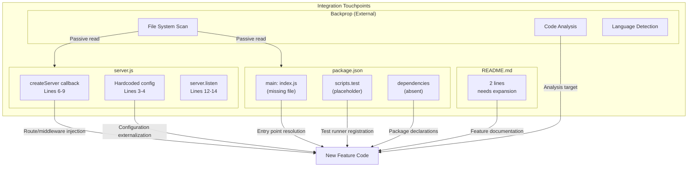

# Technical Specification

# 0. Agent Action Plan

## 0.1 Intent Clarification

### 0.1.1 Core Feature Objective

Based on the prompt, the Blitzy platform understands that the new feature requirement is to enhance and extend the existing "Hello World" Node.js server test project (`hao-backprop-test`) to strengthen its role as an integration test fixture for Backprop, a tool or service used for code analysis, refactoring, or AI-assisted development.

The platform interprets the following feature requirements from the user's input:

- **Test Project Context Preservation**: The codebase must remain a clearly designated test project, maintaining its explicit non-production stance as documented in `README.md` ("Do not touch!")
- **Backprop Integration Readiness**: The repository is structured to serve as a controlled environment where Backprop can exercise code analysis, refactoring detection, and AI-assisted development capabilities
- **Minimal Complexity Maintenance**: The Hello World server pattern (`server.js`) must preserve its intentionally simple architecture — a single-file, zero-dependency, localhost-only HTTP server using the Node.js built-in `http` module
- **Multi-Format Test Fixture Enhancement**: The existing test fixture file structure (JavaScript, Java stubs, CSV data, empty placeholders, duplicate "- Copy" files) supports Backprop's multi-format analysis capabilities and must be factored into any feature additions

Implicit requirements detected:

- Any new feature must not break the existing HTTP server behavior (status 200, `text/plain`, `Hello, World!\n` response on `127.0.0.1:3000`)
- The zero-dependency constraint (`package.json` declares no `dependencies` or `devDependencies`) must be respected unless the feature explicitly requires new packages
- The flat directory structure with no subdirectories is a deliberate architectural choice for test fixture simplicity
- The `package-lock.json` lockfileVersion 3 requires npm 7+ compatibility
- The `main` field in `package.json` points to `index.js`, which does not exist — any feature that creates this file should be aware of this entry point declaration

### 0.1.2 Special Instructions and Constraints

- **Repository Warning**: The `README.md` contains an explicit "Do not touch!" directive, indicating that the repository's baseline state is intentionally preserved for consistent integration testing. Any feature additions must be documented as controlled modifications that do not invalidate the test baseline
- **Architectural Pattern Requirement**: New feature code should follow the existing CommonJS module format (`require()` syntax) as established in `server.js`
- **Localhost-Only Networking**: Per constraint C-003, all network bindings must remain on `127.0.0.1` — no external network exposure is permitted
- **No Build System**: The project uses direct JavaScript interpretation with no transpilation, bundling, or compilation steps. New features must follow this pattern
- **Test Fixture Integrity**: The existing 12-file flat structure (including "- Copy" duplicate variants and intentionally non-compiling Java stubs) must remain intact as Backprop test specimens
- **No Specific Feature Directive Provided**: The user's input describes the project's purpose and context rather than specifying a discrete new feature. The action plan therefore covers the full repository assessment and readiness posture for any Backprop-related feature enhancement

### 0.1.3 Technical Interpretation

These feature requirements translate to the following technical implementation strategy:

- To **maintain the existing Hello World server**, we will preserve `server.js` in its current 14-line form using the built-in `http` module bound to `127.0.0.1:3000`
- To **support Backprop integration testing**, we will ensure all repository files remain accessible and parseable, including JavaScript source, Java stubs, CSV data, and placeholder text files
- To **extend feature capabilities**, we will identify integration points in the existing flat file structure where new modules, tests, or configuration files can be introduced without disrupting the test fixture baseline
- To **respect the zero-dependency architecture**, we will rely exclusively on Node.js built-in modules unless a feature explicitly demands external packages, in which case `package.json` and `package-lock.json` must be updated accordingly
- To **ensure test reproducibility**, any new files will follow the existing naming conventions and maintain the flat directory layout unless the feature scope justifies introducing subdirectories

## 0.2 Repository Scope Discovery

### 0.2.1 Comprehensive File Analysis

The repository follows a completely flat directory structure with no subdirectories. All 12 files reside at the repository root. The following table provides an exhaustive inventory of every file, its type, current purpose, and relevance to feature additions.

#### Complete Repository File Inventory

| File Path | Type | Language/Format | Size | Purpose | Feature Relevance |
|-----------|------|-----------------|------|---------|-------------------|
| `server.js` | Source | JavaScript (Node.js) | 14 lines | Primary HTTP server — responds with "Hello, World!" on 127.0.0.1:3000 | Core application; integration point for any server-side feature |
| `server - Copy.js` | Source (Duplicate) | JavaScript (Node.js) | 14 lines | Exact duplicate of `server.js` following "- Copy" naming convention | Test fixture for Backprop duplicate detection; do not modify |
| `package.json` | Configuration | JSON | 11 lines | npm manifest — name: "hello_world", version: 1.0.0, main: "index.js", no dependencies | Must be updated if new dependencies or scripts are introduced |
| `package-lock.json` | Lock File | JSON | 13 lines | npm lockfile (lockfileVersion 3) — captures empty dependency tree | Must be regenerated if dependencies change |
| `README.md` | Documentation | Markdown | 2 lines | Project name and "Do not touch!" warning | Should be updated to document any new features added |
| `LoginTest.java` | Test Stub | Java | 12 lines | Non-compiling Java stub (`com.blitzyTest` package) with invalid `Web` token | Test fixture for Backprop multi-language detection; do not modify |
| `LoginTest - Copy.java` | Test Stub (Duplicate) | Java | 12 lines | Exact duplicate of `LoginTest.java` | Test fixture for duplicate file detection; do not modify |
| `industry.csv` | Data | CSV | 44 rows | Single-column reference data with 43 industry labels plus header | Test fixture for Backprop data format handling; do not modify |
| `industry - Copy.csv` | Data (Duplicate) | CSV | 44 rows | Exact duplicate of `industry.csv` | Test fixture for duplicate file detection; do not modify |
| `test.py.txt` | Placeholder | Text | 0 bytes | Empty file for extension-handling testing | Test fixture for zero-content file handling; do not modify |
| `test.py - Copy.txt` | Placeholder (Duplicate) | Text | 0 bytes | Empty duplicate of `test.py.txt` | Test fixture; do not modify |
| `test.txt.txt` | Placeholder | Text | 0 bytes | Empty file for double-extension testing | Test fixture; do not modify |

#### Integration Point Discovery

- **HTTP Server (`server.js`)**: The single entry point for runtime behavior. Any feature involving route handling, middleware, request parsing, or response modification must integrate here. Currently uses `http.createServer()` with a single callback that sets status 200, header `Content-Type: text/plain`, and body `Hello, World!\n`
- **npm Manifest (`package.json`)**: The `main` field points to `index.js` (which does not exist). Any feature creating an entry point module should either create `index.js` or update this field. The `scripts.test` is a placeholder that echoes an error and exits with code 1 — a real test framework would replace this
- **Lock File (`package-lock.json`)**: Currently reflects zero dependencies. Will need regeneration via `npm install` after any dependency additions

#### Existing Code Patterns Observed

- **Module Format**: CommonJS (`const http = require('http')`)
- **Configuration Style**: Hardcoded constants (`hostname = '127.0.0.1'`, `port = 3000`)
- **Server Pattern**: Callback-based `http.createServer((req, res) => { ... })`
- **Logging**: Single `console.log` for startup confirmation
- **No Exports**: `server.js` does not export any modules — it is an executable script only

### 0.2.2 Web Search Research Conducted

No external web research was required for this analysis. The repository is self-contained with zero third-party dependencies, and all implementation patterns use standard Node.js built-in APIs that are well-documented. The project's simplicity and test fixture nature do not warrant best-practice research for framework selection, library comparison, or security audit tooling.

### 0.2.3 New File Requirements

Based on the current repository state and Backprop integration purpose, the following new files represent the logical additions for feature enhancement:

- **New source files to create:**
  - `index.js` — Resolve the `package.json` `main` field mismatch; serve as the canonical entry point that either re-exports or starts the server
  - `server.config.js` — Externalize hardcoded values (hostname, port) into a configuration module for flexibility during testing

- **New test files to create:**
  - `server.test.js` — Unit/integration tests for the HTTP server (replace placeholder `npm test` script); validate 200 status, `text/plain` header, and `Hello, World!\n` body

- **New configuration to create:**
  - `.env.example` — Document any environment variable overrides if configuration externalization is introduced

## 0.3 Dependency Inventory

### 0.3.1 Private and Public Packages

The repository currently operates under a strict zero-dependency architecture. No external npm packages are installed, and the `package-lock.json` confirms an empty dependency tree. The following table documents the current state of all dependencies.

#### Current Dependency Manifest (from `package.json`)

| Registry | Package Name | Version | Type | Purpose |
|----------|-------------|---------|------|---------|
| npm | `hello_world` (self) | 1.0.0 | Root package | Project identity; MIT licensed |
| Node.js built-in | `http` | Bundled with Node.js | Runtime built-in | HTTP server creation — the only module imported in `server.js` |

#### No External Dependencies

The `package.json` contains no `dependencies`, `devDependencies`, `peerDependencies`, or `optionalDependencies` blocks. This is verified by:

- `package.json` lines 1–11: No dependency fields exist
- `package-lock.json` lines 6–11: Only the root package entry (`""`) appears under `packages` with no child dependencies

#### Runtime and Tooling Requirements

| Requirement | Minimum Version | Source of Constraint | Installed Version |
|-------------|----------------|---------------------|-------------------|
| Node.js | Any version supporting CommonJS and built-in `http` module | `server.js` uses `require('http')` and `http.createServer` | v20.20.0 |
| npm | 7+ | `package-lock.json` lockfileVersion: 3 | 11.1.0 |

### 0.3.2 Dependency Updates

#### Import Updates

No import updates are currently required as the repository contains a single import statement:

- `server.js` line 1: `const http = require('http');`
- `server - Copy.js` line 1: `const http = require('http');` (identical duplicate)

If new features introduce modules, import updates would need to follow the established CommonJS pattern:

- Pattern: `const module = require('./module_name');`
- Apply to: Any new `*.js` files at the repository root

#### External Reference Updates

If dependencies are added as part of a feature, the following files require updates:

| File | Update Type | Trigger Condition |
|------|------------|-------------------|
| `package.json` | Add `dependencies` or `devDependencies` block | Any new npm package is required |
| `package-lock.json` | Regenerate via `npm install` | Any change to `package.json` dependencies |
| `README.md` | Add installation/setup instructions | New prerequisites introduced |

## 0.4 Integration Analysis

### 0.4.1 Existing Code Touchpoints

The repository has an extremely small surface area for integration. The following analysis maps every touchpoint where new feature code would need to connect.

#### Direct Modifications Required

| File | Integration Action | Location | Details |
|------|-------------------|----------|---------|
| `server.js` | Modify server callback | Lines 6–9 | To add routing, request parsing, middleware, or new response behavior, the `http.createServer` callback must be extended. Currently returns a static response for all requests |
| `server.js` | Externalize configuration | Lines 3–4 | Hardcoded `hostname` and `port` constants can be replaced with configurable values if environment-based settings are introduced |
| `package.json` | Register scripts | Line 7 | Replace the placeholder `test` script (`echo "Error: no test specified" && exit 1`) with a real test runner command |
| `package.json` | Add `start` script | After line 7 | No `start` script is defined; adding `"start": "node server.js"` would standardize the startup command |
| `package.json` | Fix `main` entry point | Line 5 | Currently points to `index.js` which does not exist; must be corrected to `server.js` or a new `index.js` must be created |
| `package.json` | Add dependency blocks | After line 10 | If any npm packages are introduced, `dependencies` and/or `devDependencies` blocks must be added |
| `package-lock.json` | Regenerate | Entire file | Must be regenerated via `npm install` whenever `package.json` dependencies change |
| `README.md` | Expand documentation | After line 2 | Currently only 2 lines; any new feature requires documentation of setup steps, usage, and purpose |

#### Backprop Integration Surface

The primary integration with Backprop is passive — Backprop reads the repository files from the filesystem. The following aspects are relevant to that integration:

| Integration Aspect | Current State | Impact of Changes |
|-------------------|---------------|-------------------|
| File Discovery | Flat directory, 12 files | Adding files increases the scan surface; adding subdirectories changes traversal behavior |
| Language Detection | JavaScript (`server.js`) + Java stubs (`LoginTest.java`) | New source files add more language specimens for analysis |
| Duplicate Detection | 5 "- Copy" variant files | The naming pattern must be preserved for existing fixtures |
| Content Analysis | Mix of functional code, invalid stubs, CSV data, and empty files | New files add new analysis categories |

#### Dependency Injections

No dependency injection framework exists in this project. The server is a self-contained script with no service container, no inversion-of-control, and no configurable providers. If a feature introduces service-style architecture, a dependency wiring mechanism would need to be created from scratch.

#### Database and Schema Updates

No database exists in this project. There are no models, migrations, schemas, or persistent storage of any kind. The `industry.csv` file is static reference data, not a database. If a feature requires data persistence, the entire data layer would need to be created as new infrastructure.

## 0.5 Technical Implementation

### 0.5.1 File-by-File Execution Plan

Every file listed below must be either created or modified to deliver the feature enhancements for Backprop integration readiness.

#### Group 1 — Core Application Files

| Action | File | Purpose |
|--------|------|---------|
| MODIFY | `server.js` | Preserve the existing HTTP server; potential integration point for new route handlers or middleware if the feature requires extending request handling beyond the static "Hello, World!" response |
| CREATE | `index.js` | Resolve the `package.json` `main` field mismatch — serve as the canonical entry point that imports and starts the server module. This file currently does not exist despite being declared as `"main": "index.js"` |

#### Group 2 — Configuration and Metadata Files

| Action | File | Purpose |
|--------|------|---------|
| MODIFY | `package.json` | Update the `scripts` block to replace the placeholder test command; add a `start` script (`node server.js`); add `dependencies`/`devDependencies` blocks if any npm packages are introduced |
| MODIFY | `package-lock.json` | Regenerate via `npm install` after any `package.json` dependency changes to maintain lockfile consistency |

#### Group 3 — Tests and Documentation

| Action | File | Purpose |
|--------|------|---------|
| CREATE | `server.test.js` | Implement test coverage for the HTTP server — verify response status (200), Content-Type header (`text/plain`), and body (`Hello, World!\n`); replaces the placeholder test script |
| MODIFY | `README.md` | Expand from 2 lines to include project overview, setup instructions, feature documentation, and run/test commands |

#### Files Explicitly Preserved (No Modification)

These files are test fixtures for Backprop's multi-format analysis and must not be altered:

| File | Preservation Reason |
|------|-------------------|
| `server - Copy.js` | Duplicate detection test specimen |
| `LoginTest.java` | Multi-language detection test specimen (non-compiling Java stub) |
| `LoginTest - Copy.java` | Duplicate detection test specimen (Java) |
| `industry.csv` | Data format handling test specimen |
| `industry - Copy.csv` | Duplicate detection test specimen (CSV) |
| `test.py.txt` | Zero-content file handling test specimen |
| `test.py - Copy.txt` | Zero-content duplicate test specimen |
| `test.txt.txt` | Double-extension handling test specimen |

### 0.5.2 Implementation Approach per File

The implementation follows a staged approach organized by dependency order:

- **Establish the entry point** by creating `index.js` to resolve the `package.json` `main` field discrepancy, ensuring Backprop and npm tooling can correctly resolve the project's module entry
- **Integrate with existing configuration** by modifying `package.json` to register proper `start` and `test` scripts, enabling standardized project lifecycle commands
- **Ensure quality** by creating `server.test.js` with assertions against the known server behavior (status 200, plain text content type, greeting body), replacing the error-exit placeholder
- **Document the project** by expanding `README.md` with setup instructions, available scripts, project structure, and Backprop integration notes
- **Regenerate the lockfile** by running `npm install` after any dependency modifications to `package.json`, keeping `package-lock.json` in sync

### 0.5.3 User Interface Design

Not applicable. This project is a backend-only Node.js HTTP server with no frontend, browser-based UI, CLI interface, or graphical components. The sole interaction model is HTTP request/response via tools such as `curl` or a browser pointed at `http://127.0.0.1:3000/`. No Figma URLs, design mockups, or UI specifications have been provided.

## 0.6 Scope Boundaries

### 0.6.1 Exhaustively In Scope

All files and paths that fall within the scope of this feature addition effort are listed below. Wildcard patterns are used where applicable.

#### Existing Files to Modify

| File Pattern | Specific Files | Scope of Change |
|-------------|----------------|-----------------|
| `server.js` | `server.js` | Server callback may be extended for new route or response handling; configuration constants may be externalized |
| `package.json` | `package.json` | Add `start` script, replace placeholder `test` script, add dependency blocks as needed, correct `main` field |
| `package-lock.json` | `package-lock.json` | Regenerate after any `package.json` dependency changes |
| `README.md` | `README.md` | Expand with setup instructions, project structure, feature documentation, and Backprop integration notes |

#### New Files to Create

| File Pattern | Specific Files | Purpose |
|-------------|----------------|---------|
| `index.js` | `index.js` | Canonical entry point resolving the `package.json` `main` field |
| `*.test.js` | `server.test.js` | Test coverage for HTTP server behavior |

#### Test Fixture Files (Read-Only — In Scope for Analysis, Not Modification)

| File Pattern | Files Covered | Analysis Purpose |
|-------------|---------------|-----------------|
| `server - Copy.js` | 1 file | Validate feature additions do not break duplicate detection |
| `LoginTest*.java` | `LoginTest.java`, `LoginTest - Copy.java` | Confirm multi-language fixture integrity |
| `industry*.csv` | `industry.csv`, `industry - Copy.csv` | Confirm data format fixture integrity |
| `test.py*.txt`, `test.txt*.txt` | `test.py.txt`, `test.py - Copy.txt`, `test.txt.txt` | Confirm placeholder fixture integrity |

#### Configuration and Environment

| Category | Items |
|----------|-------|
| Runtime | Node.js (any version supporting CommonJS + built-in `http` module); npm 7+ |
| Environment Variables | None currently; `.env.example` to be created if configuration externalization is introduced |
| CI/CD | Not applicable — no pipeline exists |

### 0.6.2 Explicitly Out of Scope

The following items are explicitly excluded from this feature addition:

| Exclusion | Rationale |
|-----------|-----------|
| Modification of "- Copy" variant files (`server - Copy.js`, `LoginTest - Copy.java`, `industry - Copy.csv`, `test.py - Copy.txt`) | These are Backprop duplicate detection test fixtures and must remain identical to their originals |
| Modification of Java stub files (`LoginTest.java`, `LoginTest - Copy.java`) | These are intentionally non-compiling multi-language test specimens |
| Modification of CSV data files (`industry.csv`, `industry - Copy.csv`) | These are static reference data for format testing |
| Modification of empty placeholder files (`test.py.txt`, `test.py - Copy.txt`, `test.txt.txt`) | These are zero-content file handling test specimens |
| Production deployment configuration (Docker, Kubernetes, cloud services) | Project is explicitly a test fixture, not a production application |
| HTTPS/TLS encryption | Localhost-only binding makes TLS unnecessary |
| Authentication and authorization | Internal test fixture requires no access control |
| Database integration | No persistent data storage is within scope |
| External API integrations | Isolated test environment by design |
| Frontend or UI components | No browser-based interface exists or is planned |
| Refactoring of existing `server.js` logic unrelated to feature integration | Baseline behavior must be preserved |
| Performance optimization beyond basic functional requirements | Test fixture does not require high-performance tuning |

## 0.7 Rules for Feature Addition

### 0.7.1 Feature-Specific Rules and Requirements

The following rules govern how features must be added to the `hao-backprop-test` repository. These rules are derived from the repository's documented constraints, its README directive, and the architectural patterns established in the existing codebase.

- **Test Fixture Integrity**: The repository serves as a controlled Backprop integration test fixture. Any feature addition must not invalidate existing test baselines. The 8 test fixture files (duplicates, Java stubs, CSV data, and empty placeholders) must remain byte-for-byte identical to their current state
- **"Do Not Touch" Compliance**: The `README.md` warning ("Do not touch!") applies to unauthorized changes. Feature additions must be documented as controlled, intentional modifications with clear justification
- **Zero-Dependency Default**: The project enforces a zero external dependency architecture (constraint C-002). If a feature absolutely requires an npm package, the justification must be explicit and the dependency must be added to both `package.json` and regenerated in `package-lock.json`
- **CommonJS Module Format**: All JavaScript files must use the CommonJS module system (`require()` / `module.exports`) consistent with `server.js` line 1: `const http = require('http');`
- **Localhost-Only Networking**: Per constraint C-003, all network bindings must use `127.0.0.1`. No `0.0.0.0` or external IP bindings are permitted
- **Flat Directory Preference**: The existing architecture uses a flat, root-level file layout with no subdirectories. New files should be placed at the root unless a compelling organizational reason justifies creating folders
- **Hardcoded Configuration Awareness**: The existing server uses hardcoded `hostname` and `port` values. If configuration externalization is introduced, it must provide backward-compatible defaults that preserve the current `127.0.0.1:3000` behavior
- **MIT License Compliance**: All new code must be compatible with the MIT license declared in `package.json` (constraint C-004)
- **No Error Handling by Design**: The existing server intentionally omits error handling to maintain predictable behavior for testing. New features should follow this pattern unless error handling is the explicit purpose of the feature
- **Duplicate File Pattern Preservation**: The "- Copy" naming convention is a deliberate test pattern for Backprop duplicate detection. New feature files should not use this suffix unless they are intentionally creating new test fixture specimens

## 0.8 References

### 0.8.1 Repository Files and Folders Searched

The following exhaustive list documents every file and folder inspected during the analysis to derive the conclusions in this Agent Action Plan.

#### Root Directory (Flat Structure — No Subdirectories)

| File Path | Inspected | Key Finding |
|-----------|-----------|-------------|
| `server.js` | Full content read (lines 1–14) | 14-line CommonJS HTTP server using built-in `http` module; binds to `127.0.0.1:3000`; returns static `Hello, World!\n` response |
| `server - Copy.js` | Full content read (lines 1–14) | Byte-for-byte duplicate of `server.js`; "- Copy" naming convention for Backprop duplicate detection testing |
| `package.json` | Full content read (lines 1–11) | npm manifest: name `hello_world`, version `1.0.0`, main `index.js` (missing file), MIT license, author `hxu`, zero dependencies, placeholder test script |
| `package-lock.json` | Full content read (lines 1–13) | lockfileVersion 3; empty dependency tree; confirms zero external packages |
| `README.md` | Full content read (lines 1–2) | Project name `hao-backprop-test`; explicit "Do not touch!" directive |
| `LoginTest.java` | Full content read (lines 1–12) | Java stub in `com.blitzyTest` package; contains invalid `Web` token; will not compile — intentional test fixture |
| `LoginTest - Copy.java` | Full content read (lines 1–12) | Exact duplicate of `LoginTest.java`; duplicate detection test specimen |
| `industry.csv` | Full content read (44 rows) | Single-column CSV with header "Industry" and 43 industry labels (e.g., Technology, Healthcare, Other) |
| `industry - Copy.csv` | Confirmed as duplicate of `industry.csv` | Duplicate detection test specimen |
| `test.py.txt` | Size verified: 0 bytes | Empty placeholder file for zero-content file handling testing |
| `test.py - Copy.txt` | Size verified: 0 bytes | Empty duplicate placeholder |
| `test.txt.txt` | Size verified: 0 bytes | Empty placeholder for double-extension testing |

#### Runtime Environment Verification

| Check | Result |
|-------|--------|
| Node.js version | v20.20.0 |
| npm version | 11.1.0 |
| `npm install` result | "up to date, audited 1 package, 0 vulnerabilities" |
| Server startup test | Confirmed: "Server running at http://127.0.0.1:3000/" |
| HTTP response test | Confirmed: `curl http://127.0.0.1:3000/` returns "Hello, World!" |

### 0.8.2 Technical Specification Sections Referenced

| Section | Key Information Extracted |
|---------|-------------------------|
| 1.1 Executive Summary | Project overview, stakeholders, repository purpose as Backprop test fixture |
| 1.3 Scope | In-scope/out-of-scope boundaries, file assets inventory, explicit exclusions |
| 2.1 Feature Catalog | Feature F-001 (HTTP Server) and F-002 (Test Fixture File Structure) definitions |
| 2.2 Functional Requirements | Requirements F-001-RQ-001 through F-002-RQ-004 with acceptance criteria |
| 2.4 Implementation Considerations | Technical constraints TC-001 through TC-005, performance targets, security implications |
| 2.7 Assumptions and Constraints | Assumptions A-001 through A-005, constraints C-001 through C-005 |
| 3.1 Programming Languages | JavaScript (Node.js) as primary language, Java stubs as secondary |
| 3.2 Frameworks & Libraries | Zero external frameworks; built-in `http` module only |
| 3.7 Technology Stack Summary | Complete technology inventory confirming zero-dependency architecture |
| 5.1 High-Level Architecture | Single-file monolithic architecture, system boundaries, data flow |
| 5.2 Component Details | HTTP server component responsibilities and interfaces |
| 6.1 Core Services Architecture | Not applicable documentation; single-component architecture confirmation |
| 8.6 CI/CD Pipeline | CI/CD explicitly excluded; placeholder test script analysis |

### 0.8.3 Attachments and External Resources

No attachments were provided for this project. No Figma URLs, design mockups, external API documentation, or supplementary files were included in the user's instructions.

| Resource Type | Status |
|---------------|--------|
| Figma designs | Not provided |
| API specifications | Not provided |
| Architectural diagrams | Not provided |
| External documentation links | Not provided |
| Environment files (`/tmp/environments_files`) | Directory exists but contains no files |

