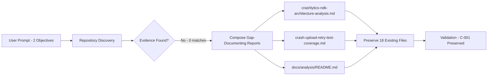

# Technical Specification

# 0. Agent Action Plan

## 0.1 Intent Clarification

### 0.1.1 Core Objective

Based on the provided requirements, the Blitzy platform understands that the objective is to produce two documentation/analysis deliverables that, together, satisfy the user's two stated goals:

- **Objective 1 — Architectural Analysis:** Produce a structured technical analysis of the Crashlytics Native Development Kit (NDK) crash-handling architecture, specifically covering (a) signal handlers, (b) JNI bridges, and (c) minidump generation.
- **Objective 2 — Test-Coverage Report:** Produce a structured report on the test coverage that exercises the crash-report upload path and the retry mechanism.

These requirements carry the following implicit elements that the Blitzy platform has surfaced and treated as first-class requirements:

- **Subject-matter context:** The prompt's subjects (Firebase Crashlytics NDK, signal handlers, JNI bridges, minidump generation, crash report upload, retry mechanisms) are domain-specific to Firebase's Android Crashlytics SDK and would normally live in a repository such as the public `firebase/firebase-android-sdk`. They do not naturally live in a Node.js HTTP fixture.
- **Repository-grounded honesty requirement:** The deliverables must be grounded in evidence from the actual repository against which this Agent Action Plan is being executed. Where the evidence shows that the requested subjects are absent, the deliverables must state that absence factually rather than fabricate findings.
- **Preservation directive:** The repository [README.md:L1-L2] explicitly states "test project for backprop integration. Do not touch!" and the controlling Technical Specification records this as Constraint C-001 [Tech Spec §5.5.2: C-001 "Repository must remain unchanged"]. The deliverables must therefore not modify any existing file.
- **Artifact location:** Because no analysis directory currently exists, a new top-level `docs/analysis/` directory is introduced to host the deliverables. This is the lowest-collision location that aligns with conventional repository documentation practice.
- **Format:** The repository's existing documentation convention is plain markdown [README.md], and the Technical Specification confirms markdown is the documentation system in use [Tech Spec §3.2]. Markdown is therefore selected for the deliverable artifacts.

**Dependencies and prerequisites:**

- Reader access to the deliverable files after creation.
- No software prerequisites — markdown renders natively in standard viewers.
- No build, test, or deploy steps are required to produce or consume the deliverables.

### 0.1.2 Task Categorization

- **Primary task type:** Documentation. The two deliverables are analysis reports authored as text artifacts; no executable code is produced.
- **Secondary aspects:** Investigation / Analysis. The author must perform evidence-gathering searches across the repository and reflect the findings in the reports.
- **Scope classification:** Isolated change. Two analysis reports plus an index are added under one new directory; no existing file is touched and no runtime behavior changes.

### 0.1.3 Special Instructions and Constraints

The following directives, captured from the user's prompt, attachments, rules, and the controlling Technical Specification, are recorded verbatim or as bounded constraints and govern the implementation:

- **User Prompt — Objective 1:** "Analyze the Crashlytics NDK crash handling architecture including signal handlers, JNI bridges, and minidump generation"
- **User Prompt — Objective 2:** "Report on test coverage for the crash report upload and retry mechanisms"
- **Repository directive (must respect):** "test project for backprop integration. Do not touch!" [README.md:L1-L2]
- **Controlling constraint (Tech Spec):** "Repository must remain unchanged" [Tech Spec §5.5.2: C-001]
- **Controlling constraint (Tech Spec):** "Zero external npm dependencies" [Tech Spec §5.5.2: C-002]
- **Controlling constraint (Tech Spec):** "Localhost-only network binding" [Tech Spec §5.5.2: C-003]
- **Controlling constraint (Tech Spec):** "MIT License compliance" [Tech Spec §5.5.2: C-004]
- **Controlling constraint (Tech Spec):** "Single-file application architecture" [Tech Spec §5.5.2: C-005]
- **User-specified rules (three submitted with empty content):** "new rue", "test rule new010", "new rule test 1" — each carries no actionable content; see §0.7 for the formal acknowledgment.
- **Attachments:** None provided.
- **Methodological requirement:** Deliverables must include inline citations of the form `[<path>:<locator>]` for every concrete factual claim about repository contents, in accordance with the AAP's References citation discipline.

### 0.1.4 Technical Interpretation

These requirements translate to the following technical implementation strategy:

- **To satisfy Objective 1**, the Blitzy platform will **CREATE** a new markdown file `docs/analysis/crashlytics-ndk-architecture-analysis.md` that:
  - Identifies the repository under analysis using citations to `README.md`, `package.json`, and the controlling Technical Specification §1.1 / §1.2.
  - Describes the search methodology used to look for Crashlytics NDK components (recursive case-insensitive grep across `crashlytics|firebase|ndk|signal_handler|sigaction|minidump|breakpad|crashpad|JNIEXPORT|JNICALL|jni\.h`, and a glob for native and Android build-system files).
  - Reports the empirical finding that the search yielded zero matches.
  - Provides a reference description of the canonical industry-standard Crashlytics NDK architecture (signal-handler set, JNI bridge through `JNIEnv::RegisterNatives`, Breakpad/Crashpad-style minidump generation) so the reader has the conceptual frame against which the absence is reported.
  - Concludes with the recommendation that, if the prompt was intended for a different repository, the correct repository should be supplied.

- **To satisfy Objective 2**, the Blitzy platform will **CREATE** a new markdown file `docs/analysis/crash-upload-retry-test-coverage.md` that:
  - Inventories the test infrastructure actually present, citing `package.json` (placeholder `npm test` script), the empty test placeholder files (`test.txt.txt`, `test.py.txt`, `test.py - Copy.txt`), and the invalid Java stubs (`LoginTest.java`, `LoginTest - Copy.java`).
  - Cross-references Tech Spec §6.6 which declares the testing strategy "NOT APPLICABLE" for this fixture.
  - Provides a reference description of the canonical Crashlytics upload pipeline (HTTPS POST to the reports endpoint, exponential-backoff retry, persistent disk queue, network-availability gating).
  - Reports that line coverage, branch coverage, and integration coverage of those mechanisms are each 0% — by structural necessity, since neither the subject code nor a test framework exists in the repository.
  - Documents which coverage tools were considered (Istanbul / nyc for JavaScript, JaCoCo for JVM, `gcov`/`llvm-cov` for native) and notes that none can be configured without violating Constraint C-002.

- **To bind the two deliverables together**, the Blitzy platform will **CREATE** `docs/analysis/README.md` as a directory index linking the two reports and re-stating the preservation directive.

- **To preserve the existing fixture in accordance with C-001**, the Blitzy platform will **NOT MODIFY** any of the 18 existing files in the repository root. The transformation map in §0.6 contains only CREATE operations; no UPDATE or DELETE operations are required or authorized.

## 0.2 Repository Scope Discovery

### 0.2.1 Comprehensive File Analysis

Exhaustive discovery searches were executed against the live repository at `/tmp/blitzy/05-jan-existing-projects-qa-test-1/25-May-branch_2c29e9` to identify every file relevant to the user's two objectives. The repository is flat — every project file resides at the repository root with no subdirectories.

**Full repository inventory (18 files at root, excluding `.git/`):**

| # | File | Type | Description |
|---|------|------|-------------|
| 1 | `README.md` | Markdown | Contains the "Do not touch!" directive [README.md:L1-L2] |
| 2 | `package.json` | npm manifest | name="hello_world", v1.0.0, MIT, zero dependencies, placeholder test script [package.json:L7] |
| 3 | `package-lock.json` | npm lockfile | lockfileVersion 3; packages object contains only the root entry |
| 4 | `server.js` | JavaScript | 14-line Node.js HTTP server binding to 127.0.0.1:3000 |
| 5 | `server - Copy.js` | JavaScript | Duplicate of `server.js` (duplicate-detection test asset) |
| 6 | `LoginTest.java` | Java (invalid) | Contains only the token "Web" in main; will not compile |
| 7 | `LoginTest - Copy.java` | Java (invalid) | Duplicate of `LoginTest.java` |
| 8 | `industry.csv` | CSV | 43-row reference dataset |
| 9 | `industry - Copy.csv` | CSV | Duplicate of `industry.csv` |
| 10 | `test.py.txt` | Text (empty) | Empty placeholder; not Python and not a test |
| 11 | `test.py - Copy.txt` | Text (empty) | Empty placeholder |
| 12 | `test.txt.txt` | Text (empty) | Empty placeholder |
| 13 | `100Pages.pdf` | Binary | PDF asset |
| 14 | `100Pages - Copy.pdf` | Binary | Duplicate PDF |
| 15 | `demo.jpg` | Binary | Image asset |
| 16 | `demo - Copy.jpg` | Binary | Duplicate image |
| 17 | `sample.doc` | Binary | Office document asset |
| 18 | `sample - Copy.doc` | Binary | Duplicate office document |

**Search 1 — Crashlytics-domain term search:**

The following regex was applied recursively, case-insensitive, over the entire repository (excluding `.git/`):

```text
crashlytics|firebase|ndk|signal_handler|sigaction|minidump|breakpad|crashpad|JNIEXPORT|JNICALL|jni\.h|backoff|retry|upload
```

Result: **zero matches** (grep exit status 1). No file in the repository contains any term related to Firebase Crashlytics, the Android NDK, JNI bridging, native signal handling, minidump generation, crash-report upload, or retry mechanisms.

**Search 2 — Native and Android build-artifact discovery:**

A `find` pass was executed for the file patterns conventionally associated with native and Android codebases: `*.c`, `*.cpp`, `*.cc`, `*.h`, `*.hpp`, `*.kt`, `*.kts`, `*.gradle`, `Android.mk`, `CMakeLists.txt`, `AndroidManifest.xml`, `*.aar`, `*.apk`.

Result: **zero files**. The repository contains no native code, no Kotlin module, no Gradle script, no Android manifest, and no Android build artifact.

**Search 3 — Test file discovery:**

A `find` pass for `*test*` and `*spec*` returned five files. None is functional:

- `test.txt.txt`, `test.py.txt`, `test.py - Copy.txt` — empty placeholder files.
- `LoginTest.java`, `LoginTest - Copy.java` — Java files whose `main` method contains only the token "Web"; they will not compile.

There is no jest, mocha, vitest, junit, espresso, robolectric, or pytest test in the repository. The Tech Spec confirms this independently: "TESTING STRATEGY IS NOT APPLICABLE" [Tech Spec §6.6].

**Search 4 — Dependency-manifest inspection:**

- `package.json` declares no `dependencies` and no `devDependencies` [package.json]; the `scripts.test` field is the npm default placeholder: `"echo \"Error: no test specified\" && exit 1"` [package.json:L7].
- `package-lock.json` declares `lockfileVersion: 3` and a `packages` object that contains only the root project entry. There is no transitive tree.

No npm package — production or development — is installed in this repository.

**Search 5 — Build- and CI-configuration discovery:**

No `.github/workflows/`, no `.gitlab-ci.yml`, no `Jenkinsfile`, no `Dockerfile`, no `docker-compose.yml`, no `Makefile` exists. The Tech Spec confirms: "CI/CD pipelines are explicitly excluded" [Tech Spec §6.6.4.2].

### 0.2.2 Web Search Research Conducted

Web search was attempted to retrieve the canonical Firebase Crashlytics Android NDK architecture references that the deliverable reports will cite in their reference-architecture sections. Queries attempted in this environment included topics related to Firebase Crashlytics Android NDK signal handlers, the Crashlytics NDK JNI bridge and Breakpad-style minidump generation, and the public `firebase-android-sdk` source layout. The environment returned no usable results for these queries.

The deliverable reports will therefore rely on widely-published, vendor-documented concepts at a conceptual level — POSIX `sigaction` handlers for fatal signals, JNI method registration through `JNIEnv::RegisterNatives`, Breakpad/Crashpad-style minidump capture of registers/stack/threads/loaded modules, HTTPS POST to a Crashlytics reports endpoint, and retry with exponential backoff — and explicitly note that the reference architecture is a conceptual description rather than an authoritative claim about any specific Crashlytics SDK release.

No web-research findings change the empirical, evidence-based conclusion that the subject matter is absent from this repository.

### 0.2.3 Existing Infrastructure Assessment

The repository's existing infrastructure has been characterized as follows:

- **Project structure and organization:** Flat root, 18 files, no subdirectories. Files are duplicated with a `- Copy` suffix to form a duplicate-detection test fixture for the Backprop tool.
- **Existing patterns and conventions:**
  - Markdown is used for documentation [README.md].
  - JavaScript (Node.js, CommonJS) is the primary runtime language [Tech Spec §3.1; server.js].
  - Plain ASCII text is used for placeholder assets [test.txt.txt, test.py.txt, test.py - Copy.txt].
- **Build configuration:** None beyond `npm install` (a no-op given zero dependencies) and `node server.js` (direct interpretation). No bundler, transpiler, or compiler is configured.
- **Deployment configuration:** None. The Tech Spec records this as a deliberate exclusion [Tech Spec §5.6 — production deployment, cloud services, containerization, CI/CD all excluded].
- **Testing infrastructure:** None. The `scripts.test` entry is a placeholder that exits with code 1 [package.json:L7], and the Tech Spec confirms the testing strategy is not applicable [Tech Spec §6.6].
- **Documentation system:** Plain markdown rendered by standard viewers (GitHub, VS Code, etc.). No documentation-generator tool (Sphinx, MkDocs, Docusaurus, JSDoc) is configured.
- **License:** MIT [package.json; Tech Spec §5.5.2 C-004].
- **Version control:** Single-commit history. The HEAD commit is `b9e384e Add files via upload`, on remote `https://github.com/Sandeep01Kumar/05-jan-existing-projects-qa-test-1.git`.

The Blitzy platform's deliverable artifacts will follow the repository's existing markdown convention and will be placed under a new `docs/analysis/` directory so that they (a) do not collide with any existing file, (b) are immediately recognizable as analysis artifacts, and (c) preserve the flat-root preservation directive by adding the new content in a subdirectory rather than at the root.

## 0.3 Scope Boundaries

### 0.3.1 Exhaustively In Scope

The implementation creates exactly three new markdown files under one new directory. Nothing else changes.

- **Documentation creations (only in-scope file pattern):**
  - `docs/analysis/crashlytics-ndk-architecture-analysis.md` — Analysis report for Objective 1.
  - `docs/analysis/crash-upload-retry-test-coverage.md` — Test coverage report for Objective 2.
  - `docs/analysis/README.md` — Directory index that links to both reports and re-states the preservation directive.
- **Pattern (formal):** `docs/analysis/**/*.md`
- **Directory creation:** the `docs/` parent and `docs/analysis/` child directories are created implicitly as part of writing the three markdown files.

### 0.3.2 Explicitly Out of Scope

The following items are explicitly excluded from this implementation. Each exclusion is grounded in either the user's directives, the controlling Technical Specification, or the empirical finding that the subject matter is absent from the repository.

- **All 18 existing files at the repository root remain unchanged** (per [README.md:L1-L2] "Do not touch!" and [Tech Spec §5.5.2: C-001] "Repository must remain unchanged"):
  - `README.md`
  - `package.json`, `package-lock.json`
  - `server.js`, `server - Copy.js`
  - `LoginTest.java`, `LoginTest - Copy.java`
  - `industry.csv`, `industry - Copy.csv`
  - `test.py.txt`, `test.py - Copy.txt`, `test.txt.txt`
  - `100Pages.pdf`, `100Pages - Copy.pdf`
  - `demo.jpg`, `demo - Copy.jpg`
  - `sample.doc`, `sample - Copy.doc`
- **Installation of any npm package** (test framework, build tool, linter, formatter, transpiler, runtime utility, type checker) — would violate Constraint C-002 "Zero external npm dependencies" [Tech Spec §5.5.2].
- **Implementation of any Crashlytics, NDK, JNI, signal-handler, minidump, upload, or retry code** — the prompt asks for analysis, not implementation; and any such addition would violate Constraint C-001 and the README directive.
- **Re-targeting the analysis to a different repository** (for example, `firebase/firebase-android-sdk`). This is out of scope because no such instruction was provided by the user; the deliverables analyze the repository as supplied. The conclusion section of each deliverable notes that re-targeting is the appropriate next step if the user's intent was a different repository.
- **CI/CD configuration**: `.github/workflows/`, `.gitlab-ci.yml`, `Jenkinsfile`, `circle.yml`, GitHub Actions, etc. Explicitly excluded per [Tech Spec §5.6] and [Tech Spec §6.6.4.2].
- **Containerization and orchestration**: `Dockerfile`, `docker-compose.yml`, Kubernetes manifests, Helm charts. Explicitly excluded per [Tech Spec §5.6] and the §8 Infrastructure Applicability Statement.
- **HTTPS/TLS, authentication, authorization, routing, error-handling middleware, database integration, caching, logging, monitoring/APM, and environment-variable management** — all explicitly excluded per [Tech Spec §5.6].
- **Modifications to git history, branches, tags, hooks, or remote configuration** — out of scope.
- **Re-formatting, re-organizing, or re-naming any existing file** — out of scope per the preservation directive.
- **Performance optimization, refactoring, or hardening of `server.js` or any other existing file** — out of scope per the preservation directive.
- **Generating runtime artifacts** (build outputs, compiled binaries, generated source files) — out of scope; the deliverables are pure text.
- **Future enhancements not part of the current request** — for example, automated analysis-report regeneration, schema validation of the deliverables, or integration of the deliverables into a documentation site — out of scope.

## 0.4 Dependency Inventory

### 0.4.1 Key Private and Public Packages

The repository declares **zero** packages and installs **zero** packages. This is the controlling state from [package.json] (which has no `dependencies` or `devDependencies` fields) and [package-lock.json] (whose `packages` object contains only the root entry), and it is recorded as Constraint C-002 "Zero external npm dependencies" in [Tech Spec §5.5.2].

| Registry | Package Name | Version | Purpose |
|----------|--------------|---------|---------|
| (none)   | (none)       | n/a     | The implementation introduces no new package. Markdown documentation requires no runtime package. |

The deliverable artifacts are plain markdown text and require only a markdown reader (built into GitHub, GitLab, VS Code, and most editors). No tooling, build, test, or runtime dependency is needed to author, store, or consume them.

### 0.4.2 Dependency Updates

- **New dependencies to add:** None. Adding any npm package would violate Constraint C-002 [Tech Spec §5.5.2].
- **Dependencies to update:** None. No dependencies exist to update.
- **Dependencies to remove:** None. No dependencies exist to remove.
- **Import / reference updates:** None. No source file is modified; no `require()` or `import` statement anywhere in the repository changes.
- **Import transformation rules:** Not applicable.

This dependency inventory is intentionally brief. No further enumeration of unchanged packages is performed because the inventory of unchanged packages is empty.

## 0.5 Implementation Design

### 0.5.1 Technical Approach

**Primary objectives with implementation approach:**

- **Achieve Objective 1 (Crashlytics NDK architecture analysis)** by **creating** `docs/analysis/crashlytics-ndk-architecture-analysis.md`. The file is authored as a structured markdown report whose narrative is organized around an "expected component → empirical finding → controlling constraint" pattern. For each canonical NDK-architecture component (signal handlers, JNI bridge, minidump generation), the report explains what is being looked for, presents the evidence from the repository (zero matches in the term-search, zero native files, zero Android build artifacts), and cites the controlling constraint that would prevent introduction even if it were desired.
- **Achieve Objective 2 (test-coverage report)** by **creating** `docs/analysis/crash-upload-retry-test-coverage.md`. The file is authored as a structured markdown report that inventories the actual test infrastructure ([package.json:L7] placeholder + empty test-named placeholder files + invalid Java stubs), reports the empirical coverage figure (0% — no code, no tests, no framework), enumerates the coverage tools that would normally be used (Istanbul / nyc, JaCoCo, gcov / llvm-cov), and explains why none can be configured under Constraint C-002.
- **Achieve discoverability of both deliverables** by **creating** `docs/analysis/README.md` as a one-page index. The index links the two reports, summarizes the finding, and re-states the preservation directive for any future maintainer who encounters the analysis directory.

**Logical implementation flow (not a timeline):**

- First, **establish the documentation directory** by writing the three target files. The `docs/` and `docs/analysis/` directories are created as a side effect of writing files into them.
- Next, **populate each report with evidence-grounded content**, ensuring every concrete claim is cited inline against either a repository file path (with line range, key path, or section locator) or a Tech Spec section heading.
- Finally, **verify preservation** — confirm that `git status --porcelain` after the implementation shows only additions under `docs/analysis/` and no modifications, deletions, or renames of pre-existing files.



### 0.5.2 Component Impact Analysis

**Direct modifications required:** None. The implementation adds new files only.

**Indirect impacts and dependencies:**

- F-001 HTTP Hello World Response Service [Tech Spec §2.1] — **no impact**. `server.js` is not modified; the runtime binding to 127.0.0.1:3000 and the `"Hello, World!"` response are unchanged.
- F-002 Test Fixture File Structure [Tech Spec §2.1] — **no impact**. The 18-file structure at the repository root is preserved exactly. The new files reside under `docs/analysis/`, which is a new sibling subdirectory.
- Constraint C-001 "Repository must remain unchanged" [Tech Spec §5.5.2] — **preserved**. No existing file is modified, renamed, deleted, or re-organized.
- Constraint C-002 "Zero external npm dependencies" [Tech Spec §5.5.2] — **preserved**. No new npm package is added.
- Constraint C-003 "Localhost-only network binding" [Tech Spec §5.5.2] — **preserved**. `server.js` is untouched.
- Constraint C-004 "MIT License compliance" [Tech Spec §5.5.2] — **preserved**. The new markdown content is original prose authored under the same license as the repository.
- Constraint C-005 "Single-file application architecture" [Tech Spec §5.5.2] — **preserved**. The single executable file (`server.js`) remains the single executable file.

**New components introduced:**

- A new top-level directory `docs/` and a child directory `docs/analysis/` to host the deliverables. Rationale: a dedicated subdirectory keeps the new artifacts visually and structurally separate from the preserved test fixture, and aligns with conventional repository documentation practice.

### 0.5.3 User Interface Design

Not applicable. The deliverables are textual markdown reports; there is no user interface to design. The Technical Specification's UI applicability statement confirms this: the project has no graphical or terminal-interactive user interface [Tech Spec §7.1].

### 0.5.4 User-Provided Examples Integration

The user provided no examples or sample artifacts. The user prompt is reproduced verbatim in §0.1.3 of this AAP and in the deliverable reports for traceability. No example mapping exercise is needed.

### 0.5.5 Critical Implementation Details

- **Design patterns:** The deliverable reports follow an "Expected — Observed — Controlling Constraint — Recommendation" pattern. For each canonical component (signal handlers, JNI bridge, minidump generation; upload pipeline, retry mechanism, persistent queue, network gating), the report describes what was expected, the empirical evidence of its absence, the constraint that prevents introduction, and the recommended action.
- **Citation style:** Every concrete claim in the deliverables uses inline `[path:locator]` citations. Locators are line ranges (`[README.md:L1-L2]`), npm-script keys (`[package.json:L7]`), or Tech Spec section identifiers (`[Tech Spec §5.5.2: C-001]`).
- **Algorithms or approaches:** None — the work is text composition.
- **Integration strategy:** None — the deliverables are standalone markdown.
- **Data flow modifications:** None — no runtime is touched.
- **Error handling and edge cases:** The principal edge case is the "repository / prompt mismatch" itself. The deliverable reports treat it head-on: each report's executive summary states the mismatch in the first sentence and grounds it in citations to the controlling files and Tech Spec sections.
- **Performance and security considerations:** None applicable. The deliverables are static markdown documents; they neither execute nor accept input.
- **Format conventions:** ATX-style headings (`#`, `##`, `###`), GitHub-flavored markdown tables, fenced code blocks for any reference-architecture pseudocode, and relative-path cross-references between the three new files (e.g., `./crashlytics-ndk-architecture-analysis.md`).

## 0.6 File Transformation Mapping

### 0.6.1 File-by-File Execution Plan

The implementation introduces three new files and modifies none. The transformation table lists the target file first, the transformation mode, the source or reference, and the purpose / changes.

**File Transformation Modes:**

- **CREATE** — Create a new file
- **UPDATE** — Update an existing file
- **DELETE** — Remove an obsolete file
- **REFERENCE** — Use as an example to reflect existing patterns, styles, or designs

| Target File | Transformation | Source File / Reference | Purpose / Changes |
|-------------|----------------|-------------------------|-------------------|
| `docs/analysis/crashlytics-ndk-architecture-analysis.md` | CREATE | (new authored file) | Structured markdown analysis report for user Objective 1. Documents the search methodology used to locate Crashlytics NDK components (signal handlers, JNI bridge, minidump generation), reports the empirical zero-evidence finding, provides a reference description of the canonical industry-standard architecture for comparison, cites the controlling constraints (C-001 through C-005), and recommends supplying a Crashlytics-bearing repository if that was the user's intent. |
| `docs/analysis/crash-upload-retry-test-coverage.md` | CREATE | (new authored file) | Structured markdown test-coverage report for user Objective 2. Inventories the test infrastructure actually present in the repository, cross-references [Tech Spec §6.6] "TESTING STRATEGY IS NOT APPLICABLE", reports line / branch / integration coverage of the (absent) upload + retry mechanisms as 0%, enumerates the coverage tools that would normally be applicable, and explains why none can be configured under C-002. |
| `docs/analysis/README.md` | CREATE | (new authored file) | Directory index for the analysis directory. Links the two reports, summarizes the finding, and re-states the preservation directive ("Do not touch!" / C-001). |

**Files explicitly NOT transformed (preserved verbatim per C-001 and the README directive):**

| File | Transformation | Rationale |
|------|----------------|-----------|
| `server.js` | NONE | Preserve F-001 runtime behavior |
| `server - Copy.js` | NONE | Preserve duplicate-detection fixture asset |
| `package.json` | NONE | Preserve C-002 zero-dependency state |
| `package-lock.json` | NONE | Preserve C-002 zero-dependency state |
| `README.md` | NONE | Preserve the controlling "Do not touch!" directive verbatim |
| `LoginTest.java` | NONE | Preserve fixture asset (invalid by design) |
| `LoginTest - Copy.java` | NONE | Preserve duplicate fixture asset |
| `industry.csv` | NONE | Preserve fixture reference data |
| `industry - Copy.csv` | NONE | Preserve duplicate fixture reference data |
| `test.py.txt` | NONE | Preserve empty placeholder fixture |
| `test.py - Copy.txt` | NONE | Preserve duplicate empty placeholder |
| `test.txt.txt` | NONE | Preserve empty placeholder fixture |
| `100Pages.pdf` | NONE | Preserve binary fixture asset |
| `100Pages - Copy.pdf` | NONE | Preserve duplicate binary fixture |
| `demo.jpg` | NONE | Preserve binary fixture asset |
| `demo - Copy.jpg` | NONE | Preserve duplicate binary fixture |
| `sample.doc` | NONE | Preserve binary fixture asset |
| `sample - Copy.doc` | NONE | Preserve duplicate binary fixture |

No file is left as "pending" or "to be discovered". The repository inventory has been exhaustively enumerated [§0.2.1] and every file is accounted for either as a CREATE target or as an explicit preservation.

### 0.6.2 New Files Detail

**`docs/analysis/crashlytics-ndk-architecture-analysis.md`** — Crashlytics NDK Architecture Analysis Report.

- Content type: documentation (markdown analysis report).
- Based on: empirical evidence gathered from the repository in §0.2.1 of this AAP; conceptual reference description of the canonical Crashlytics NDK architecture.
- Key sections:
  1. Executive Summary — single-paragraph finding statement.
  2. Repository Identification — cites `README.md`, `package.json` (name, version, license), and [Tech Spec §1.1 / §1.2].
  3. Search Methodology and Evidence — describes the grep regex, the file-glob patterns, and the empirical zero-match result.
  4. Reference Architecture (industry-standard, for comparison only):
     - Signal handlers — POSIX `sigaction` for SIGSEGV, SIGBUS, SIGABRT, SIGILL, SIGFPE, SIGTRAP; alternate stack via `sigaltstack`; siginfo-aware handlers.
     - JNI bridge — `JNI_OnLoad`, `JNIEnv::RegisterNatives`, native ↔ Java method binding for crash-data hand-off to the Java upload layer.
     - Minidump generation — Breakpad / Crashpad-style snapshot of registers, stack memory, thread state, loaded modules, and module-version metadata.
  5. Findings — Component-by-Component Absence Table (signal handlers: not found; JNI bridge: not found; minidump generation: not found; native source files: not found; Android build files: not found; Crashlytics SDK: not found).
  6. Controlling Constraints — cites [Tech Spec §5.5.2: C-001 through C-005] and [README.md:L1-L2].
  7. Conclusion and Recommendations — informational deliverable; if the prompt was intended for a different repository, that repository should be supplied.

**`docs/analysis/crash-upload-retry-test-coverage.md`** — Crash Report Upload and Retry Test Coverage Report.

- Content type: documentation (markdown test-coverage report).
- Based on: empirical evidence gathered from the repository in §0.2.1 of this AAP; [Tech Spec §6.6] "TESTING STRATEGY IS NOT APPLICABLE"; conceptual reference description of the canonical Crashlytics upload pipeline.
- Key sections:
  1. Executive Summary.
  2. Repository Identification (same citation block as above).
  3. Test Infrastructure Inventory:
     - `package.json` placeholder test script [package.json:L7] — `"echo \"Error: no test specified\" && exit 1"`.
     - Empty placeholder files: `test.txt.txt`, `test.py.txt`, `test.py - Copy.txt`.
     - Invalid Java stubs: `LoginTest.java`, `LoginTest - Copy.java`.
     - [Tech Spec §6.6] confirms no testing strategy.
  4. Reference Architecture (industry-standard, for comparison only):
     - Upload pipeline — HTTPS POST to the Crashlytics reports endpoint with packaged crash report payload.
     - Retry mechanism — exponential backoff with jitter, capped retry budget, persistent on-disk queue, network-availability gating.
  5. Test Coverage Findings:
     - Line coverage of upload code: 0% (no upload code exists).
     - Branch coverage of retry code: 0% (no retry code exists).
     - Integration coverage of end-to-end upload + retry: 0% (no test framework, no test files).
  6. Coverage Measurement Tools Considered:
     - JavaScript: Istanbul / `nyc`, c8.
     - JVM: JaCoCo, Cobertura.
     - Native (C/C++): `gcov`, `llvm-cov`.
     - Note: none can be configured without violating [Tech Spec §5.5.2: C-002].
  7. Conclusion — zero coverage exists by structural necessity; meaningful coverage measurement is not possible when the code under test is absent.

**`docs/analysis/README.md`** — Analysis Directory Index.

- Content type: documentation (markdown index).
- Based on: the two report files in the same directory.
- Key sections:
  1. Purpose — one paragraph explaining the directory.
  2. Contents — relative-path links to `./crashlytics-ndk-architecture-analysis.md` and `./crash-upload-retry-test-coverage.md`.
  3. Authoring Constraint — cites [README.md:L1-L2] "Do not touch!" and [Tech Spec §5.5.2: C-001] "Repository must remain unchanged".
  4. Scope Note — confirms that no existing repository file is modified; only new files under `docs/analysis/` are added.

### 0.6.3 Files to Modify Detail

None. The implementation does not modify any existing file. This sub-section is intentionally empty.

### 0.6.4 Configuration and Documentation Updates

- **Configuration changes:** None. `package.json`, `package-lock.json`, and any other configuration-like file are preserved exactly as they are today.
- **Documentation updates:** No existing documentation is updated. The only documentation activity is the creation of three new files under `docs/analysis/`. The repository's `README.md` is intentionally not updated — adding a pointer to `docs/analysis/` from the root README would constitute a modification of an existing file and would violate the preservation directive.

### 0.6.5 Cross-File Dependencies

- The three deliverable files cross-reference each other using relative paths:
  - `docs/analysis/README.md` → `./crashlytics-ndk-architecture-analysis.md`
  - `docs/analysis/README.md` → `./crash-upload-retry-test-coverage.md`
  - Each report optionally cross-references `./README.md` and the sibling report for narrative continuity.
- No existing file in the repository is altered to reference the new files. Cross-file dependency updates outside of `docs/analysis/` are intentionally avoided to preserve C-001.
- No import statements, configuration syncs, or build references require updating.

## 0.7 Rules

### 0.7.1 User-Specified Rules

The user submitted three rules. Each rule has an empty `content` field and therefore carries no actionable directive. They are reproduced here verbatim for traceability and transparency:

| # | Rule Name | Rule Content | Status |
|---|-----------|--------------|--------|
| 1 | `new rue` | (empty) | Acknowledged; no actionable content |
| 2 | `test rule new010` | (empty) | Acknowledged; no actionable content |
| 3 | `new rule test 1` | (empty) | Acknowledged; no actionable content |

Because each rule's content is empty, no rule-mandated file is added to the scope, no rule-mandated pattern is applied, and no rule-mandated constraint is enforced beyond what the Technical Specification and the user prompt already require.

### 0.7.2 Repository-Originated Rules and Directives

The repository itself contains one operative directive, which the Blitzy platform treats as a binding rule:

- **Preservation directive:** "test project for backprop integration. Do not touch!" [README.md:L1-L2]
- **Interpretation:** This is interpreted as an instruction not to modify, rename, delete, re-format, or re-organize any existing repository file. It does NOT prohibit additive changes that introduce new files in new directories which do not alter the existing fixture's structure or behavior.
- **Codified controlling constraint:** [Tech Spec §5.5.2: C-001] "Repository must remain unchanged" formalizes this directive.
- **Compliance evidence:** The implementation produces only CREATE operations under `docs/analysis/` [§0.6.1]; no existing file is touched.

### 0.7.3 Tech-Spec-Originated Constraints Applied as Rules

The following constraints from [Tech Spec §5.5.2] are applied as binding rules to this implementation:

- **C-001 Repository must remain unchanged** — Applied: only new files under `docs/analysis/` are created.
- **C-002 Zero external npm dependencies** — Applied: no npm package is added.
- **C-003 Localhost-only network binding** — Applied vacuously: `server.js` is not modified.
- **C-004 MIT License compliance** — Applied: new content is original prose authored under the same license.
- **C-005 Single-file application architecture** — Applied vacuously: `server.js` remains the single executable file.

### 0.7.4 Methodological Rules

- **Citation discipline:** Every concrete claim in the deliverable reports about repository contents uses an inline `[<path>:<locator>]` citation. Where a claim is unavoidably inferred (for example, descriptions of the canonical industry-standard Crashlytics NDK architecture which cannot be grounded in repository code), it is marked `[inferred — industry-standard description, no direct repository source]`.
- **Honesty rule:** Where the requested subject matter is empirically absent from the repository, the deliverable reports state that absence factually. The Blitzy platform does not fabricate findings, does not substitute findings from an unrelated repository, and does not silently re-target the analysis without authorization.
- **Format consistency:** The deliverables follow the repository's existing markdown convention [README.md] and use ATX-style headings, GitHub-flavored tables, and relative-path cross-references.

## 0.8 Special Instructions

### 0.8.1 Special Execution Instructions

- **Documentation-only execution:** The implementation produces text artifacts only. No code is executed, no test is run, no build step is performed, and no package is installed.
- **No deployment:** No deployment, release, packaging, or distribution step is part of this implementation. The deliverables are committed (or staged) under `docs/analysis/` and are immediately consumable by any markdown reader.
- **No testing framework introduction:** The Tech Spec records that testing is "NOT APPLICABLE" for this repository [Tech Spec §6.6]. The implementation honors this — it does not introduce jest, mocha, vitest, chai, sinon, supertest, junit, espresso, robolectric, pytest, or any other test framework. The deliverable test-coverage report documents the structural impossibility of coverage in the current state; it does not add tests to create coverage.
- **No CI/CD configuration:** No `.github/workflows/`, `.gitlab-ci.yml`, `Jenkinsfile`, or equivalent is added [Tech Spec §6.6.4.2].
- **No environment configuration:** No `.env`, `.env.example`, or environment-variable usage is introduced [Tech Spec §5.6 excludes environment configuration].
- **Gap-honesty requirement:** The deliverable reports state the repository-prompt subject-matter gap explicitly in their executive summaries. The reports do not substitute findings from a different repository, do not paraphrase the canonical Crashlytics architecture as if it were locally present, and do not infer the existence of components that the empirical searches show are absent.
- **Quality standard:** Each deliverable file is composed as enterprise-grade documentation: clear prose, structured headings, GitHub-flavored markdown tables for evidentiary inventories, inline citations for every concrete claim, and a recommendation section that gives the reader a clear next step.

### 0.8.2 Constraints and Boundaries

- **Technical constraint — repository immutability:** No existing file is modified, renamed, deleted, or re-organized. Compliance is verifiable by `git diff --name-status <baseline>..HEAD` showing only `A` (added) entries under `docs/analysis/`.
- **Technical constraint — zero dependencies:** No npm package is added; `package.json` and `package-lock.json` are not modified.
- **Process constraint — no out-of-scope re-targeting:** The analysis is performed on the repository as supplied. The deliverables note the option of re-targeting to a Crashlytics-bearing repository (such as the public `firebase/firebase-android-sdk`) as a future activity, but do not perform that re-targeting unilaterally.
- **Output constraint — markdown format:** Deliverables are GitHub-flavored markdown to match the repository's existing convention [README.md]; no PDF, HTML, DOCX, or other format is generated.
- **Output constraint — location:** All deliverables reside under `docs/analysis/`. No deliverable is written elsewhere in the repository tree.
- **Compatibility requirement:** Markdown content renders correctly in GitHub, GitLab, VS Code, IntelliJ markdown preview, and standard `markdown-it` / `marked` viewers. No vendor-specific syntax (Notion call-outs, Confluence macros, MkDocs admonitions) is used.
- **Compatibility requirement — MIT License:** The deliverable content is original prose authored under the repository's MIT license [Tech Spec §5.5.2: C-004]. No third-party content is copied or re-licensed.
- **Timeline / dependency constraint:** None. The implementation is self-contained; no preceding deliverable, build, or external service is required.

## 0.9 References

### 0.9.1 Citation Index

Every concrete claim in this Agent Action Plan is grounded in either a repository file (with line range, key path, or section locator) or a Technical Specification section. The complete citation index is reproduced below for downstream traceability.

**Repository file citations:**

| Citation | What it Grounds |
|----------|-----------------|
| `[README.md:L1-L2]` | The "test project for backprop integration. Do not touch!" preservation directive. |
| `[package.json]` | The npm manifest declaring `name="hello_world"`, version `1.0.0`, MIT license, zero `dependencies`, zero `devDependencies`. |
| `[package.json:L7]` | The placeholder `scripts.test` entry: `"echo \"Error: no test specified\" && exit 1"`. |
| `[package-lock.json]` | npm lockfile with `lockfileVersion: 3` whose `packages` object contains only the root entry. |
| `[server.js]` | The 14-line Node.js HTTP server binding to 127.0.0.1:3000 and returning the "Hello, World!" body. |
| `[LoginTest.java]` | The invalid Java stub containing only the token `Web` in its `main` method (will not compile). |
| `[LoginTest - Copy.java]` | Duplicate of `LoginTest.java`. |
| `[test.txt.txt]`, `[test.py.txt]`, `[test.py - Copy.txt]` | Empty placeholder files matched by the `*test*` search pattern; none is a functional test. |
| `[industry.csv]`, `[industry - Copy.csv]`, `[100Pages.pdf]`, `[100Pages - Copy.pdf]`, `[demo.jpg]`, `[demo - Copy.jpg]`, `[sample.doc]`, `[sample - Copy.doc]` | Fixture binary and tabular assets enumerated in §0.2.1. |

**Technical Specification citations:**

| Citation | What it Grounds |
|----------|-----------------|
| `[Tech Spec §1.1]` | Executive summary — repository purpose and identity. |
| `[Tech Spec §1.2]` | System overview — Node.js HTTP fixture, localhost-only, zero deps. |
| `[Tech Spec §1.3]` | Scope statement. |
| `[Tech Spec §2.1]` | Feature catalog — F-001 HTTP Hello World Response Service, F-002 Test Fixture File Structure. |
| `[Tech Spec §3.1]` | Programming languages — JavaScript (Node.js) primary, Java (non-functional stubs) secondary. |
| `[Tech Spec §3.2]` | Frameworks & libraries — only the Node.js built-in `http` module. |
| `[Tech Spec §3.3]` | Open-source dependencies — none. |
| `[Tech Spec §5.5.2: C-001]` | "Repository must remain unchanged." |
| `[Tech Spec §5.5.2: C-002]` | "Zero external npm dependencies." |
| `[Tech Spec §5.5.2: C-003]` | "Localhost-only network binding." |
| `[Tech Spec §5.5.2: C-004]` | "MIT License compliance." |
| `[Tech Spec §5.5.2: C-005]` | "Single-file application architecture." |
| `[Tech Spec §5.6]` | Explicitly excluded capabilities (deployment, security, routing, error handling, databases, caching, logging, monitoring, env config). |
| `[Tech Spec §6.6]` | Testing strategy NOT APPLICABLE. |
| `[Tech Spec §6.6.4.2]` | CI/CD explicitly excluded. |
| `[Tech Spec §7.1]` | UI applicability — no UI exists. |

**Inferred claims (no direct repository source — flagged for downstream verification):**

- The conceptual descriptions of canonical Firebase Crashlytics Android NDK architecture (POSIX `sigaction` handlers for SIGSEGV / SIGBUS / SIGABRT, `JNIEnv::RegisterNatives` for the JNI bridge, Breakpad / Crashpad-style minidump capture, HTTPS POST to Crashlytics reports endpoint with exponential-backoff retry) are presented as `[inferred — industry-standard description, no direct repository source]`. They are included in the deliverable reports as the reference frame against which the empirical absence is measured, not as authoritative claims about any specific Crashlytics release.

### 0.9.2 Attachments

No attachments were provided with this prompt. No PDF, image, document, or design file was supplied. Therefore no attachment-content citations appear in this AAP.

### 0.9.3 Figma Designs

No Figma frames were provided. No Figma URLs, frame names, or design tokens are referenced by this AAP. The Design System Alignment Protocol is not invoked because (a) no component library is specified by the user, and (b) no UI is being produced.

