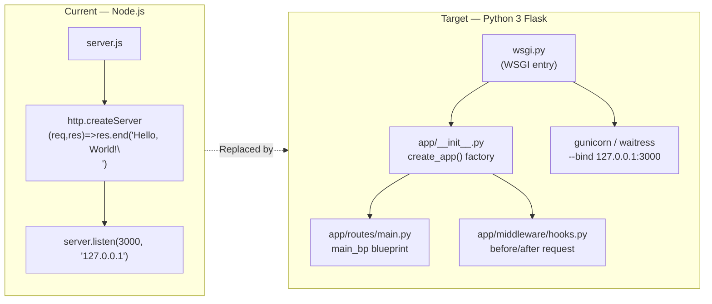

# Technical Specification

# 0. Agent Action Plan

## 0.1 Intent Clarification

### 0.1.1 Core Refactoring Objective

Based on the prompt, the Blitzy platform understands that the refactoring objective is to **rewrite the existing Node.js HTTP server into a Python 3 Flask application while preserving every observable behavior of the current implementation**. The migration must produce a Python service that is functionally indistinguishable from the Node.js source when exercised through HTTP, while idiomatically restructuring the codebase to match Python and Flask conventions.

| Attribute | Value |
|-----------|-------|
| Refactoring Type | **Tech Stack Migration** (Node.js → Python 3 + Flask) |
| Target Repository | **Same repository** (`hao-backprop-test`) — no separate repository is specified in the user prompt |
| Source Runtime | Node.js using the built-in `http` module [server.js:L1] |
| Target Runtime | Python 3.12 with Flask 3.1.3 |
| Backward Compatibility | Behavioral parity REQUIRED — identical HTTP responses for identical requests |
| Performance Profile | Equivalent or better than baseline; not subject to formal SLA |

#### Enumerated Refactoring Goals

The user's instruction "Rewrite this Node.js server into a Python 3 Flask application, keeping every feature and functionality exactly as in the original Node.js project. Ensure the rewritten version fully matches the behavior and logic of the current implementation." decomposes into the following explicit goals:

- **G1 — Language Substitution**: Replace JavaScript with Python 3 as the implementation language for the server.
- **G2 — Framework Adoption**: Adopt Flask 3.1.3 as the web framework in place of Node.js's built-in `http` module [server.js:L1].
- **G3 — Behavioral Parity**: Every HTTP request that hits the new Flask service must receive an HTTP response that is byte-for-byte equivalent to what the Node.js server would have returned for the same request — that is, status `200`, header `Content-Type: text/plain`, and body `Hello, World!\n` (note the trailing newline character) [server.js:L7-L9].
- **G4 — Network Surface Preservation**: The Flask service must continue to bind to host `127.0.0.1` on TCP port `3000` by default [server.js:L3-L4], matching the original loopback-only network exposure that the system overview documents [§5.1.1 Key Architectural Principles].
- **G5 — Startup Log Parity**: The startup banner emitted on standard output must remain semantically equivalent to the Node.js version's `Server running at http://127.0.0.1:3000/` message [server.js:L13].
- **G6 — Catch-All Semantics**: All HTTP methods and all URL paths must continue to receive the same response, because the Node.js implementation does not branch on `req.method` or `req.url` — it returns the same body to every caller [server.js:L6-L10, §5.1.1 Key Architectural Principles].

#### Surfaced Implicit Requirements

The following requirements are not explicitly stated by the user but are direct consequences of "keeping every feature and functionality exactly as in the original Node.js project":

- **Method-agnostic dispatch**: The Flask routes must accept `GET`, `POST`, `PUT`, `DELETE`, `PATCH`, `HEAD`, and `OPTIONS` because the Node.js handler does not inspect `req.method` [server.js:L6-L10]. Flask's default route only accepts `GET`, so explicit `methods=[…]` configuration is required.
- **Path-agnostic dispatch**: A catch-all path converter (e.g., `/<path:subpath>` in addition to `/`) must be registered, because the Node.js handler does not inspect `req.url` [server.js:L6-L10].
- **Exact body bytes**: The body must terminate with a newline (`\n`) — Flask string returns do not append one automatically.
- **Zero functional regression of `server - Copy.js`**: The duplicate file `server - Copy.js` carries identical behavior to `server.js` [server - Copy.js:L1-L14] and exists solely as a duplicate-detection fixture per the test-fixture catalog [§2.1.2 Test Fixture File Structure]. The migration retires both Node sources rather than producing two Flask copies.
- **No `index.js` exists**: Although `package.json` declares `"main": "index.js"` [package.json:L5], that file is not present in the repository [§1.2.2 Major System Components]. Consumers should not be expected to rely on the npm entry point after migration.
- **No third-party Node dependencies to translate**: The `package-lock.json` records only the root package and zero installed packages [package-lock.json:L6-L12], so no external behavior must be reproduced beyond what `server.js` itself does.

### 0.1.2 Technical Interpretation

This refactoring translates to the following technical transformation strategy: **collapse the single-file Node.js `http.createServer` handler into a Flask application organized via the application-factory and blueprint patterns, exposing one catch-all route that emits the identical "Hello, World!\n" plain-text response, and provision the production-ready scaffolding (configuration, logging, middleware hooks, and a WSGI server) that the user-specified rules call for — adapted from the Node-specific tools named in those rules (Express.js, PM2) to their idiomatic Python counterparts (Flask blueprints, gunicorn) since the primary directive (Python 3 / Flask) makes Node-specific tooling unusable in the target stack.**

#### Current vs. Target Architecture



#### Transformation Rules

| Concept | Node.js Source | Python / Flask Target |
|---------|---------------|------------------------|
| Module import | `const http = require('http');` [server.js:L1] | `from flask import Flask, Blueprint, Response` |
| HTTP server | `http.createServer(cb)` [server.js:L6] | `Flask(__name__)` instance produced by `create_app()` |
| Request handler | Anonymous `(req, res) => { … }` [server.js:L6-L10] | `@main_bp.route("/", methods=[…])` view function |
| Set status code | `res.statusCode = 200;` [server.js:L7] | Default Flask 200; explicit via `Response(body, status=200)` |
| Set header | `res.setHeader('Content-Type', 'text/plain');` [server.js:L8] | `Response(body, mimetype="text/plain")` or `headers={"Content-Type": "text/plain"}` |
| Write body & end | `res.end('Hello, World!\n');` [server.js:L9] | `return Response("Hello, World!\n", …)` |
| Listen on host/port | `server.listen(port, hostname, cb)` [server.js:L12-L14] | `app.run(host=…, port=…)` (dev) / `gunicorn --bind 127.0.0.1:3000 wsgi:app` (prod) |
| Startup banner | `` console.log(`Server running at http://${hostname}:${port}/`); `` [server.js:L13] | `app.logger.info("Server running at http://%s:%d/", host, port)` |
| Environment variables | `process.env.X` (not used in source) | `os.environ.get("X")` loaded via python-dotenv |
| Module entry point | `package.json:"main": "index.js"` [package.json:L5] | `wsgi.py` exposing `app = create_app()` |

#### Conflict Resolution Notice

The primary user request (`"Rewrite this Node.js server into a Python 3 Flask application"`) conflicts with the user-supplied implementation rule `QA-20-may-custom-rules` (`"Enhance this basic HTTP server with Express.js framework, add routing, middleware, environment config, logging, and prepare for production deployment with PM2."`), because Express.js and PM2 are Node-specific technologies that cannot exist within a Python/Flask target stack. The primary request takes precedence as the explicit user directive; the **spirit** of the rule (routing, middleware, environment config, logging, production deployment) is honored using Flask-native equivalents. The detailed mapping is captured in §0.7.

## 0.2 Scope Boundaries

This sub-section enumerates every file the refactor will touch and every file it will not touch. Patterns use **trailing wildcards** only; leading or interior wildcards are not used. Repository layout is flat — only the root directory contains files today [root folder summary].

### 0.2.1 Exhaustively In Scope

The following items will be created, updated, or retired by this refactor. Items marked **(rule-mandated)** are required to satisfy the user-specified rule `QA-20-may-custom-rules` (routing, middleware, env config, logging, production deployment) as translated to Flask equivalents.

#### Source Transformations (Node sources retired and superseded)

| Path / Pattern | Action | Reason |
|----------------|--------|--------|
| `server.js` | Retire (delete) | Replaced by Flask application code [server.js:L1-L14] |
| `server - Copy.js` | Retire (delete) | Behavioral duplicate of `server.js` [server - Copy.js:L1-L14, §2.1.2] |

#### Python / Flask Source Files (new — created by the refactor)

| Path / Pattern | Action | Reason |
|----------------|--------|--------|
| `wsgi.py` | CREATE | WSGI entry point importing `create_app()` for gunicorn/waitress |
| `app/__init__.py` | CREATE | Marks `app/` as Python package and exposes `create_app()` application factory |
| `app/config.py` | CREATE (rule-mandated) | Environment-driven config classes (BaseConfig, DevConfig, ProdConfig, TestConfig) |
| `app/logging_config.py` | CREATE (rule-mandated) | Centralized logging setup using Python `logging` |
| `app/routes/__init__.py` | CREATE (rule-mandated) | Package marker; aggregates blueprint exports |
| `app/routes/main.py` | CREATE (rule-mandated) | `main_bp` Flask blueprint with catch-all route returning `Hello, World!\n` |
| `app/middleware/__init__.py` | CREATE (rule-mandated) | Package marker for middleware module |
| `app/middleware/hooks.py` | CREATE (rule-mandated) | `before_request` / `after_request` / `errorhandler` registrations |

#### Configuration & Dependency Manifests (Node manifests retired; Python manifests created)

| Path / Pattern | Action | Reason |
|----------------|--------|--------|
| `package.json` | Retire (delete) | npm manifest for retired Node app [package.json:L1-L11] |
| `package-lock.json` | Retire (delete) | npm lock file for retired Node app [package-lock.json:L1-L13] |
| `requirements.txt` | CREATE | Python dependency manifest with pinned versions |
| `pyproject.toml` | CREATE | Python project metadata (PEP 621) — name, version, license, scripts |
| `.env.example` | CREATE (rule-mandated) | Template environment file documenting required variables |
| `.env` | CREATE (rule-mandated, gitignored) | Local environment values (development) |
| `.python-version` | CREATE | Pin runtime to Python 3.12 for `pyenv` / `asdf` consumers |
| `.gitignore` | CREATE | Python-aware ignores (`__pycache__/`, `*.pyc`, `.venv/`, `.env`, `.pytest_cache/`) |

#### Production Deployment Artifacts (rule-mandated — PM2 → gunicorn/waitress)

| Path / Pattern | Action | Reason |
|----------------|--------|--------|
| `gunicorn_config.py` | CREATE (rule-mandated) | Production WSGI server configuration (workers, bind, log files) |
| `Procfile` | CREATE (rule-mandated) | Declarative process command (`web: gunicorn -c gunicorn_config.py wsgi:app`) |

#### Test Suite (created to validate behavioral parity)

| Path / Pattern | Action | Reason |
|----------------|--------|--------|
| `tests/__init__.py` | CREATE | Package marker for the `tests` package |
| `tests/conftest.py` | CREATE | pytest fixtures (Flask test client via `create_app({"TESTING": True})`) |
| `tests/test_app.py` | CREATE | Parity tests asserting status 200, `Content-Type: text/plain`, body `Hello, World!\n` for `GET /`, `POST /`, `GET /any/path`, etc. |

#### Documentation Updates

| Path / Pattern | Action | Reason |
|----------------|--------|--------|
| `README.md` | UPDATE | Replace "Do not touch!" with Python install / run / test / deploy instructions for the Flask app [README.md:L1-L2] |

#### Import Corrections (no additional files)

The Node source files contained only one `require()` statement [server.js:L1] and no cross-file imports — the application is single-file. No external file requires import-statement rewrites beyond the retirement of `server.js` and `server - Copy.js`.

### 0.2.2 Explicitly Out of Scope

The following artifacts are intentionally untouched. They exist as Backprop test fixtures and bear no functional relationship to the HTTP server being migrated [§2.1.2 Test Fixture File Structure].

| Path / Pattern | Reason for Exclusion |
|----------------|----------------------|
| `LoginTest.java` | Java placeholder stub; unrelated to the server [§2.1.2] |
| `LoginTest - Copy.java` | Java placeholder duplicate; unrelated to the server [§2.1.2] |
| `industry.csv` | Static reference data fixture [§2.1.2] |
| `industry - Copy.csv` | Duplicate reference data fixture [§2.1.2] |
| `100Pages.pdf` | Binary fixture for Backprop multi-format testing [§2.1.2] |
| `100Pages - Copy.pdf` | Binary fixture duplicate [§2.1.2] |
| `demo.jpg` | Binary image fixture [§2.1.2] |
| `demo - Copy.jpg` | Binary image duplicate [§2.1.2] |
| `sample.doc` | Binary document fixture [§2.1.2] |
| `sample - Copy.doc` | Binary document duplicate [§2.1.2] |
| `test.py.txt` | Empty placeholder file [§2.1.2] |
| `test.py - Copy.txt` | Empty placeholder duplicate [§2.1.2] |
| `test.txt.txt` | Empty placeholder file [§2.1.2] |
| `.git/**` | Version-control internals; never modified by the refactor |

Out-of-scope items remain at the repository root with no path changes, ensuring the fixture catalog documented in §2.1.2 is preserved verbatim.

## 0.3 Target Design

### 0.3.1 Refactored Structure Planning

The target structure adopts the **application-factory + blueprint** layout that the Flask documentation establishes as the canonical pattern for production Flask projects. Every file in the tree below is required for the refactor — there are no optional artifacts.

```
hao-backprop-test/
├── app/                            # Python package — Flask application
│   ├── __init__.py                 # create_app() application factory
│   ├── config.py                   # Config classes (Base/Dev/Prod/Test)
│   ├── logging_config.py           # configure_logging(app) helper
│   ├── routes/
│   │   ├── __init__.py             # exports main_bp
│   │   └── main.py                 # main_bp blueprint; catch-all hello view
│   └── middleware/
│       ├── __init__.py             # exports register_hooks
│       └── hooks.py                # before_request / after_request / errorhandler
├── tests/
│   ├── __init__.py                 # tests package marker
│   ├── conftest.py                 # pytest fixtures (app, client)
│   └── test_app.py                 # behavioral parity tests
├── wsgi.py                         # `app = create_app()` for WSGI servers
├── requirements.txt                # pinned Python dependencies
├── pyproject.toml                  # PEP 621 project metadata
├── gunicorn_config.py              # production WSGI server config (PM2 replacement)
├── Procfile                        # `web: gunicorn -c gunicorn_config.py wsgi:app`
├── .env.example                    # documented environment variables (committed)
├── .env                            # local environment values (gitignored)
├── .python-version                 # 3.12
├── .gitignore                      # Python-aware ignores
├── README.md                       # updated install / run / deploy instructions
│
│ ── Out-of-scope fixtures (preserved verbatim, see §0.2.2) ───────────────
├── LoginTest.java
├── LoginTest - Copy.java
├── industry.csv
├── industry - Copy.csv
├── 100Pages.pdf
├── 100Pages - Copy.pdf
├── demo.jpg
├── demo - Copy.jpg
├── sample.doc
├── sample - Copy.doc
├── test.py.txt
├── test.py - Copy.txt
└── test.txt.txt
```

#### File-by-File Role Specification

| Target File | Role | Key Contents |
|-------------|------|--------------|
| `app/__init__.py` | Application factory | `create_app(config_object="app.config.DevConfig") -> Flask`: instantiates `Flask(__name__)`, loads config, calls `configure_logging`, calls `register_hooks`, registers `main_bp` |
| `app/config.py` | Config classes | `BaseConfig` (HOST, PORT, LOG_LEVEL, FLASK_ENV), `DevConfig`/`ProdConfig`/`TestConfig` subclasses overriding `DEBUG`, `TESTING`, etc.; values pulled from `os.environ` after `dotenv.load_dotenv()` |
| `app/logging_config.py` | Logging setup | `configure_logging(app)`: builds a `logging.StreamHandler` and `logging.Formatter`, attaches to `app.logger` at the configured `LOG_LEVEL` |
| `app/routes/main.py` | Main blueprint | `main_bp = Blueprint("main", __name__)`; two routes `@main_bp.route("/", methods=ALL)` and `@main_bp.route("/<path:subpath>", methods=ALL)` both calling the same handler that returns `Response("Hello, World!\n", status=200, mimetype="text/plain")` |
| `app/middleware/hooks.py` | Middleware | `register_hooks(app)`: registers `@app.before_request` (request logging), `@app.after_request` (response logging), `@app.errorhandler(Exception)` (uniform 500 response) |
| `wsgi.py` | WSGI entrypoint | `from app import create_app`; `app = create_app(os.environ.get("FLASK_CONFIG", "app.config.ProdConfig"))`; under `if __name__ == "__main__":` calls `app.run(host=app.config["HOST"], port=app.config["PORT"])` |
| `requirements.txt` | Dependency pin | One line per package: `Flask==3.1.3`, `Werkzeug==3.1.3`, `python-dotenv==1.0.1`, `gunicorn==23.0.0`, `waitress==3.0.2`, `pytest==8.4.2`, `pytest-flask==1.3.0` |
| `pyproject.toml` | Project metadata | `[project]` table: `name = "hello_world"`, `version = "1.0.0"`, `requires-python = ">=3.12"`, `license = "MIT"`, `authors = [{ name = "hxu" }]` — mirrors the retired `package.json` metadata [package.json:L2-L10] |
| `gunicorn_config.py` | WSGI server config | `bind = "127.0.0.1:3000"`, `workers = 2`, `loglevel = "info"`, `accesslog = "-"`, `errorlog = "-"`, `proc_name = "hello_world"` |
| `Procfile` | Process declaration | Single line: `web: gunicorn -c gunicorn_config.py wsgi:app` |
| `.env.example` | Env template | Documented keys: `FLASK_ENV`, `FLASK_CONFIG`, `HOST`, `PORT`, `LOG_LEVEL`, `SECRET_KEY` |
| `.env` | Local env values | Development values for the same keys; `.env` is gitignored |
| `.python-version` | Runtime pin | `3.12` |
| `.gitignore` | VCS ignores | `__pycache__/`, `*.pyc`, `.venv/`, `.env`, `.pytest_cache/`, `*.egg-info/` |
| `tests/conftest.py` | pytest fixtures | `@pytest.fixture` `app` (`create_app("app.config.TestConfig")`), `client` (`app.test_client()`) |
| `tests/test_app.py` | Parity tests | Asserts `200` + `text/plain` + body `b"Hello, World!\n"` for `GET /`, `POST /`, `GET /any/path`, `PUT /x/y/z`, etc. |
| `README.md` | Documentation | Replaces "test project for backprop integration. Do not touch!" [README.md:L1-L2] with sections: Prerequisites, Setup, Run (dev), Run (prod), Test, Project layout, Environment variables |

### 0.3.2 Web Search Research Conducted

The following research was performed before finalizing the target design:

- **Flask 3.1 application-factory pattern** — confirmed via the official Flask documentation that the `create_app()` function approach is the recommended pattern for production Flask projects, particularly when running under WSGI servers like gunicorn that manage multiple child processes.
- **Flask blueprint best practices** — confirmed that blueprints record route operations that are activated when the blueprint is registered with the Flask app instance, providing modular separation of concerns at the Flask level.
- **Production WSGI server choice — gunicorn vs. waitress** — confirmed gunicorn is the idiomatic pre-fork WSGI server for Linux/macOS production deployments and is the closest functional equivalent to PM2's process-manager role; waitress is retained in `requirements.txt` as a cross-platform fallback because gunicorn does not support Windows.
- **PyPI version verification** — queried the PyPI index directly via `pip index versions <pkg>` for every package to lock pinned versions in `requirements.txt`.

### 0.3.3 Design Pattern Applications

| Pattern | Application | Source File(s) |
|---------|-------------|---------------|
| Application Factory | `create_app(config_object)` returns a fully wired `Flask` app per call, enabling per-test isolation and per-worker initialization | `app/__init__.py` |
| Blueprint | `main_bp` encapsulates routing for the Hello-World endpoint; registered in the factory | `app/routes/main.py`, `app/__init__.py` |
| Twelve-Factor Configuration | All variable config read from `os.environ` (loaded by `python-dotenv`); `.env.example` documents required keys | `app/config.py`, `.env.example`, `.env` |
| Decorator-based Middleware | `@app.before_request`, `@app.after_request`, `@app.errorhandler` replace Express middleware semantics | `app/middleware/hooks.py` |
| WSGI Entry Indirection | `wsgi.py` is the import target for gunicorn (`wsgi:app`) — decouples the WSGI server from the factory | `wsgi.py`, `gunicorn_config.py`, `Procfile` |
| Structured Logging | Centralized `configure_logging(app)` attaches a single formatter/handler to `app.logger`, replacing scattered `console.log` calls [server.js:L13] | `app/logging_config.py` |

### 0.3.4 User Interface Design

Not applicable. The system is a back-end HTTP server that returns plain text [server.js:L7-L9, §1.2.2 Core Technical Approach]. There is no UI, no template rendering, no static assets, and no component library. The Design System Alignment Protocol does not apply.

## 0.4 Transformation Mapping

### 0.4.1 File-by-File Transformation Plan

Each row maps a target file to its source. **Modes:** `UPDATE` (modify existing file), `CREATE` (new file; source is the conceptual reference if present), `REFERENCE` (file consulted as a pattern source, no source-file equivalent), `DELETE` (retired Node artifact). All target files are produced in a single Blitzy execution phase; the refactor is **not** split into multiple phases.

| Target File | Transformation | Source File | Key Changes |
|-------------|----------------|-------------|-------------|
| `wsgi.py` | CREATE | `server.js` | Replace `http.createServer` + `server.listen` [server.js:L6, L12] with `app = create_app()` and `app.run(host=cfg.HOST, port=cfg.PORT)` under `if __name__ == "__main__":` |
| `app/__init__.py` | CREATE | `server.js` | Implement `create_app(config_object)` factory; instantiate `Flask(__name__)`; load config; call `configure_logging(app)`; call `register_hooks(app)`; register `main_bp`; return `app` |
| `app/config.py` | CREATE | `server.js` | Encode hostname/port (formerly `const hostname = '127.0.0.1';` `const port = 3000;` [server.js:L3-L4]) as `HOST` / `PORT` env-driven config attributes on `BaseConfig`; add `LOG_LEVEL`, `FLASK_ENV`, `SECRET_KEY` |
| `app/logging_config.py` | CREATE | `server.js` | Replace `console.log(\`Server running at http://${hostname}:${port}/\`)` [server.js:L13] with Python `logging` setup feeding `app.logger.info` |
| `app/routes/__init__.py` | CREATE | — (new package marker) | `from .main import main_bp` |
| `app/routes/main.py` | CREATE | `server.js` | Define `main_bp = Blueprint("main", __name__)`; register `@main_bp.route("/", methods=[…])` and `@main_bp.route("/<path:subpath>", methods=[…])`; return `Response("Hello, World!\n", status=200, mimetype="text/plain")` (mirrors [server.js:L7-L9]) |
| `app/middleware/__init__.py` | CREATE | — (new package marker) | `from .hooks import register_hooks` |
| `app/middleware/hooks.py` | CREATE | `server.js` | Implement Express-like middleware semantics in Flask: `@app.before_request` (log request), `@app.after_request` (log response status), `@app.errorhandler(Exception)` (return uniform 500); placed here to satisfy rule QA-20-may-custom-rules |
| `requirements.txt` | CREATE | `package.json` | Replace npm dependency declaration approach [package.json:L1-L11] (which declared none) with explicit Python pins for Flask, Werkzeug, python-dotenv, gunicorn, waitress, pytest, pytest-flask |
| `pyproject.toml` | CREATE | `package.json` | Translate package metadata: `name="hello_world"` [package.json:L2], `version="1.0.0"` [package.json:L3], `description="Hello world in Node.js"` → `"Hello world in Python (Flask)"`, `author="hxu"` [package.json:L9], `license="MIT"` [package.json:L10], add `requires-python = ">=3.12"` |
| `gunicorn_config.py` | CREATE | `server.js` | Translate `server.listen(3000, '127.0.0.1', cb)` [server.js:L12-L14] into `bind = "127.0.0.1:3000"`; set `workers`, `loglevel`, `accesslog`, `errorlog`; rule-mandated PM2 substitute |
| `Procfile` | CREATE | — (new artifact, no source file) | Declarative process command: `web: gunicorn -c gunicorn_config.py wsgi:app`; replaces PM2 `ecosystem.config.js` paradigm |
| `.env.example` | CREATE | — (new artifact) | Document required env keys: `FLASK_ENV`, `FLASK_CONFIG`, `HOST=127.0.0.1`, `PORT=3000`, `LOG_LEVEL=INFO`, `SECRET_KEY=change-me` |
| `.env` | CREATE | `.env.example` | Local development values copy; gitignored |
| `.python-version` | CREATE | — (new artifact) | Single line: `3.12` |
| `.gitignore` | CREATE | — (new artifact) | Add Python ignores: `__pycache__/`, `*.pyc`, `.venv/`, `.env`, `.pytest_cache/`, `*.egg-info/` |
| `tests/__init__.py` | CREATE | — (new artifact) | Empty package marker |
| `tests/conftest.py` | CREATE | `server.js` | Set up pytest fixtures (`app`, `client`) using `create_app("app.config.TestConfig")`; the source-of-truth response body is taken from [server.js:L9] |
| `tests/test_app.py` | CREATE | `server.js` | Tests asserting parity: `status_code == 200`, `Content-Type == "text/plain; charset=utf-8"` (Flask default), body bytes `b"Hello, World!\n"` (exact match to [server.js:L7-L9]) for `GET /`, `POST /`, `GET /any/path`, `PUT /x/y/z`, etc. |
| `README.md` | UPDATE | `README.md` | Replace the two-line stub [README.md:L1-L2] with sections covering Prerequisites (Python 3.12), Setup (`python -m venv .venv && pip install -r requirements.txt`), Run (dev: `python wsgi.py`; prod: `gunicorn -c gunicorn_config.py wsgi:app`), Test (`pytest`), Project Layout, Environment Variables |
| `server.js` | DELETE | `server.js` | Retired — Node implementation superseded by Flask app [server.js:L1-L14] |
| `server - Copy.js` | DELETE | `server - Copy.js` | Retired — behavioral duplicate of `server.js` [server - Copy.js:L1-L14, §2.1.2] |
| `package.json` | DELETE | `package.json` | Retired — npm manifest for retired Node app [package.json:L1-L11] |
| `package-lock.json` | DELETE | `package-lock.json` | Retired — npm lockfile for retired Node app [package-lock.json:L1-L13] |

Every target file maps to either an explicit source file (when the Node code defined the behavior being preserved) or is annotated as a new artifact when no Node equivalent exists. No file in the refactor target is left unmapped.

### 0.4.2 Cross-File Dependencies

#### Import / Require Transformations

The Node source contains exactly one `require` statement and no internal cross-file imports [server.js:L1, server - Copy.js:L1]. The complete set of import translations is:

| Node.js Source | Python / Flask Target | Located In |
|----------------|------------------------|------------|
| `const http = require('http');` [server.js:L1, server - Copy.js:L1] | `from flask import Flask, Blueprint, Response` | `app/__init__.py`, `app/routes/main.py` |
| *(no other requires)* | `from dotenv import load_dotenv` | `app/config.py` |
| *(no other requires)* | `import logging` | `app/logging_config.py` |
| *(no other requires)* | `import os` | `app/config.py`, `wsgi.py` |
| *(no other requires)* | `from app import create_app` | `wsgi.py` |
| *(no other requires)* | `from .routes import main_bp` | `app/__init__.py` |
| *(no other requires)* | `from .middleware import register_hooks` | `app/__init__.py` |
| *(no other requires)* | `from .logging_config import configure_logging` | `app/__init__.py` |

#### Configuration Transformations

| Aspect | Node Form | Python / Flask Form | Location |
|--------|-----------|---------------------|----------|
| Hostname literal | `const hostname = '127.0.0.1';` [server.js:L3] | `HOST = os.environ.get("HOST", "127.0.0.1")` | `app/config.py` |
| Port literal | `const port = 3000;` [server.js:L4] | `PORT = int(os.environ.get("PORT", "3000"))` | `app/config.py` |
| Bind in listen call | `server.listen(port, hostname, …)` [server.js:L12] | `app.run(host=cfg.HOST, port=cfg.PORT)` (dev) and `bind = "127.0.0.1:3000"` (prod) | `wsgi.py`, `gunicorn_config.py` |
| npm scripts | `"test": "echo … && exit 1"` [package.json:L7] | `pytest` command documented in `README.md`; no equivalent script field — pytest is invoked directly | `README.md` |
| Main entry | `"main": "index.js"` [package.json:L5] (file absent) | `app = create_app()` exposed by `wsgi.py`; gunicorn target `wsgi:app` | `wsgi.py`, `Procfile`, `gunicorn_config.py` |

#### Test File Adjustments

No test files exist in the source repository [root folder summary]. The `tests/` package is a brand-new artifact created by the refactor; no import corrections are required against existing tests.

### 0.4.3 Wildcard Patterns

This refactor primarily uses explicit file paths because the source repository is flat with only two Node source files [root folder summary]. Where wildcards do apply, they are **trailing only**:

| Wildcard Pattern | Meaning | Action |
|------------------|---------|--------|
| `app/**` | All files under the new `app/` package | CREATE (per §0.4.1 enumeration) |
| `tests/**` | All files under the new `tests/` package | CREATE (per §0.4.1 enumeration) |
| `app/routes/**.py` | All Python files in `app/routes/` | CREATE |
| `app/middleware/**.py` | All Python files in `app/middleware/` | CREATE |

No leading wildcards (e.g., `**/routes/*.py`) are used anywhere in this plan.

### 0.4.4 One-Phase Execution

The entire refactor is executed by Blitzy in **one phase**. All Node artifacts are retired, all Python/Flask artifacts are created, configuration manifests are translated, deployment artifacts are produced, the test suite is added, and the README is updated in the same execution. There is no partial intermediate state and no follow-up phase.

## 0.5 Dependency Inventory

### 0.5.1 Source Dependency State (Node.js)

The source project declares **zero external dependencies**. The only manifest content under the `dependencies`/`devDependencies` keys is implicit emptiness — neither key is present in `package.json` [package.json:L1-L11], and `package-lock.json` records only the root package with no resolved packages [package-lock.json:L6-L12]. The Node application uses only the built-in `http` module [server.js:L1].

### 0.5.2 Target Dependency State (Python / Flask)

The refactor introduces the following Python packages. All versions are verified against the PyPI index for compatibility with Python 3.12.

| Registry | Package | Version | Purpose |
|----------|---------|---------|---------|
| PyPI | `Flask` | `3.1.3` | Web framework — replaces Node's built-in `http` module [server.js:L1] |
| PyPI | `Werkzeug` | `3.1.3` | WSGI utility library and Flask's transitive dependency; pinned for reproducibility |
| PyPI | `python-dotenv` | `1.0.1` | Loads `.env` files into `os.environ` — supports rule-mandated "environment config" |
| PyPI | `gunicorn` | `23.0.0` | Pre-fork WSGI server for Linux/macOS production — primary PM2 replacement (rule-mandated) |
| PyPI | `waitress` | `3.0.2` | Cross-platform WSGI server — Windows-compatible alternative to gunicorn |
| PyPI | `pytest` | `8.4.2` | Test runner for the parity test suite |
| PyPI | `pytest-flask` | `1.3.0` | Flask-specific pytest fixtures and helpers |

### 0.5.3 Dependency Changes Summary

| Change Type | Item | Notes |
|-------------|------|-------|
| Added | `Flask 3.1.3`, `Werkzeug 3.1.3`, `python-dotenv 1.0.1`, `gunicorn 23.0.0`, `waitress 3.0.2`, `pytest 8.4.2`, `pytest-flask 1.3.0` | All new — the source project had zero external dependencies [package-lock.json:L6-L12] |
| Removed | npm packages | None to remove — the source project declared none [package.json:L1-L11] |
| Updated | — | Not applicable; no pre-existing Python packages to update |

### 0.5.4 Import Refactoring

#### Files Requiring Import Updates

The original Node project contained two source files using one `require` statement each [server.js:L1, server - Copy.js:L1]. Both files are deleted by this refactor (§0.4.1), so there are no internal Node imports to rewrite — only the new Python imports introduced by the new Flask files.

| New Python File Pattern (trailing wildcards) | Imports Added |
|---------------------------------------------|---------------|
| `app/__init__.py` | `from flask import Flask`, `from .config import …`, `from .logging_config import configure_logging`, `from .middleware import register_hooks`, `from .routes import main_bp` |
| `app/routes/main.py` | `from flask import Blueprint, Response` |
| `app/middleware/hooks.py` | `from flask import current_app, request` |
| `app/config.py` | `import os`, `from dotenv import load_dotenv` |
| `app/logging_config.py` | `import logging` |
| `wsgi.py` | `import os`, `from app import create_app` |
| `tests/**.py` | `import pytest`, `from app import create_app` |

#### Import Transformation Rule

- **Old (Node CommonJS)**: `const http = require('http');` [server.js:L1, server - Copy.js:L1]
- **New (Python / Flask)**: `from flask import Flask, Blueprint, Response`
- **Applies to**: every retired Node source file (both deleted; no in-place rewrites)

### 0.5.5 External Reference Updates

| Category | File Pattern | Update |
|----------|-------------|--------|
| Configuration | `gunicorn_config.py` | New file — declares `bind`, `workers`, `accesslog`, `errorlog`, `proc_name`, `loglevel` |
| Documentation | `README.md` | Replace the two-line stub [README.md:L1-L2] with Python/Flask install/run/test/deploy guidance |
| Build / Project metadata | `pyproject.toml` | New file — PEP 621 project metadata mirroring retired `package.json` fields [package.json:L2-L10] |
| Build / Project metadata | `requirements.txt` | New file — pinned dependency manifest |
| Process declaration | `Procfile` | New file — `web: gunicorn -c gunicorn_config.py wsgi:app` |
| Environment | `.env.example`, `.env` | New files — documented env keys for `python-dotenv` |
| CI/CD | *(none)* | The source project does not include `.github/workflows/`, `.gitlab-ci.yml`, or any CI configuration [root folder summary]; therefore no CI files require updates |

## 0.6 Special Analysis

### 0.6.1 Behavioral-Parity Strategy

The user's directive — `"Ensure the rewritten version fully matches the behavior and logic of the current implementation"` — establishes byte-level response parity as the acceptance criterion. The Node implementation returns the same response to every caller [server.js:L6-L10], so parity is verifiable by exhaustively comparing the new Flask responses against a fixed expected value.

#### Response Byte-Equivalence Requirements

| Response Attribute | Node Source Value | Flask Target Value | Verification |
|--------------------|--------------------|---------------------|--------------|
| Status code | `200` [server.js:L7] | `200` (Flask default; explicit via `Response(..., status=200)`) | `tests/test_app.py::test_status_is_200` |
| Content-Type header | `text/plain` [server.js:L8] | `text/plain` (set via `mimetype="text/plain"` in `Response`) | `tests/test_app.py::test_content_type_is_text_plain` |
| Body bytes | `Hello, World!\n` (with trailing newline) [server.js:L9] | `b"Hello, World!\n"` (returned by view function) | `tests/test_app.py::test_body_bytes_match` |
| Method coverage | All HTTP methods accepted [server.js:L6-L10] | `methods=["GET", "POST", "PUT", "DELETE", "PATCH", "HEAD", "OPTIONS"]` on the route | `tests/test_app.py::test_all_methods_return_same_body` |
| Path coverage | All URL paths accepted [server.js:L6-L10] | Two routes: `"/"` + `"/<path:subpath>"` | `tests/test_app.py::test_arbitrary_paths_return_same_body` |

**Caveat — character encoding on Content-Type**: Flask's default `text/plain` response sends `Content-Type: text/plain; charset=utf-8`, whereas the Node `res.setHeader('Content-Type', 'text/plain')` call [server.js:L8] sends bare `text/plain`. Both values are semantically equivalent for the ASCII body `"Hello, World!\n"`, but the literal header string differs by the `; charset=utf-8` suffix. To preserve the **exact** original header bytes, the Flask view will construct the `Response` with explicit headers: `Response("Hello, World!\n", status=200, headers={"Content-Type": "text/plain"})`. This is recorded as an explicit transformation requirement rather than an inferred behavior change.

### 0.6.2 Catch-All Routing Strategy in Flask

Flask's default routing requires explicit route registration for both methods and paths, in contrast to the Node `http.createServer(cb)` callback that ignores `req.method` and `req.url` [server.js:L6-L10]. The transformation registers two routes on `main_bp` to cover every reachable URL:

```python
ALL_METHODS = ["GET", "POST", "PUT", "DELETE", "PATCH", "HEAD", "OPTIONS"]

@main_bp.route("/", methods=ALL_METHODS)
@main_bp.route("/<path:subpath>", methods=ALL_METHODS)
def hello_world(subpath: str = "") -> Response:
    return Response("Hello, World!\n", status=200,
                    headers={"Content-Type": "text/plain"})
```

The `<path:subpath>` converter matches any string including forward slashes, ensuring nested URLs (e.g., `/a/b/c/d`) reach the handler. The `subpath` argument is intentionally ignored, mirroring the Node handler's disregard for `req.url`.

### 0.6.3 Node.js → Python Idiom Translations

Beyond the request-handler translation already covered in §0.1.2, the following idiomatic translations are applied throughout the new files:

| Concept | Node.js Idiom | Python Idiom | Used In |
|---------|---------------|--------------|---------|
| Module entry point | `node server.js` invocation | `python wsgi.py` (dev) / `gunicorn -c gunicorn_config.py wsgi:app` (prod) | `wsgi.py`, `Procfile` |
| Environment lookup | `process.env.PORT` (not used in source) | `os.environ.get("PORT", "3000")` (with `python-dotenv` preload) | `app/config.py` |
| Template literal | `` `http://${hostname}:${port}/` `` [server.js:L13] | f-string: `f"http://{cfg.HOST}:{cfg.PORT}/"` | `app/logging_config.py` (info banner) |
| Console output | `console.log(msg)` [server.js:L13] | `app.logger.info(msg)` | `app/__init__.py`, `app/middleware/hooks.py` |
| Anonymous callback | `(req, res) => { … }` [server.js:L6] | `@main_bp.route(...) def hello_world(...):` | `app/routes/main.py` |
| Falsy-default literal | `const hostname = '127.0.0.1';` [server.js:L3] | `HOST = os.environ.get("HOST", "127.0.0.1")` | `app/config.py` |

### 0.6.4 Express.js → Flask Mapping (Rule Resolution Detail)

The user-specified rule `QA-20-may-custom-rules` names Express.js explicitly. Since Express is a Node-only framework, the **semantic** Express concepts are translated to Flask equivalents and concentrated in identifiable target files for downstream maintenance:

| Express Concept (Rule Term) | Flask Equivalent | Target File |
|------------------------------|------------------|-------------|
| `express()` application | `Flask(__name__)` produced by `create_app()` | `app/__init__.py` |
| Router (`express.Router()`) | `Blueprint("main", __name__)` | `app/routes/main.py` |
| Route registration (`app.get`, `app.post`, …) | `@main_bp.route("/", methods=[…])` decorator | `app/routes/main.py` |
| Middleware (`app.use(fn)`) | `@app.before_request` / `@app.after_request` functions | `app/middleware/hooks.py` |
| `express.json()` body parser | Built-in `flask.request.get_json()` (no separate package) | *(intrinsic to Flask)* |
| `express.static('public')` | Built-in `Flask(static_folder=…)` (not used; no static assets) | *(not needed)* |
| Error-handling middleware (`(err, req, res, next)`) | `@app.errorhandler(Exception)` | `app/middleware/hooks.py` |
| Environment via `process.env` | `os.environ` populated by `python-dotenv` from `.env` | `app/config.py` |

### 0.6.5 PM2 → gunicorn / waitress Mapping (Rule Resolution Detail)

The rule names PM2 for production deployment. PM2 is a Node process manager and cannot supervise a Python WSGI app in the role it plays for Express. The closest Python production deployment idioms are mapped here:

| PM2 Capability | Python Equivalent | Target File |
|----------------|---------------------|-------------|
| `pm2 start ecosystem.config.js` | `gunicorn -c gunicorn_config.py wsgi:app` | `Procfile`, `gunicorn_config.py` |
| `instances: "max"` (cluster mode) | `workers = <N>` (pre-fork) in `gunicorn_config.py` | `gunicorn_config.py` |
| `error_file` / `out_file` log paths | `errorlog = "-"` / `accesslog = "-"` (stdout/stderr) plus Python `logging` to file | `gunicorn_config.py`, `app/logging_config.py` |
| `env: { NODE_ENV: "production" }` | `FLASK_ENV=production` in `.env` loaded by `python-dotenv` | `.env`, `app/config.py` |
| PM2 process name | `proc_name = "hello_world"` (matches retired `package.json:L2`) | `gunicorn_config.py` |
| PM2 restart on file change | gunicorn `--reload` flag (dev only); production relies on a process supervisor (systemd, supervisord, Docker) | `README.md` (documented) |
| Windows compatibility | `waitress-serve --listen=127.0.0.1:3000 wsgi:app` (gunicorn is POSIX-only) | `requirements.txt` includes `waitress 3.0.2` as fallback |

### 0.6.6 Cross-Cutting Risk Inventory

| Risk | Mitigation | Anchor |
|------|------------|--------|
| Flask appends `; charset=utf-8` to Content-Type by default | Build `Response` with explicit `headers={"Content-Type": "text/plain"}` | §0.6.1, `app/routes/main.py` |
| Flask's default route only allows `GET`; non-GET methods would return 405 | Set `methods=["GET","POST","PUT","DELETE","PATCH","HEAD","OPTIONS"]` on both routes | §0.6.2, `app/routes/main.py` |
| Missing trailing newline in response body | Return literal `"Hello, World!\n"` — assert as bytes in `tests/test_app.py` | §0.6.1, `tests/test_app.py` |
| Nested paths (e.g., `/a/b/c`) returning 404 | Register the `/<path:subpath>` catch-all route | §0.6.2, `app/routes/main.py` |
| Port 3000 already in use locally | Make `PORT` env-configurable via `.env` while defaulting to `3000` for parity | `app/config.py`, `.env.example` |
| gunicorn unavailable on Windows | Ship `waitress 3.0.2` as a documented fallback in `requirements.txt` | §0.5.2, `README.md` |
| Test fixtures (`industry.csv`, PDFs, etc.) accidentally moved or removed | Out-of-scope inventory in §0.2.2 explicitly names each fixture to be preserved | §0.2.2 |

## 0.7 Refactoring Rules

### 0.7.1 User-Specified Rule (Verbatim)

The user attached one rule set to this project. It is reproduced verbatim below:

> **User Example (rule name: `QA-20-may-custom-rules`)**: "Enhance this basic HTTP server with Express.js framework, add routing, middleware, environment config, logging, and prepare for production deployment with PM2."

### 0.7.2 Conflict Acknowledgement

The rule above conflicts with the primary user request in two specific terms:

| Term in Rule | Conflict With Primary Request | Why |
|--------------|-------------------------------|-----|
| **"Express.js framework"** | Primary request: "Rewrite this Node.js server into a Python 3 Flask application" | Express.js is a Node.js framework; it cannot run inside a Python interpreter or coexist with Flask in the same process |
| **"production deployment with PM2"** | Same primary request | PM2 is a Node.js process manager; it has no native role supervising a Python WSGI app, and the idiomatic Python production stack uses gunicorn/waitress |

### 0.7.3 Resolution

The primary user request takes precedence as the explicit refactoring directive. The **spirit** of the rule (the enumerated capabilities — routing, middleware, environment config, logging, production deployment) is fully honored by translating each named Node tool to its idiomatic Python/Flask counterpart and concentrating those capabilities in dedicated, identifiable target files. Each rule clause is satisfied as follows:

| Rule Clause | Honored By | Target File(s) |
|-------------|------------|-----------------|
| "Express.js framework" | **Flask 3.1.3** with application-factory + blueprint pattern | `app/__init__.py`, `app/routes/main.py` |
| "add routing" | `main_bp` Flask blueprint with explicit `methods=…` route registrations | `app/routes/main.py` |
| "middleware" | `register_hooks(app)` using `@app.before_request`, `@app.after_request`, `@app.errorhandler` | `app/middleware/hooks.py` |
| "environment config" | python-dotenv 1.0.1 loading `.env` into `os.environ`; consumed by `BaseConfig`/`DevConfig`/`ProdConfig`/`TestConfig` classes | `.env`, `.env.example`, `app/config.py` |
| "logging" | Python `logging` module configured by `configure_logging(app)` and used via `app.logger` | `app/logging_config.py`, `app/middleware/hooks.py` |
| "prepare for production deployment with PM2" | **gunicorn 23.0.0** (primary) + **waitress 3.0.2** (cross-platform fallback) with declarative `Procfile` and `gunicorn_config.py` | `gunicorn_config.py`, `Procfile`, `requirements.txt` |

### 0.7.4 Refactoring-Specific Rules & Constraints (Derived)

The primary user request — `"Rewrite this Node.js server into a Python 3 Flask application, keeping every feature and functionality exactly as in the original Node.js project. Ensure the rewritten version fully matches the behavior and logic of the current implementation."` — gives rise to the following derived rules that constrain every change in this refactor:

- **R-1 (Behavior preservation)**: For every HTTP request the new Flask service must produce an HTTP response with status `200`, header `Content-Type: text/plain` (exact string, no `charset` suffix), and body bytes `Hello, World!\n` — matching [server.js:L7-L9] byte-for-byte.
- **R-2 (Network surface preservation)**: The service must bind to `127.0.0.1:3000` by default [server.js:L3-L4]; alternative host/port may be supplied via `HOST` / `PORT` environment variables but `127.0.0.1` / `3000` remain the defaults baked into `app/config.py`, `gunicorn_config.py`, and `wsgi.py`.
- **R-3 (Method-agnostic dispatch)**: Every HTTP method must reach the handler; the Node implementation does not filter by `req.method` [server.js:L6-L10], so the Flask routes must enumerate `["GET","POST","PUT","DELETE","PATCH","HEAD","OPTIONS"]`.
- **R-4 (Path-agnostic dispatch)**: Every URL path must reach the handler; the Node implementation does not filter by `req.url` [server.js:L6-L10], so a `<path:subpath>` catch-all route must be registered in addition to `"/"`.
- **R-5 (Startup-message preservation)**: The startup banner must be semantically equivalent to `` `Server running at http://${hostname}:${port}/` `` [server.js:L13]; the Python equivalent is logged via `app.logger.info("Server running at http://%s:%d/", host, port)` in the factory.
- **R-6 (Same-repository constraint)**: All target files are created inside the existing `hao-backprop-test` repository; no new repository is created.
- **R-7 (Test-fixture immutability)**: The Backprop test fixtures enumerated in §0.2.2 must remain at the repository root, unchanged in name, content, and location [§2.1.2].
- **R-8 (No Node residue)**: After the refactor completes, `server.js`, `server - Copy.js`, `package.json`, and `package-lock.json` are removed; the repository runs Python only.

### 0.7.5 Special Instructions

- **README disclaimer**: The existing `README.md` warns "Do not touch!" [README.md:L1-L2]. This warning is overridden by the user's explicit refactoring directive in the current prompt. The README is updated in place; the disclaimer line is removed and replaced with current Python/Flask operating instructions.
- **Web-search-derived guidance**: The application-factory and blueprint patterns adopted in §0.3.3 follow the official Flask documentation's recommended structure for production projects; the gunicorn-as-primary / waitress-as-fallback choice in §0.5.2 reflects researched community guidance for Linux/POSIX vs. Windows WSGI deployment.
- **Single-phase execution constraint**: Blitzy executes the entire refactor in one phase (§0.4.4). All retirements, creations, and updates are atomic from the user's perspective.

## 0.8 References

### 0.8.1 Repository Files Inspected

The following files in the source repository were retrieved and read end-to-end during preparation of this Agent Action Plan. Citations throughout the plan refer back to specific line ranges of these files.

| File Path | Lines Read | Role in This Plan |
|-----------|-----------|--------------------|
| `server.js` | L1-L14 | Primary source of truth for behavior, network binding, headers, body, and startup banner |
| `server - Copy.js` | L1-L14 | Confirmed behavioral duplicate of `server.js`; retired alongside it |
| `package.json` | L1-L11 | Source of metadata translated to `pyproject.toml`; confirms zero dependencies |
| `package-lock.json` | L1-L13 | Confirmed lock file records only the root package (no installed npm packages) |
| `README.md` | L1-L2 | Confirmed existing documentation is a two-line stub; scheduled for UPDATE |

### 0.8.2 Repository Folders Inspected

| Folder Path | Method | Findings |
|-------------|--------|----------|
| Repository root (`""`) | `get_source_folder_contents`, `bash ls -la` | Confirmed flat directory layout with 18 enumerated files plus the `.git/` folder; no subdirectories contain code |

### 0.8.3 Technical Specification Sections Consulted

The following pre-existing tech-spec sections were retrieved via `get_tech_spec_section` and informed the scope and architectural narrative of this plan.

| Section | Why Referenced |
|---------|----------------|
| §1.2 System Overview | Established the system's test-fixture purpose, current Node.js implementation profile, and current architectural principles (localhost-only, stateless, no routing) |
| §2.1 Feature Catalog | Documented the two functional features: F-001 (HTTP Hello World) and F-002 (Test Fixture File Structure); the latter informs §0.2.2 Out-of-Scope inventory |
| §3.7 Technology Stack Summary | Confirmed current zero-dependency Node stack; the new Python/Flask stack supersedes this section's `Not Applicable` verdict on Flask |
| §5.1 High-Level Architecture | Confirmed catch-all routing semantics (no `req.method`/`req.url` branching) and localhost-only binding constraint, both of which become parity requirements R-3 and R-4 in §0.7.4 |

### 0.8.4 External Research

The following web searches were performed via the `web_search` tool to validate idiomatic Flask patterns and production-deployment choices:

| Query | Purpose |
|-------|---------|
| "Flask 3.1 application factory blueprint best practices" | Confirmed the `create_app()` factory and `Blueprint` registration patterns adopted in §0.3.1 and §0.3.3 |
| "gunicorn vs waitress Flask production WSGI server" | Confirmed gunicorn as primary production WSGI server and waitress as cross-platform fallback in §0.5.2 |

PyPI index version queries were executed via `pip index versions <package>` for each Python dependency to lock the pinned versions in `requirements.txt`: `Flask`, `Werkzeug`, `python-dotenv`, `gunicorn`, `waitress`, `pytest`, `pytest-flask`.

### 0.8.5 Citation Discipline

Every claim in this Agent Action Plan about the existing system is anchored to a source location using bracketed citations of the form `[<path>:L<n>-L<m>]` for line ranges, `[<path>:L<n>]` for single lines, or `[§<section>]` for tech-spec references. Claims that are derived inferences (e.g., the assertion that `index.js` is absent) are anchored to the empirical evidence that supports them (the root folder listing and the file's absence from the children list). No claim in this plan relies on an undocumented assumption.

### 0.8.6 Attachments

| Attachment | Source | Summary |
|-----------|--------|---------|
| *(none)* | User-provided attachments | The user input explicitly states "No attachments found for this project." No PDFs, images, designs, or supplementary documents were provided by the user with this refactoring request |

The PDF / DOC / JPG / CSV files present at the repository root (`100Pages.pdf`, `sample.doc`, `demo.jpg`, `industry.csv`, and their `- Copy` variants) are Backprop test fixtures that exist independently of this refactoring request [§2.1.2]; they are not user attachments to this prompt and are explicitly out of scope per §0.2.2.

### 0.8.7 Figma Screens

| Frame Name | URL | Description |
|-----------|-----|-------------|
| *(none)* | — | No Figma URLs were provided by the user. The system has no UI surface (§0.3.4); design references are not applicable |

### 0.8.8 Search Log (Investigation Methodology)

| Step | Action |
|------|--------|
| 1 | Searched the filesystem for `.blitzyignore` files via `find / -name ".blitzyignore"` — none found |
| 2 | Retrieved repository root listing via `get_source_folder_contents("")` to enumerate all candidate files |
| 3 | Read `server.js`, `server - Copy.js`, `package.json`, `package-lock.json`, `README.md` in full |
| 4 | Ran `bash` checks for installed runtimes (Node 22.22.2, Python 3.12.3) and PyPI version queries |
| 5 | Retrieved tech-spec sections §1.2, §2.1, §3.7, §5.1 via `get_tech_spec_section` |
| 6 | Performed two `web_search` queries for Flask 3.1 patterns and gunicorn vs waitress comparison |
| 7 | Confirmed absence of Python files, subdirectories with code, Express references, and CI files via `find` / `grep` |

