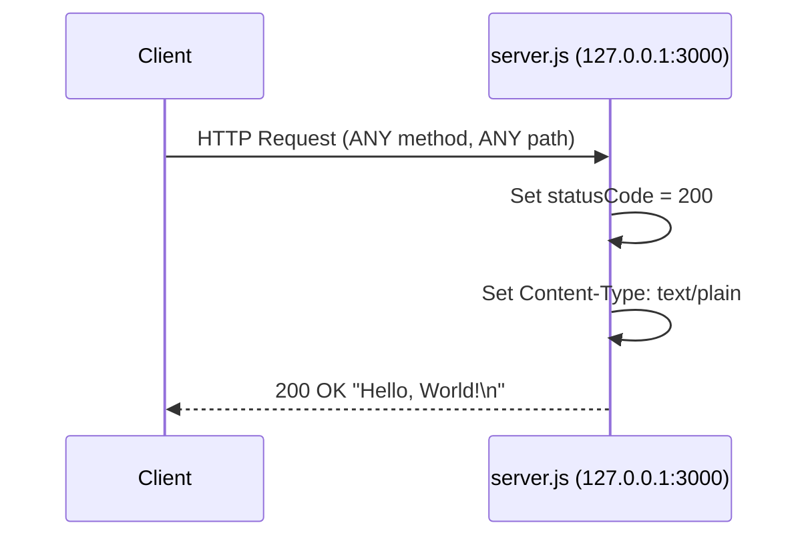
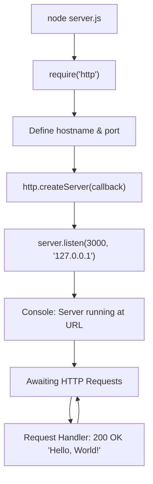

# Technical Specification

# 0. Agent Action Plan

## 0.1 Intent Clarification


### 0.1.1 Core Documentation Objective

Based on the provided requirements, the Blitzy platform understands that the documentation objective is to **comprehensively document an existing minimal Node.js HTTP server project** (`hello_world` v1.0.0) by adding structured JSDoc annotations to the source code and creating a full-featured README that transforms this currently underdocumented test fixture into a well-documented, developer-friendly repository.

**Request Categorization:** Create new documentation | Improve documentation coverage

**Documentation Types Required:**
- **Inline code documentation** — JSDoc comments for all functions, constants, and the server creation callback in `server.js`
- **Project README** — Comprehensive `README.md` covering setup, API reference, deployment guidance, and code explanations
- **API documentation** — HTTP endpoint specification with request/response details
- **Deployment guide** — Instructions for running the server locally and in production-like environments

**Requirement Breakdown with Enhanced Clarity:**

- **Requirement 1: Add JSDoc comments to `server.js` functions** — Annotate every callable unit and exported constant in `server.js` with standards-compliant `/** ... */` JSDoc block comments, including `@description`, `@param`, `@returns`, `@type`, `@module`, and `@example` tags where applicable. The `http.createServer` callback and `server.listen` callback are the two primary function expressions requiring documentation.
- **Requirement 2: Comprehensive README with setup instructions** — Replace the current minimal stub `README.md` (which contains only a project title and a "Do not touch!" warning) with a fully-structured README that includes prerequisites, installation steps, environment setup, and how to run the project.
- **Requirement 3: API documentation** — Document the single HTTP endpoint behavior: the server responds to ANY HTTP method at ANY path with a `200 OK` status, `Content-Type: text/plain` header, and body `Hello, World!\n`.
- **Requirement 4: Deployment guide** — Provide instructions for deploying the server, covering local execution via `node server.js`, process management options, and network binding considerations (currently restricted to `127.0.0.1`).
- **Requirement 5: Inline code explanations** — Add contextual explanations within the README that walk through each section of `server.js`, explaining the purpose and behavior of each code construct for educational clarity.

**Implicit Documentation Needs Surfaced:**
- The `package.json` field `"main": "index.js"` references a non-existent file; the README should clarify that the entry point is `server.js`, not `index.js`
- The project lacks a `start` script in `package.json`; documentation should note how to launch the server and recommend adding `"start": "node server.js"` as a script
- The test script is a placeholder (`echo "Error: no test specified" && exit 1`); documentation should note this limitation
- The `server - Copy.js` duplicate should be acknowledged or distinguished from the primary `server.js`

### 0.1.2 Special Instructions and Constraints

- No specific directives about documentation style were provided; default to standard JSDoc 3/4 annotation conventions and GitHub-flavored Markdown for the README
- No template requirements were specified; the README will follow standard Node.js project README conventions (project title, description, prerequisites, installation, usage, API reference, deployment, license)
- No examples or templates were provided by the user
- The existing `README.md` contains the note "Do not touch!" which refers to the test project itself—the README content will be replaced entirely to fulfill the documentation objective
- The project is a test fixture for Backprop integration, which provides useful context for the documentation narrative

### 0.1.3 Technical Interpretation

These documentation requirements translate to the following technical documentation strategy:

- To **document server.js functions**, we will **update** `server.js` by inserting JSDoc block comments (`/** ... */`) above each constant declaration (`hostname`, `port`), the `http.createServer` callback function, and the `server.listen` callback function, using appropriate `@module`, `@constant`, `@type`, `@description`, `@param`, `@returns`, and `@callback` tags
- To **create a comprehensive README**, we will **replace** the current `README.md` stub with a complete project documentation file structured with sections for Overview, Prerequisites, Installation, Quick Start, API Reference, Code Walkthrough, Deployment, Configuration, Project Structure, and License
- To **provide API documentation**, we will **create within the README** a dedicated API Reference section detailing the HTTP endpoint behavior, including method handling, response format, status codes, and example `curl` commands
- To **include a deployment guide**, we will **create within the README** a Deployment section covering local execution, process management recommendations (PM2, systemd), network binding configuration, and production considerations
- To **add inline code explanations**, we will **create within the README** a Code Walkthrough section that progresses through `server.js` line-by-line, explaining each construct in accessible technical language

### 0.1.4 Inferred Documentation Needs

- Based on code analysis: `server.js` contains 2 constant declarations, 1 `createServer` callback, and 1 `listen` callback, all lacking any documentation comments — 0% JSDoc coverage currently
- Based on structure: The project is a single-file application with no module exports, meaning JSDoc should annotate it as a standalone executable module rather than a library
- Based on dependencies: The server uses only the built-in Node.js `http` module (via CommonJS `require`), meaning no third-party API documentation is needed
- Based on user journey: A developer encountering this repository needs a clear onboarding path — from understanding the purpose, to installing prerequisites, to running the server and verifying it works
- Based on `package.json` discrepancy: The `"main": "index.js"` field does not match the actual entry point `server.js`; documentation should call this out and recommend correction


## 0.2 Documentation Discovery and Analysis


### 0.2.1 Existing Documentation Infrastructure Assessment

Repository analysis reveals a **minimal documentation infrastructure** with a single stub README and zero inline code documentation. No documentation generators, style guides, templates, or documentation tooling are present.

**Documentation Files Discovered:**

| File | Type | Status | Content |
|------|------|--------|---------|
| `README.md` | Project README | Minimal stub | Contains only project title ("hao-backprop-test") and warning "test project for backprop integration. Do not touch!" — 2 lines total |

**Documentation Generator Detection:**

| Tool | Config File Searched | Found |
|------|---------------------|-------|
| JSDoc | `jsdoc.json`, `.jsdoc.conf.json`, `jsdoc.conf.js` | No |
| MkDocs | `mkdocs.yml` | No |
| Docusaurus | `docusaurus.config.js` | No |
| Sphinx | `conf.py`, `sphinx.conf.py` | No |
| TypeDoc | `typedoc.json` | No |
| Docsify | `index.html` in `docs/` | No |

**Inline Documentation Status:**

| File | Lines | JSDoc Comments | Inline Comments | Coverage |
|------|-------|----------------|-----------------|----------|
| `server.js` | 14 | 0 | 0 | 0% |
| `server - Copy.js` | 14 | 0 | 0 | 0% |

- Current documentation framework: **None** — no documentation generator is configured
- API documentation tools in use: **None** — JSDoc is not installed as a dependency
- Diagram tools detected: **None**
- Documentation hosting/deployment setup: **None**

### 0.2.2 Repository Code Analysis for Documentation

**Search patterns used for code to document:**

- Public APIs: `server.js` — contains the `http.createServer` callback and `server.listen` callback (both anonymous arrow functions)
- Module interfaces: `package.json` declares `"main": "index.js"` but `index.js` does not exist; the actual entry point is `server.js`
- Configuration options: Hardcoded constants `hostname = '127.0.0.1'` and `port = 3000` in `server.js`
- CLI commands: None — the project is run directly with `node server.js`

**Key directories examined:**

| Path | Contents | Documentation Relevance |
|------|----------|------------------------|
| `/` (root) | All project files at root level | Flat structure; no `src/`, `lib/`, or `docs/` directories |
| `server.js` | Core application — 14 lines, Node.js HTTP server | Primary documentation target |
| `server - Copy.js` | Exact duplicate of `server.js` | Secondary; should be noted as duplicate |
| `package.json` | npm manifest — `hello_world` v1.0.0, MIT license | Metadata source for README |
| `package-lock.json` | Lockfile — lockfileVersion 3, zero dependencies | Confirms zero-dependency architecture |
| `LoginTest.java` | Java stub with invalid syntax | Out of scope for documentation (non-functional placeholder) |
| `LoginTest - Copy.java` | Duplicate Java stub | Out of scope |
| `industry.csv` | CSV reference data — 43 industry labels | Out of scope (static data asset) |
| `industry - Copy.csv` | Duplicate of industry.csv | Out of scope |
| `*.txt` files | Empty placeholder files | Out of scope |

**Related documentation found:** The existing `README.md` provides no useful documentation context — it functions only as a project identifier.

### 0.2.3 Web Search Research Conducted

- **JSDoc best practices for Node.js:** JSDoc 4.0.5 is the latest stable version, supporting Node.js 12.0.0 and later. JSDoc annotations use block comment syntax with structured tags such as `@param`, `@returns`, `@type`, `@module`, `@description`, and `@example`. JSDoc can be installed as a dev dependency via `npm install --save-dev jsdoc` and invoked with `npx jsdoc server.js` to generate HTML documentation.
- **README conventions for Node.js projects:** npm recommends including a `README.md` in the package root directory covering installation, configuration, and usage. GitHub-Flavored Markdown is the standard rendering format. Best practices include: project title and description, badges, prerequisites, installation steps, usage examples, API reference, contributing guidelines, and license information.
- **Node.js documentation style:** The official Node.js documentation style guide recommends using language-aware fenced code blocks, camelCase for instances, PascalCase for constructors, and consistent US English spelling. Methods should include parentheses in references (e.g., `server.listen()` not `server.listen`).


## 0.3 Documentation Scope Analysis


### 0.3.1 Code-to-Documentation Mapping

**Modules requiring documentation:**

- **Module: `server.js`** (Source: `server.js:1-14`)
  - Public APIs / Documentable units:
    - `const http = require('http')` — Module import declaration (line 1)
    - `const hostname = '127.0.0.1'` — Server hostname constant (line 3)
    - `const port = 3000` — Server port constant (line 4)
    - `http.createServer((req, res) => {...})` — Request handler callback (lines 6-10)
    - `server.listen(port, hostname, () => {...})` — Server startup callback (lines 12-14)
  - Current documentation: **Missing** — zero JSDoc comments, zero inline comments
  - Documentation needed: Module-level JSDoc header, `@constant` annotations for `hostname` and `port`, `@callback` annotation for the request handler, `@description` for the listen callback, and `@example` showing how to run the server

- **Module: `server - Copy.js`** (Source: `server - Copy.js:1-14`)
  - This is an exact byte-for-byte duplicate of `server.js`
  - Current documentation: **Missing**
  - Documentation needed: Same JSDoc annotations as `server.js` to maintain consistency between the files

**Configuration options requiring documentation:**

| Config Source | Option | Current Value | Documented | Documentation Needed |
|---------------|--------|---------------|------------|---------------------|
| `server.js:3` | `hostname` | `'127.0.0.1'` | No | README configuration section explaining localhost binding |
| `server.js:4` | `port` | `3000` | No | README configuration section explaining port selection |
| `package.json` | `name` | `"hello_world"` | No | README project overview |
| `package.json` | `version` | `"1.0.0"` | No | README project overview |
| `package.json` | `main` | `"index.js"` | No | README must note this is incorrect; actual entry point is `server.js` |
| `package.json` | `license` | `"MIT"` | No | README license section |
| `package.json` | `scripts.test` | Placeholder | No | README should note test limitations |

**Features requiring user guides:**

- **Feature: HTTP Server**
  - Current coverage: None
  - Gaps: Server startup instructions, request handling behavior, response format, testing the endpoint, shutting down the server

### 0.3.2 Documentation Gap Analysis

Given the requirements and repository analysis, documentation gaps include:

**Undocumented public APIs:**

| Documentable Unit | File | Line(s) | Gap Description |
|-------------------|------|---------|-----------------|
| Module declaration | `server.js` | 1 | No `@module` or `@file` JSDoc tag identifying the module purpose |
| `hostname` constant | `server.js` | 3 | No `@constant` or `@type` annotation |
| `port` constant | `server.js` | 4 | No `@constant` or `@type` annotation |
| Request handler callback | `server.js` | 6-10 | No `@callback`, `@param`, or `@description` for the `(req, res) => {}` function |
| Listen callback | `server.js` | 12-14 | No documentation for the startup confirmation callback |

**Missing user guides:**

- No getting-started or quick-start guide exists
- No installation instructions beyond the generic npm workflow
- No API endpoint documentation
- No troubleshooting or FAQ section
- No code walkthrough or architectural explanation

**Incomplete architecture documentation:**

- No explanation of the single-file monolithic architecture
- No request/response flow documentation
- No network binding explanation (localhost-only constraint)

**Outdated documentation:**

- `README.md` references the project as "hao-backprop-test" with a "Do not touch!" warning — this does not accurately reflect the documentation needs and will be replaced with comprehensive content


## 0.4 Documentation Implementation Design


### 0.4.1 Documentation Structure Planning

Since the repository is a flat, single-file project with no existing `docs/` directory, the documentation structure will be kept proportional to the project scope. Documentation will reside in the project root alongside the source files.

**Documentation hierarchy:**

```
/ (project root)
├── README.md              (comprehensive project documentation — UPDATE)
├── server.js              (JSDoc-annotated source — UPDATE for inline docs)
└── server - Copy.js       (JSDoc-annotated duplicate — UPDATE for inline docs)
```

No separate `docs/` directory is warranted for a single-file application. The README will serve as the central documentation hub, consolidating all documentation requirements into a single, well-organized Markdown file. The JSDoc annotations embedded in `server.js` and `server - Copy.js` will serve as the inline code documentation layer.

**README Sections Architecture:**

```
README.md
├── Project Title and Description
├── Badges (Node.js version, License, npm version)
├── Table of Contents
├── Prerequisites
├── Installation
├── Quick Start
├── API Reference
│   ├── Endpoint Specification
│   ├── Request Handling
│   └── Response Format
├── Code Walkthrough
│   ├── Module Import
│   ├── Server Configuration
│   ├── Request Handler
│   └── Server Startup
├── Deployment Guide
│   ├── Local Development
│   ├── Production Considerations
│   └── Process Management
├── Configuration
├── Project Structure
├── Troubleshooting
├── License
└── Author
```

### 0.4.2 Content Generation Strategy

**Information Extraction Approach:**

- "Extract server configuration constants from `server.js:3-4` to populate the Configuration section"
- "Derive API endpoint behavior from `server.js:6-10` (the `createServer` callback) to create the API Reference section"
- "Analyze `package.json` fields (`name`, `version`, `author`, `license`) to populate the project overview, badges, and license sections"
- "Map the `http.createServer` and `server.listen` call chain from `server.js:1-14` to construct the Code Walkthrough section"
- "Reference the `package-lock.json` lockfileVersion 3 to determine minimum npm version (7+) for the Prerequisites section"

**Documentation Standards:**

- Markdown formatting with proper heading hierarchy (`#` for title, `##` for major sections, `###` for subsections)
- Code examples using fenced blocks with `js` language tag for JavaScript and `bash` language tag for shell commands
- Tables for structured data (API responses, configuration options, project files)
- Source citations as inline references: `Source: server.js:LineNumber`
- Consistent terminology: "Node.js" (not "Node" or "NodeJS"), `server.listen()` with parentheses for method references

**JSDoc Annotation Standards:**

- Every documentable unit receives a `/** ... */` block comment
- Module-level documentation uses `@module` and `@file` tags
- Constants use `@constant` and `@type` tags
- Callbacks use `@callback` or `@param` with `@description`
- The `@example` tag provides runnable usage demonstrations
- Tags follow the order: `@module` / `@file`, `@description`, `@type` / `@constant`, `@param`, `@returns`, `@example`

### 0.4.3 Diagram and Visual Strategy

**Mermaid diagrams to create:**

- **Request Flow Diagram** — Sequence diagram illustrating the lifecycle of an HTTP request from client to server and back, showing the `createServer` callback execution:



- **Architecture Overview Diagram** — Flowchart showing the application's component structure and startup flow:



These diagrams will be embedded in the README Code Walkthrough and API Reference sections respectively, providing visual context for the text-based explanations.


## 0.5 Documentation File Transformation Mapping


### 0.5.1 File-by-File Documentation Plan

The following table maps **every** documentation file to be created, updated, or used as a reference in this documentation exercise. The target documentation file is listed first.

| Target Documentation File | Transformation | Source Code/Docs | Content/Changes |
|---------------------------|----------------|------------------|-----------------|
| `README.md` | **UPDATE** | `README.md`, `server.js`, `package.json` | Replace minimal 2-line stub with comprehensive project documentation including: project overview, prerequisites, installation, quick start, API reference with endpoint specification, code walkthrough with inline explanations, deployment guide, configuration reference, project structure table, troubleshooting, and license section |
| `server.js` | **UPDATE** | `server.js` | Add JSDoc block comments: `@module` header for the file, `@constant` annotations for `hostname` and `port`, `@callback` / `@param` / `@description` for the `http.createServer` request handler callback, and `@description` for the `server.listen` startup callback. Add inline comments explaining each code section |
| `server - Copy.js` | **UPDATE** | `server - Copy.js`, `server.js` | Mirror the same JSDoc annotations and inline comments added to `server.js` to maintain consistency between the primary file and its copy |
| `package.json` | **REFERENCE** | `package.json` | Use as metadata source for README (project name, version, author, license, description). Not modified — serves as reference only |
| `package-lock.json` | **REFERENCE** | `package-lock.json` | Use lockfileVersion 3 to determine npm 7+ prerequisite. Not modified — serves as reference only |

### 0.5.2 New Documentation Content Detail

No entirely new documentation files are being created. All documentation is either embedded inline (JSDoc in `.js` files) or consolidated into the updated `README.md`. This is appropriate given the project's single-file architecture.

### 0.5.3 Documentation Files to Update Detail

**`README.md` — Full Replacement with Comprehensive Documentation**

```
File: README.md
Type: Project README (comprehensive)
Source Code: server.js, package.json, package-lock.json
Sections:
  - Project Title and Description (from package.json:name, description)
  - Badges (Node.js compatibility, MIT license, npm version)
  - Table of Contents (auto-linked section headers)
  - Prerequisites (Node.js runtime, npm 7+)
  - Installation (git clone, npm install)
  - Quick Start (node server.js, curl verification)
  - API Reference (endpoint spec from server.js:6-10)
  - Code Walkthrough (line-by-line from server.js:1-14)
  - Deployment Guide (local, production, process management)
  - Configuration (hostname, port from server.js:3-4)
  - Project Structure (all root-level files with descriptions)
  - Troubleshooting (common issues and solutions)
  - License (MIT from package.json:license)
  - Author (hxu from package.json:author)
Diagrams:
  - Mermaid sequence diagram for HTTP request flow
  - Mermaid flowchart for application architecture
Key Citations: server.js:1-14, package.json:1-11
```

**`server.js` — JSDoc Annotation Insertion**

```
File: server.js
Type: Inline code documentation (JSDoc)
Source Code: server.js (self-referencing)
Annotations to add:
  - Line 1 (above): @module and @file tag with module description
  - Line 3 (above): @constant {string} hostname with description
  - Line 4 (above): @constant {number} port with description
  - Line 6 (above): @description for createServer, @callback for handler
  - Line 6 (params): @param {http.IncomingMessage} req
  - Line 6 (params): @param {http.ServerResponse} res
  - Line 12 (above): @description for server.listen callback
Key Citations: Node.js http module API
```

**`server - Copy.js` — JSDoc Annotation Insertion (Mirror)**

```
File: server - Copy.js
Type: Inline code documentation (JSDoc)
Source Code: server - Copy.js (mirrors server.js)
Annotations to add:
  - Identical JSDoc blocks as server.js
  - Note in module header that this is a copy/duplicate variant
Key Citations: server.js (primary reference)
```

### 0.5.4 Documentation Configuration Updates

No documentation configuration files need to be created or updated because:
- No documentation generator (MkDocs, Docusaurus, Sphinx) is in use
- No documentation build pipeline exists
- The project uses raw Markdown rendered by GitHub/npm

However, the `package.json` `scripts` section should be noted as a candidate for adding a `"docs"` script (e.g., `"docs": "jsdoc server.js -d docs/"`) if the JSDoc tool is added as a dev dependency in the future.

### 0.5.5 Cross-Documentation Dependencies

- **`README.md` → `server.js`**: The README Code Walkthrough section references specific lines and constructs in `server.js`; JSDoc annotations in `server.js` should be consistent with the README explanations
- **`README.md` → `package.json`**: The README project overview, prerequisites, and license sections derive their data directly from `package.json` fields
- **`server - Copy.js` → `server.js`**: JSDoc annotations in the copy must mirror those in the primary file to avoid documentation drift
- **Navigation links**: The README Table of Contents will use anchor links (`#section-name`) to enable in-document navigation


## 0.6 Dependency Inventory


### 0.6.1 Documentation Dependencies

The following documentation tools and packages are relevant to this documentation exercise. Since the project currently has **zero** npm dependencies, JSDoc would be a new addition as a development dependency.

| Registry | Package Name | Version | Purpose |
|----------|--------------|---------|---------|
| npm | jsdoc | 4.0.5 | API documentation generator for JavaScript; used to parse JSDoc comments in `server.js` and optionally generate HTML documentation output |
| Built-in | Node.js `http` module | (bundled with Node.js) | The only runtime dependency; its API types (`http.IncomingMessage`, `http.ServerResponse`) are referenced in JSDoc `@param` annotations |

**Runtime Environment Dependencies:**

| Dependency | Required Version | Detected Version | Purpose |
|------------|-----------------|------------------|---------|
| Node.js | Any version supporting CommonJS and built-in `http` module (Node.js 0.10+) | v20.20.0 (installed) | Runtime for `server.js` |
| npm | 7+ (per lockfileVersion 3 in `package-lock.json`) | 11.1.0 (installed) | Package manager for dependency installation |

**Notes on JSDoc dependency:**
- JSDoc 4.0.5 is the latest stable release and supports Node.js 12.0.0 and later
- JSDoc should be installed as a `devDependency` since it is a documentation tool, not a runtime requirement: `npm install --save-dev jsdoc`
- Even without installing JSDoc as a dependency, the JSDoc comment annotations in the source code provide immediate value through IDE intellisense and type checking in editors like Visual Studio Code
- If HTML documentation generation is desired, the JSDoc CLI can be invoked via `npx jsdoc server.js --destination docs/`

### 0.6.2 Documentation Reference Updates

No documentation link updates are required since:
- There are no existing internal documentation links to update (the current README contains no links)
- No cross-referencing between documentation files exists yet
- The README will establish fresh internal anchor links via the Table of Contents

**Link establishment plan for the new README:**

| Link Type | Source Section | Target | Format |
|-----------|---------------|--------|--------|
| Table of Contents anchor | README.md TOC | Each major section | `[Section Title](#section-slug)` |
| External reference | Prerequisites section | Node.js download page | `https://nodejs.org/` |
| External reference | License section | MIT license details | `https://opensource.org/licenses/MIT` |


## 0.7 Coverage and Quality Targets


### 0.7.1 Documentation Coverage Metrics

**Current coverage analysis:**

| Coverage Category | Documented | Total | Percentage |
|-------------------|-----------|-------|------------|
| Public APIs / Documentable units in `server.js` | 0 | 5 | 0% |
| User-facing features (HTTP server) | 0 | 1 | 0% |
| Configuration options (`hostname`, `port`) | 0 | 2 | 0% |
| Project-level documentation (README) | 0 (stub only) | 1 | 0% |
| **Overall** | **0** | **9** | **0%** |

**Target coverage:** 100% of all documentable units based on the user requirement for comprehensive documentation.

**Coverage gaps to address:**

| Scope Area | Current | Target | Gap |
|------------|---------|--------|-----|
| `server.js` JSDoc annotations | 0% | 100% | All 5 documentable units need JSDoc blocks |
| `server - Copy.js` JSDoc annotations | 0% | 100% | Mirror all annotations from `server.js` |
| README project overview | 0% | 100% | Full project description, badges, metadata |
| README setup instructions | 0% | 100% | Prerequisites, installation, quick start |
| README API documentation | 0% | 100% | Endpoint specification, examples, response format |
| README deployment guide | 0% | 100% | Local development, production, process management |
| README code explanations | 0% | 100% | Line-by-line walkthrough of `server.js` |
| README configuration reference | 0% | 100% | `hostname`, `port` documentation |
| README project structure | 0% | 100% | File listing with descriptions |

### 0.7.2 Documentation Quality Criteria

**Completeness requirements:**
- All 5 documentable units in `server.js` have JSDoc block comments with `@description`, appropriate type tags, and `@param` tags where applicable
- The README includes all 12 planned sections (Title, Table of Contents, Prerequisites, Installation, Quick Start, API Reference, Code Walkthrough, Deployment Guide, Configuration, Project Structure, Troubleshooting, License)
- Every code example in the README includes language-tagged fenced code blocks with correct, copy-pasteable syntax
- API documentation includes at least one `curl` example demonstrating the endpoint

**Accuracy validation:**
- Code examples must reflect the actual `server.js` source — hostname `127.0.0.1`, port `3000`, response body `Hello, World!\n`
- JSDoc `@param` types must match Node.js built-in types (`http.IncomingMessage`, `http.ServerResponse`)
- Prerequisites section must accurately state Node.js and npm version requirements based on `package-lock.json` lockfileVersion 3
- The `package.json` `"main": "index.js"` discrepancy must be explicitly noted

**Clarity standards:**
- Technical accuracy with accessible language suitable for developers of all experience levels
- Progressive disclosure: Quick Start section provides the fastest path to running the server, with deeper sections for those who need more detail
- Consistent terminology: "Node.js" (never "Node" or "NodeJS"), `server.listen()` with parentheses

**Maintainability:**
- Source citations embedded as comments referencing `server.js` line numbers
- JSDoc annotations tightly coupled to the code they describe — any future code changes will naturally prompt documentation updates
- README structure follows standard conventions making it easy for future contributors to extend

### 0.7.3 Example and Diagram Requirements

| Requirement | Target | Location |
|-------------|--------|----------|
| Minimum code examples per API endpoint | 2 (one `curl` command, one programmatic `http.get` example) | README API Reference section |
| Minimum JSDoc `@example` tags | 1 per module (showing `node server.js` execution) | `server.js` module-level JSDoc |
| Mermaid diagrams | 2 (request flow sequence diagram, application architecture flowchart) | README Code Walkthrough and API Reference |
| Shell command examples | 3 (installation, server start, verification) | README Installation, Quick Start, API Reference |
| Configuration examples | 1 (table of configurable constants with default values) | README Configuration section |


## 0.8 Scope Boundaries


### 0.8.1 Exhaustively In Scope

**Source files receiving JSDoc annotations (inline documentation):**
- `server.js` — Full JSDoc annotation of all constants, callbacks, and module-level documentation
- `server - Copy.js` — Mirror JSDoc annotations from `server.js`

**Documentation files being updated:**
- `README.md` — Complete replacement of current stub with comprehensive project documentation

**Documentation content to be created within README.md:**
- Project overview and description section
- Badges section (Node.js, license, version)
- Table of Contents with anchor links
- Prerequisites section (Node.js, npm)
- Installation instructions section
- Quick Start section
- API Reference section with endpoint specification, request/response tables, and `curl` examples
- Code Walkthrough section with line-by-line explanations of `server.js`
- Deployment Guide section covering local, production, and process management
- Configuration Reference section documenting `hostname` and `port` constants
- Project Structure section listing all repository files
- Troubleshooting section for common issues
- License section (MIT)
- Author section

**Reference files used for documentation content extraction:**
- `package.json` — Project metadata (name, version, description, author, license, scripts)
- `package-lock.json` — Lockfile version for npm compatibility requirements
- `server.js` — Source code for all technical documentation content

**Documentation assets:**
- Mermaid diagrams embedded within `README.md` (no separate image files)

### 0.8.2 Explicitly Out of Scope

- **Source code logic modifications** — No changes to the functional behavior of `server.js` or `server - Copy.js`. Only documentation comments (JSDoc blocks and inline comments) are added; executable code remains untouched
- **`package.json` modifications** — The `package.json` will not be modified (e.g., adding a `"start"` script or correcting `"main"` from `"index.js"` to `"server.js"`); these are noted as recommendations in the README only
- **New file creation** — No new files (e.g., `docs/` directory, `CONTRIBUTING.md`, `CHANGELOG.md`) will be created; all documentation is consolidated into the existing `README.md` and inline JSDoc
- **Test file modifications** — The placeholder test script in `package.json` will not be modified
- **Java stub documentation** — `LoginTest.java` and `LoginTest - Copy.java` are non-functional placeholders and are not in scope for documentation
- **CSV/binary file documentation** — `industry.csv`, `industry - Copy.csv`, PDF, DOC, and JPG files are static assets outside the documentation scope
- **Empty placeholder files** — `test.py.txt`, `test.py - Copy.txt`, `test.txt.txt` are empty and require no documentation
- **Dependency installation** — JSDoc will not be installed as a project dependency as part of this task; JSDoc annotations work without the tool being installed. Installation of JSDoc is documented as an optional recommendation
- **Documentation generator setup** — No documentation site generator (MkDocs, Docusaurus, etc.) will be configured
- **CI/CD pipeline changes** — No build or deployment pipeline modifications
- **Feature additions or code refactoring** — No functional changes to the HTTP server behavior


## 0.9 Execution Parameters


### 0.9.1 Documentation-Specific Instructions

| Parameter | Value |
|-----------|-------|
| Documentation build command | `npx jsdoc server.js --destination docs/` (optional; generates HTML API docs from JSDoc annotations) |
| Documentation preview command | Open `README.md` in any Markdown viewer, or use `npx grip README.md` for GitHub-flavored preview |
| Diagram generation command | Mermaid diagrams are embedded inline in `README.md` and rendered natively by GitHub; no separate generation step required |
| Documentation deployment command | Not applicable — documentation is rendered by GitHub/npm from Markdown in the repository |
| Default format | Markdown (GitHub-Flavored) for `README.md`; JSDoc 3/4 comment syntax for inline annotations |
| Citation requirement | Every technical claim in the README must reference the source file and line number (e.g., `Source: server.js:6-10`) |
| Style guide | Node.js documentation style conventions: US English spelling, `Node.js` capitalization, camelCase for instances, methods with parentheses |
| Documentation validation | Visual review of Markdown rendering; verify JSDoc annotations parse correctly via `npx jsdoc server.js --explain` |

### 0.9.2 Environment Configuration

| Configuration | Value | Source |
|---------------|-------|--------|
| Node.js version | v20.20.0 | System-installed runtime |
| npm version | 11.1.0 | Bundled with Node.js |
| Package lockfileVersion | 3 | `package-lock.json:4` |
| Module system | CommonJS (`require()`) | `server.js:1` |
| Project license | MIT | `package.json:10` |
| Author | hxu | `package.json:9` |


## 0.10 Rules for Documentation


### 0.10.1 Documentation-Specific Rules

The following rules govern all documentation changes in this task. No user-specified documentation directives were explicitly provided beyond the core requirements, so these rules are derived from best practices and the project context.

**JSDoc Annotation Rules:**
- Every documentable unit in `server.js` and `server - Copy.js` must receive a JSDoc block comment (`/** ... */`)
- JSDoc comments must be placed immediately above the code construct they document, with no blank lines between the comment and the code
- Use standard JSDoc tags: `@module`, `@file`, `@description`, `@constant`, `@type`, `@param`, `@returns`, `@callback`, `@example`
- Type annotations must reference Node.js built-in types accurately (e.g., `http.IncomingMessage`, `http.ServerResponse`, `http.Server`)
- The `@example` tag must contain runnable commands or code that a developer can copy and execute

**README Content Rules:**
- The README must be self-contained — a developer should be able to understand, install, run, and verify the project using only the README
- All code examples must be accurate and reflect the current state of `server.js` (hostname `127.0.0.1`, port `3000`, response `Hello, World!\n`)
- Shell commands must be non-interactive and copy-pasteable
- The Table of Contents must link to every major section via Markdown anchor links
- Configuration values must be documented with their types, defaults, and descriptions
- The `package.json` discrepancy (`"main": "index.js"` vs actual `server.js`) must be explicitly noted

**Consistency Rules:**
- JSDoc annotations in `server - Copy.js` must exactly mirror those in `server.js` (except the module-level comment may note it is a duplicate)
- All documentation must use consistent terminology: "Node.js" (not "Node" or "NodeJS"), "npm" (lowercase), method names with parentheses
- Markdown heading levels must follow a strict hierarchy: `#` for title, `##` for major sections, `###` for subsections
- Code blocks must use appropriate language tags (`js` for JavaScript, `bash` for shell commands)

**Accuracy Rules:**
- No assumptions about features not present in the codebase — the server has no routing, no middleware, no error handling, no authentication; documentation must not imply otherwise
- Port and hostname values must match the hardcoded constants in `server.js`
- License must match the `package.json` value (MIT)


## 0.11 References


### 0.11.1 Repository Files and Folders Searched

The following files and folders were examined during the documentation discovery and analysis phase to derive all conclusions in this Agent Action Plan.

**Files retrieved and analyzed:**

| File Path | Purpose of Inspection | Key Findings |
|-----------|-----------------------|--------------|
| `server.js` | Primary documentation target — source code analysis | 14-line Node.js HTTP server using built-in `http` module; binds to `127.0.0.1:3000`; responds with `Hello, World!\n` to all requests; zero JSDoc or inline comments |
| `server - Copy.js` | Duplicate detection and documentation parity analysis | Byte-for-byte duplicate of `server.js`; same documentation gaps |
| `package.json` | Project metadata extraction and dependency analysis | Package `hello_world` v1.0.0 by `hxu`; MIT license; `"main": "index.js"` (incorrect — should be `server.js`); zero dependencies; placeholder test script |
| `package-lock.json` | Dependency verification and npm version determination | lockfileVersion 3 (requires npm 7+); zero dependency tree; confirms zero-dependency architecture |
| `README.md` | Existing documentation assessment | 2-line stub: project title "hao-backprop-test" and warning "Do not touch!"; provides no useful documentation |
| `LoginTest.java` | Scope boundary determination | Java stub with invalid syntax (`Web` token); non-functional placeholder; excluded from documentation scope |
| `LoginTest - Copy.java` | Scope boundary determination | Duplicate of `LoginTest.java`; excluded from scope |

**Folders retrieved and analyzed:**

| Folder Path | Purpose of Inspection | Key Findings |
|-------------|-----------------------|--------------|
| `/` (repository root) | Full project structure discovery | Flat directory structure with 12 files; no `src/`, `lib/`, `docs/`, or `test/` directories; all files at root level |

**Searches conducted for documentation infrastructure:**

| Search Target | Pattern | Result |
|---------------|---------|--------|
| `.blitzyignore` files | `find / -name ".blitzyignore"` | None found |
| Documentation generators | `mkdocs.yml`, `docusaurus.config.js`, `jsdoc.json`, `sphinx.conf.py`, `typedoc.json` | None found |
| Markdown files | `*.md`, `*.mdx`, `*.rst` | Only `README.md` at root |
| Node.js version files | `.nvmrc`, `.node-version`, `engines` in `package.json` | None found |

### 0.11.2 Tech Spec Sections Referenced

| Section | Purpose |
|---------|---------|
| 1.1 Executive Summary | Project context, stakeholders, and value proposition |
| 1.2 System Overview | System architecture, components, and capabilities |
| 3.1 Programming Languages | Node.js and Java language details |
| 3.2 Frameworks & Libraries | Confirmation of zero external dependencies and built-in `http` module usage |
| 5.2 Component Details | HTTP Server component specification, interfaces, and API behavior |

### 0.11.3 External Research Sources

| Source | Topic Researched | Key Information Used |
|--------|-----------------|---------------------|
| npmjs.com/package/jsdoc | JSDoc latest version | JSDoc 4.0.5 is the current stable release; supports Node.js 12.0.0+ |
| jsdoc.app | JSDoc official documentation | Tag reference for `@module`, `@param`, `@returns`, `@constant`, `@type`, `@example` |
| docs.npmjs.com (About package README files) | README best practices for npm packages | README should cover installation, configuration, and usage |
| github.com/nodejs/node/doc/README.md | Node.js documentation style guide | US English, language-aware code fences, PascalCase constructors, camelCase instances |

### 0.11.4 Attachments

No attachments were provided for this project. No Figma URLs or external design assets are referenced.


