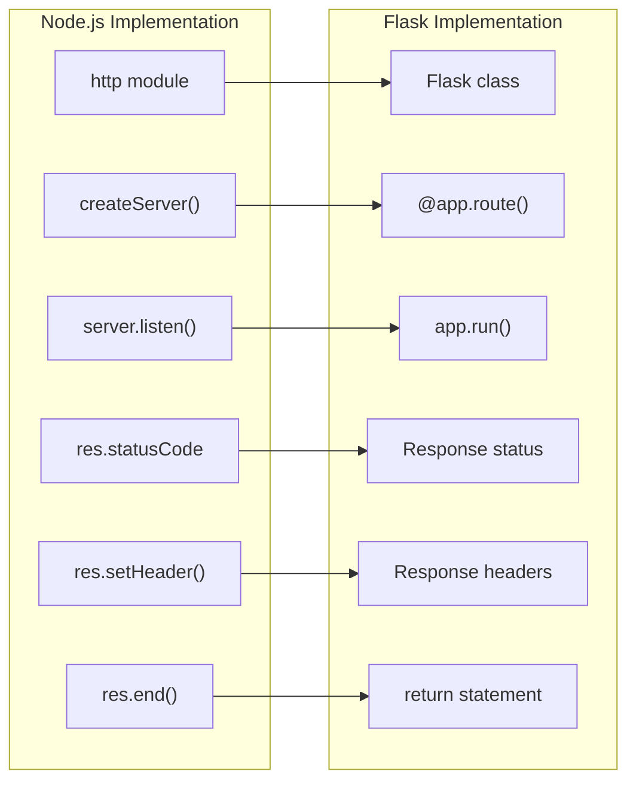
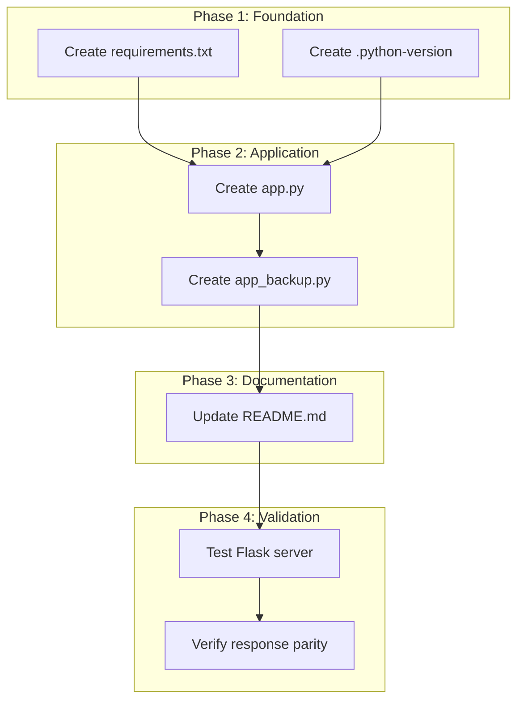
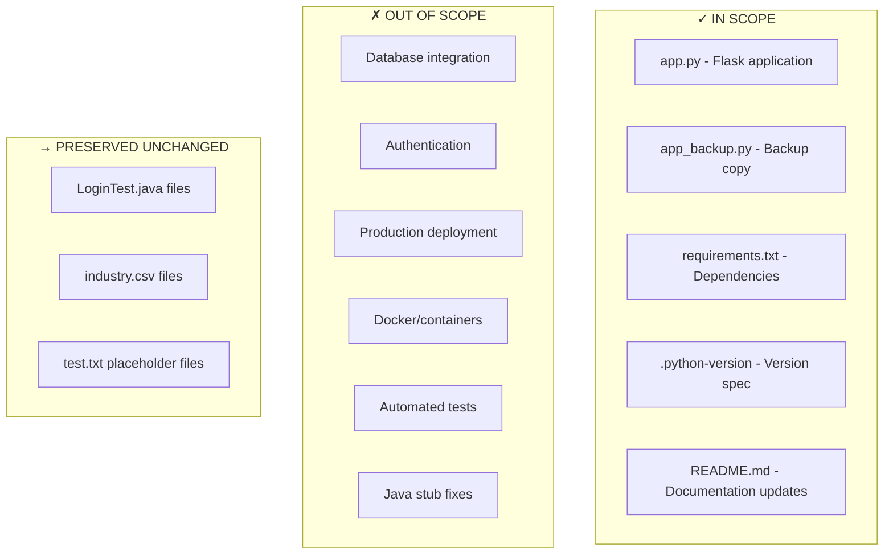

# Technical Specification

# 0. Agent Action Plan

## 0.1 Intent Clarification

### 0.1.1 Core Feature Objective

Based on the prompt, the Blitzy platform understands that the new feature requirement is to:

**Complete Language Migration from Node.js to Python Flask**

The primary objective is to perform a comprehensive rewrite of an existing Node.js HTTP server application into an equivalent Python 3 Flask web application while preserving exact behavioral parity.

| Requirement ID | Requirement Description | Priority |
|----------------|------------------------|----------|
| REQ-001 | Rewrite Node.js server.js into a Python 3 Flask application | Critical |
| REQ-002 | Preserve all existing features and functionality exactly | Critical |
| REQ-003 | Match the behavior and logic of the current implementation | Critical |
| REQ-004 | Maintain the same HTTP endpoint behavior (status codes, headers, response body) | Critical |
| REQ-005 | Preserve localhost-only binding (127.0.0.1) constraint | High |
| REQ-006 | Maintain stateless operation pattern | High |

**Implicit Requirements Detected:**

- The Flask application must listen on the same network interface (127.0.0.1) and port (3000) as the original Node.js server
- Response content must be identical: "Hello, World!\n" with HTTP 200 status and Content-Type: text/plain
- Server startup logging behavior must be preserved
- The application must handle all HTTP methods and paths uniformly (returning the same response)
- Zero external dependency philosophy should be maintained where possible (Flask being the only required dependency)

**Feature Dependencies and Prerequisites:**

| Dependency | Type | Description |
|------------|------|-------------|
| Python 3.9+ | Runtime | Required for Flask 3.1.x compatibility |
| Flask 3.1.2 | Framework | Web framework to replace Node.js http module |
| Werkzeug 3.1+ | Library | WSGI utilities (auto-installed with Flask) |
| pip | Package Manager | Python package installer |

### 0.1.2 Special Instructions and Constraints

**Critical Directives:**

- **Exact Behavioral Matching**: The rewritten Flask application must produce byte-identical HTTP responses to the original Node.js server
- **Preserve Test Fixture Purpose**: The repository serves as a Backprop integration test fixture; the Python version must maintain this utility
- **Maintain Project Identity**: Preserve the project's purpose as a "Hello World" test server for validation purposes
- **Localhost-Only Binding**: Security constraint C-003 requires binding exclusively to 127.0.0.1

**Architectural Requirements:**

- Follow Flask's idiomatic patterns while maintaining functional equivalence
- Use Flask's built-in development server for consistency with original Node.js approach
- Maintain single-file architecture per constraint C-005
- Implement catch-all routing to mirror Node.js behavior of responding to all paths

**User Example (Original Node.js Implementation):**

```javascript
const http = require('http');
const hostname = '127.0.0.1';
const port = 3000;
```

**Web Search Research Conducted:**

- Flask latest stable version confirmed: 3.1.2 (released August 2025)
- Flask 3.1.x requires Python >= 3.9 and includes Werkzeug >= 3.1, ItsDangerous >= 2.2, Blinker >= 1.9
- Flask development server supports host and port configuration via `app.run()`

### 0.1.3 Technical Interpretation

These feature requirements translate to the following technical implementation strategy:

| User Requirement | Technical Action | Implementation Approach |
|------------------|------------------|-------------------------|
| Rewrite to Flask | Create app.py | Implement Flask application with identical HTTP endpoint behavior |
| Preserve features | Implement catch-all route | Use `@app.route('/', defaults={'path': ''})` and `@app.route('/<path:path>')` decorators |
| Match behavior | Configure response | Return "Hello, World!\n" with status 200 and Content-Type: text/plain |
| Same binding | Configure server | Use `app.run(host='127.0.0.1', port=3000)` |
| Stateless operation | No session/state | Avoid Flask session management and database integration |
| Startup logging | Console output | Flask provides automatic startup logging to stdout |

**Technical Translation:**

- To **replicate HTTP server functionality**, we will **create** `app.py` with Flask application initialization and route handlers
- To **match response behavior**, we will **implement** a catch-all route that returns plain text "Hello, World!\n" with appropriate headers
- To **preserve network binding**, we will **configure** Flask to run on 127.0.0.1:3000
- To **maintain project structure**, we will **create** `requirements.txt` for Python dependency management (replacing package.json)
- To **enable equivalent execution**, we will **update** documentation to reflect Python startup commands

## 0.2 Repository Scope Discovery

### 0.2.1 Comprehensive File Analysis

**Existing Repository Files Analyzed:**

| File Path | Type | Status | Conversion Action |
|-----------|------|--------|-------------------|
| `server.js` | JavaScript Source | To be replaced | Convert to `app.py` |
| `server - Copy.js` | JavaScript Source (Duplicate) | To be replaced | Convert to `app_backup.py` |
| `package.json` | npm Manifest | To be replaced | Convert to `requirements.txt` |
| `package-lock.json` | npm Lock File | To be replaced | Convert to `requirements.txt` (pinned versions) |
| `README.md` | Documentation | To be modified | Update with Python/Flask instructions |
| `LoginTest.java` | Java Stub | No change | Preserved for multi-language testing |
| `LoginTest - Copy.java` | Java Stub (Duplicate) | No change | Preserved for multi-language testing |
| `industry.csv` | Data File | No change | Preserved as static asset |
| `industry - Copy.csv` | Data File (Duplicate) | No change | Preserved as static asset |
| `test.py.txt` | Empty Placeholder | No change | Preserved for file type testing |
| `test.py - Copy.txt` | Empty Placeholder (Duplicate) | No change | Preserved for file type testing |
| `test.txt.txt` | Empty Placeholder | No change | Preserved for file type testing |

**Search Patterns Evaluated:**

| Pattern | Files Found | Purpose |
|---------|-------------|---------|
| `*.js` | `server.js`, `server - Copy.js` | Node.js source files requiring conversion |
| `package*.json` | `package.json`, `package-lock.json` | npm configuration files requiring replacement |
| `*.md` | `README.md` | Documentation requiring updates |
| `*.java` | `LoginTest.java`, `LoginTest - Copy.java` | Java stubs (preserved unchanged) |
| `*.csv` | `industry.csv`, `industry - Copy.csv` | Data files (preserved unchanged) |
| `*.txt` | `test.py.txt`, `test.py - Copy.txt`, `test.txt.txt` | Placeholder files (preserved unchanged) |

**Integration Point Discovery:**

| Integration Point | Current Implementation | Flask Equivalent |
|-------------------|------------------------|------------------|
| HTTP Endpoint | `http.createServer()` callback | `@app.route()` decorator |
| Server Binding | `server.listen(port, hostname)` | `app.run(host, port)` |
| Response Status | `res.statusCode = 200` | Flask default 200 or explicit return |
| Response Headers | `res.setHeader('Content-Type', 'text/plain')` | `Response(mimetype='text/plain')` |
| Response Body | `res.end('Hello, World!\n')` | `return 'Hello, World!\n'` |
| Startup Logging | `console.log()` | Flask auto-logs to stdout |

### 0.2.2 Web Search Research Conducted

| Research Topic | Findings | Application to Project |
|----------------|----------|------------------------|
| Flask latest version | 3.1.2 (August 2025) | Use Flask==3.1.2 in requirements.txt |
| Flask Python compatibility | Requires Python >= 3.9 | Project uses Python 3.12.3 (compatible) |
| Flask catch-all routing | Use `<path:path>` with defaults | Implement universal route handler |
| Flask development server | Built-in via `app.run()` | Replaces Node.js http module |
| Flask response handling | Return strings, Response objects | Use Response class for headers |

### 0.2.3 New File Requirements

**New Source Files to Create:**

| File Path | Purpose | Description |
|-----------|---------|-------------|
| `app.py` | Main Flask Application | Primary HTTP server implementation replacing server.js |
| `app_backup.py` | Backup Flask Application | Copy variant replacing server - Copy.js for test coverage |
| `requirements.txt` | Python Dependencies | Lists Flask and pinned versions (replaces package.json/package-lock.json) |

**New Configuration Files:**

| File Path | Purpose | Content |
|-----------|---------|---------|
| `.python-version` | Python Version Specification | Contains "3.12" for pyenv/asdf compatibility |
| `pyproject.toml` (Optional) | Modern Python Project Config | Alternative to requirements.txt for dependency management |

**Modified Documentation Files:**

| File Path | Changes Required |
|-----------|------------------|
| `README.md` | Update to include Python/Flask setup and run instructions |

**File Structure After Conversion:**

```
hao-backprop-test/
├── app.py                    # NEW: Flask application (replaces server.js)
├── app_backup.py             # NEW: Flask backup (replaces server - Copy.js)
├── requirements.txt          # NEW: Python dependencies
├── .python-version           # NEW: Python version specification
├── README.md                 # MODIFIED: Updated documentation
├── server.js                 # DEPRECATED: Original Node.js server
├── server - Copy.js          # DEPRECATED: Original Node.js backup
├── package.json              # DEPRECATED: npm manifest
├── package-lock.json         # DEPRECATED: npm lock file
├── LoginTest.java            # UNCHANGED: Java stub
├── LoginTest - Copy.java     # UNCHANGED: Java stub copy
├── industry.csv              # UNCHANGED: Data file
├── industry - Copy.csv       # UNCHANGED: Data file copy
├── test.py.txt               # UNCHANGED: Placeholder
├── test.py - Copy.txt        # UNCHANGED: Placeholder copy
└── test.txt.txt              # UNCHANGED: Placeholder
```

## 0.3 Dependency Inventory

### 0.3.1 Private and Public Packages

**Package Registry Summary:**

| Registry | Package Name | Version | Purpose |
|----------|--------------|---------|---------|
| PyPI (Public) | Flask | 3.1.2 | Web application framework replacing Node.js http module |
| PyPI (Public) | Werkzeug | >=3.1.0 | WSGI utilities (auto-dependency of Flask) |
| PyPI (Public) | Jinja2 | >=3.1.2 | Template engine (auto-dependency, not actively used) |
| PyPI (Public) | itsdangerous | >=2.2.0 | Cryptographic signing (auto-dependency) |
| PyPI (Public) | click | >=8.1.3 | CLI support (auto-dependency) |
| PyPI (Public) | blinker | >=1.9.0 | Signal support (auto-dependency of Flask 3.1+) |
| PyPI (Public) | MarkupSafe | >=2.0 | HTML escaping (auto-dependency of Jinja2) |

**Original Node.js Dependencies (Being Replaced):**

| Registry | Package Name | Version | Status |
|----------|--------------|---------|--------|
| npm | hello_world | 1.0.0 | Package identity (replaced by Python project) |
| Node.js Built-in | http | N/A | Core module (replaced by Flask) |

**Requirements File Content:**

```
# requirements.txt - Python dependencies for hao-backprop-test

#### Replacing Node.js package.json dependencies

#### Core Framework

Flask==3.1.2

#### Flask automatically installs these dependencies:

#### - Werkzeug>=3.1.0

#### - Jinja2>=3.1.2

#### - itsdangerous>=2.2.0

#### - click>=8.1.3

#### - blinker>=1.9.0

#### - MarkupSafe>=2.0

```

### 0.3.2 Dependency Updates

**Import Updates Required:**

| Original (Node.js) | New (Python/Flask) | Files Affected |
|--------------------|--------------------|--------------------|
| `const http = require('http');` | `from flask import Flask, Response` | `app.py`, `app_backup.py` |
| `http.createServer()` | `Flask(__name__)` | `app.py`, `app_backup.py` |
| `server.listen()` | `app.run()` | `app.py`, `app_backup.py` |

**Import Transformation Rules:**

| Pattern | Transformation |
|---------|----------------|
| CommonJS `require('http')` | Python `from flask import Flask` |
| Callback-based server creation | Decorator-based route definition |
| Imperative response handling | Flask Response object or string return |

**External Reference Updates:**

| File Type | Pattern | Changes Required |
|-----------|---------|------------------|
| Documentation (`*.md`) | Node.js commands | Update to Python/Flask commands |
| Configuration (`package.json`) | npm scripts | Replace with Python equivalents in README |
| Lock files (`package-lock.json`) | npm dependencies | Replace with requirements.txt |

### 0.3.3 Runtime Environment Comparison

| Aspect | Node.js (Current) | Python/Flask (Target) |
|--------|-------------------|----------------------|
| Runtime | Node.js v20.20.0 | Python 3.12.3 |
| Package Manager | npm | pip |
| Manifest File | package.json | requirements.txt |
| Lock File | package-lock.json | requirements.txt (pinned) |
| Module System | CommonJS | Python imports |
| Server Library | Built-in http | Flask (WSGI) |
| Entry Point | `node server.js` | `python app.py` or `flask run` |

### 0.3.4 Version Pinning Strategy

**Exact Version Pinning (Production-Ready):**

```
Flask==3.1.2
Werkzeug==3.1.3
Jinja2==3.1.4
itsdangerous==2.2.0
click==8.1.7
blinker==1.9.0
MarkupSafe==3.0.2
```

**Minimum Version Pinning (Flexible):**

```
Flask>=3.1.2,<4.0.0
```

**Recommendation:** Use exact version pinning in requirements.txt to ensure reproducible builds, mirroring the determinism provided by package-lock.json in the Node.js version.

## 0.4 Integration Analysis

### 0.4.1 Existing Code Touchpoints

**Direct Modifications Required:**

| File | Location | Modification Description |
|------|----------|-------------------------|
| `server.js` | Entire file | Replace with Flask equivalent in `app.py` |
| `server - Copy.js` | Entire file | Replace with Flask equivalent in `app_backup.py` |
| `package.json` | Entire file | Replace with `requirements.txt` |
| `package-lock.json` | Entire file | Superseded by pinned versions in `requirements.txt` |
| `README.md` | Lines 1-2 | Update to include Python/Flask setup instructions |

**Component Mapping (Node.js to Flask):**



### 0.4.2 Functional Equivalence Mapping

**Request Handling Comparison:**

| Behavior | Node.js Implementation | Flask Implementation |
|----------|------------------------|----------------------|
| Accept all HTTP methods | Implicit (callback receives all) | `methods=['GET', 'POST', ...]` or catch-all |
| Accept all URL paths | Implicit (callback receives all) | `@app.route('/<path:path>')` with defaults |
| Ignore request body | `req` object not used | Request object not accessed |
| Ignore query parameters | `req.url` not parsed | `request.args` not accessed |
| Ignore headers | `req.headers` not used | `request.headers` not accessed |

**Response Generation Comparison:**

| Aspect | Node.js Code | Flask Code |
|--------|--------------|------------|
| Status Code | `res.statusCode = 200` | Default 200 or `Response(status=200)` |
| Content-Type | `res.setHeader('Content-Type', 'text/plain')` | `Response(mimetype='text/plain')` |
| Body | `res.end('Hello, World!\n')` | `return Response('Hello, World!\n')` |

### 0.4.3 Server Lifecycle Comparison

**Startup Sequence:**

| Step | Node.js | Flask |
|------|---------|-------|
| 1 | Import http module | Import Flask |
| 2 | Create server with callback | Create Flask app instance |
| 3 | Define request handler inline | Define route handler with decorator |
| 4 | Call `server.listen()` | Call `app.run()` |
| 5 | Log startup message to console | Flask auto-logs to stderr |

**Console Output Equivalence:**

| Event | Node.js Output | Flask Output |
|-------|----------------|--------------|
| Server Start | `Server running at http://127.0.0.1:3000/` | `* Running on http://127.0.0.1:3000` |

### 0.4.4 Network Configuration Mapping

| Parameter | Node.js Value | Flask Value | Notes |
|-----------|---------------|-------------|-------|
| Host | `'127.0.0.1'` | `'127.0.0.1'` | Identical localhost binding |
| Port | `3000` | `3000` | Same port number |
| Protocol | HTTP/1.1 | HTTP/1.1 | Flask dev server uses HTTP/1.1 |
| Backlog | Default | Default | Connection queue unchanged |

### 0.4.5 External Integration Preservation

**Backprop Integration (Unchanged):**

| Integration Aspect | Before (Node.js) | After (Flask) |
|--------------------|------------------|---------------|
| File System Scanning | JavaScript files indexed | Python files indexed |
| Code Analysis | JavaScript AST parsing | Python AST parsing |
| Multi-Language Detection | JS + Java stubs | Python + Java stubs |
| Repository Structure | Flat directory | Flat directory (preserved) |

**HTTP Client Integration (Functionally Equivalent):**

| Client Action | Node.js Response | Flask Response |
|---------------|------------------|----------------|
| `curl http://127.0.0.1:3000/` | `Hello, World!` | `Hello, World!` |
| `curl -X POST http://127.0.0.1:3000/api` | `Hello, World!` | `Hello, World!` |
| `curl http://127.0.0.1:3000/any/path` | `Hello, World!` | `Hello, World!` |

## 0.5 Technical Implementation

### 0.5.1 File-by-File Execution Plan

**CRITICAL: Every file listed here MUST be created or modified.**

**Group 1 - Core Application Files:**

| Action | File Path | Purpose |
|--------|-----------|---------|
| CREATE | `app.py` | Main Flask HTTP server implementation (replaces `server.js`) |
| CREATE | `app_backup.py` | Backup Flask application (replaces `server - Copy.js`) |
| CREATE | `requirements.txt` | Python dependency manifest (replaces `package.json`) |

**Group 2 - Configuration Files:**

| Action | File Path | Purpose |
|--------|-----------|---------|
| CREATE | `.python-version` | Python version specification for version managers |
| DEPRECATE | `package.json` | Mark as legacy Node.js configuration |
| DEPRECATE | `package-lock.json` | Mark as legacy npm lock file |
| DEPRECATE | `server.js` | Mark as legacy Node.js implementation |
| DEPRECATE | `server - Copy.js` | Mark as legacy Node.js backup |

**Group 3 - Documentation:**

| Action | File Path | Purpose |
|--------|-----------|---------|
| MODIFY | `README.md` | Update with Python/Flask setup and execution instructions |

### 0.5.2 Implementation Approach per File

**File: `app.py` (Primary Flask Application)**

Implementation approach:
- Import Flask and Response from flask package
- Create Flask application instance with `__name__`
- Define catch-all route using `@app.route` decorator with path variable
- Implement request handler returning plain text response
- Configure and start server with `app.run()`

**Flask Implementation Pattern:**

```python
from flask import Flask, Response

app = Flask(__name__)

@app.route('/', defaults={'path': ''})
@app.route('/<path:path>')
def hello(path):
    return Response(
        'Hello, World!\n',
        status=200,
        mimetype='text/plain'
    )

if __name__ == '__main__':
    app.run(host='127.0.0.1', port=3000)
```

**File: `app_backup.py` (Backup Flask Application)**

Implementation approach:
- Identical to `app.py` to maintain parity with `server - Copy.js`
- Serves as duplicate variant for Backprop's duplicate detection testing

**File: `requirements.txt` (Dependency Manifest)**

Implementation approach:
- Pin Flask to version 3.1.2
- Include comment documentation for project context
- Maintain MIT license compatibility

**File: `.python-version` (Version Specification)**

Implementation approach:
- Specify Python 3.12 for pyenv/asdf version managers
- Single line content: `3.12`

**File: `README.md` (Documentation Update)**

Implementation approach:
- Preserve existing project description and warning
- Add Python/Flask setup section with pip instructions
- Add execution instructions for running the Flask server
- Document both Node.js (legacy) and Python (current) options

### 0.5.3 Implementation Sequence



### 0.5.4 Code Transformation Details

**Original Node.js Code (server.js):**

```javascript
const http = require('http');
const hostname = '127.0.0.1';
const port = 3000;
```

**Equivalent Flask Code (app.py):**

```python
from flask import Flask, Response
app = Flask(__name__)
# Host and port configured in app.run()

```

**Response Handling Transformation:**

| Node.js Pattern | Flask Equivalent |
|-----------------|------------------|
| `res.statusCode = 200` | `Response(status=200)` or default |
| `res.setHeader('Content-Type', 'text/plain')` | `Response(mimetype='text/plain')` |
| `res.end('Hello, World!\n')` | `return Response('Hello, World!\n')` |

### 0.5.5 Testing and Verification

**Verification Commands:**

| Test | Command | Expected Result |
|------|---------|-----------------|
| Server Start | `python app.py` | Server running message |
| HTTP GET | `curl http://127.0.0.1:3000/` | `Hello, World!` |
| HTTP POST | `curl -X POST http://127.0.0.1:3000/` | `Hello, World!` |
| Any Path | `curl http://127.0.0.1:3000/any/path` | `Hello, World!` |
| Content-Type | `curl -I http://127.0.0.1:3000/` | `Content-Type: text/plain` |
| Status Code | `curl -o /dev/null -w '%{http_code}' http://127.0.0.1:3000/` | `200` |

## 0.6 Scope Boundaries

### 0.6.1 Exhaustively In Scope

**All Feature Source Files:**

| Pattern | Files Matched | Action |
|---------|---------------|--------|
| `app.py` | Main Flask application | CREATE |
| `app_backup.py` | Backup Flask application | CREATE |
| `app*.py` | All Python application files | CREATE |

**All Configuration Files:**

| Pattern | Files Matched | Action |
|---------|---------------|--------|
| `requirements.txt` | Python dependencies | CREATE |
| `.python-version` | Python version spec | CREATE |
| `package.json` | npm manifest | DEPRECATE (add legacy notice) |
| `package-lock.json` | npm lock file | DEPRECATE (add legacy notice) |

**Integration Points:**

| File | Lines/Sections | Description |
|------|----------------|-------------|
| `app.py` | Route decorator | HTTP endpoint registration |
| `app.py` | `app.run()` call | Server binding configuration |
| `requirements.txt` | All lines | Dependency specifications |

**Documentation Files:**

| Pattern | Files Matched | Action |
|---------|---------------|--------|
| `README.md` | Project documentation | MODIFY - Add Python instructions |

**Preserved Test Assets (No Modification):**

| Pattern | Files Matched | Purpose |
|---------|---------------|---------|
| `LoginTest*.java` | Java stub files | Multi-language testing |
| `industry*.csv` | CSV data files | Data format testing |
| `test*.txt` | Text placeholders | File type testing |

### 0.6.2 Explicitly Out of Scope

**Excluded from This Implementation:**

| Category | Items Excluded | Rationale |
|----------|----------------|-----------|
| **Unrelated Features** | Database integration | Original has no persistence |
| **Unrelated Features** | Authentication/Authorization | Original has no auth |
| **Unrelated Features** | Session management | Original is stateless |
| **Unrelated Features** | API routing beyond catch-all | Original has no routes |
| **Performance Optimizations** | WSGI production server (gunicorn) | Original uses dev server |
| **Performance Optimizations** | Multi-worker configuration | Original is single-threaded |
| **Performance Optimizations** | Caching mechanisms | Original has no caching |
| **Existing Code Refactoring** | Java stub compilation fixes | Intentionally broken for testing |
| **Existing Code Refactoring** | CSV data restructuring | Data files unchanged |
| **Additional Features** | Health check endpoints | Not in original |
| **Additional Features** | Logging infrastructure | Minimal logging only |
| **Additional Features** | Error handling middleware | Original has no error handling |
| **Additional Features** | Request validation | Original ignores requests |
| **Infrastructure** | Docker containerization | Not in original scope |
| **Infrastructure** | CI/CD pipeline | Not in original scope |
| **Infrastructure** | Environment variable configuration | Original uses hardcoded values |

### 0.6.3 Scope Summary Table

| Scope Category | In Scope | Out of Scope |
|----------------|----------|--------------|
| **Application Code** | Flask app implementation | Advanced routing, middleware |
| **Dependencies** | Flask 3.1.2 only | Additional libraries |
| **Configuration** | requirements.txt, .python-version | Docker, CI/CD configs |
| **Documentation** | README.md updates | Comprehensive API docs |
| **Testing** | Manual curl verification | Automated test suite |
| **Deployment** | Local development server | Production deployment |
| **Data Files** | Preserve existing | Create new data files |
| **Java Stubs** | Preserve existing | Fix compilation issues |

### 0.6.4 Boundary Diagram



## 0.7 Rules for Feature Addition

### 0.7.1 Feature-Specific Rules

**Behavioral Parity Requirements:**

| Rule ID | Rule Description | Enforcement |
|---------|------------------|-------------|
| RULE-001 | Response body must be exactly `Hello, World!\n` (with newline) | Mandatory |
| RULE-002 | HTTP status code must be 200 for all requests | Mandatory |
| RULE-003 | Content-Type header must be `text/plain` | Mandatory |
| RULE-004 | Server must bind to `127.0.0.1` (localhost only) | Mandatory |
| RULE-005 | Server must listen on port `3000` | Mandatory |
| RULE-006 | All HTTP methods must be accepted | Mandatory |
| RULE-007 | All URL paths must return identical response | Mandatory |

**Integration Requirements:**

| Rule ID | Rule Description | Enforcement |
|---------|------------------|-------------|
| RULE-008 | Flask application must be executable via `python app.py` | Mandatory |
| RULE-009 | Repository must remain functional for Backprop code analysis | Mandatory |
| RULE-010 | Duplicate file naming convention (`*_backup.py`) must mirror `- Copy` pattern | Mandatory |

### 0.7.2 Coding Conventions

**Python Style Requirements:**

| Convention | Requirement | Example |
|------------|-------------|---------|
| File naming | Snake_case for Python files | `app.py`, `app_backup.py` |
| Import style | Explicit imports from flask | `from flask import Flask, Response` |
| App instantiation | Use `__name__` for module name | `app = Flask(__name__)` |
| Route decorators | Use function decorators | `@app.route('/')` |
| Main guard | Use `if __name__ == '__main__':` | Standard Python idiom |

**Flask-Specific Patterns:**

| Pattern | Implementation | Rationale |
|---------|----------------|-----------|
| Catch-all route | `/<path:path>` with defaults | Match Node.js behavior |
| Response object | Use `Response` class | Explicit header control |
| Development server | `app.run()` built-in | Match original simplicity |

### 0.7.3 Performance and Scalability Considerations

**Design Constraints (Preserved from Original):**

| Constraint | Description | Implementation |
|------------|-------------|----------------|
| Single-threaded | No worker processes | Flask dev server default |
| Localhost-only | No external access | `host='127.0.0.1'` |
| Stateless | No session storage | No Flask-Session extension |
| In-memory | No disk persistence | No file or database writes |

**Not Applicable (Out of Scope):**

| Consideration | Status | Rationale |
|---------------|--------|-----------|
| Load balancing | Not applicable | Test fixture, not production |
| Horizontal scaling | Not applicable | Single instance by design |
| Connection pooling | Not applicable | No external connections |
| Response caching | Not applicable | Static response only |

### 0.7.4 Security Requirements

**Security Constraints (Preserved from Original):**

| Requirement | Implementation | Rationale |
|-------------|----------------|-----------|
| Network isolation | Bind to 127.0.0.1 only | Prevent external access |
| No authentication | Not implemented | Original has no auth |
| No input processing | Ignore all request data | Original ignores requests |
| Minimal attack surface | Flask only, no extensions | Reduce vulnerability potential |

**Flask-Specific Security Notes:**

| Setting | Value | Purpose |
|---------|-------|---------|
| Debug mode | Disabled in production pattern | Prevent debug info exposure |
| SECRET_KEY | Not required | No sessions or cookies used |
| HTTPS | Not configured | Localhost-only, HTTP sufficient |

### 0.7.5 Documentation Standards

**Required Documentation Updates:**

| Document | Required Content |
|----------|------------------|
| README.md | Python version requirement |
| README.md | pip install instructions |
| README.md | Server startup command |
| README.md | Verification curl command |
| requirements.txt | Version comments |

**Code Documentation:**

| Element | Documentation Required |
|---------|------------------------|
| Module docstring | Brief description of purpose |
| Function docstring | Not required (single simple function) |
| Inline comments | Minimal, only for non-obvious logic |

## 0.8 References

### 0.8.1 Repository Files Analyzed

**Source Code Files:**

| File Path | Purpose | Analysis Performed |
|-----------|---------|-------------------|
| `server.js` | Primary Node.js HTTP server | Full content analysis for conversion |
| `server - Copy.js` | Duplicate Node.js server | Verified identical to server.js |

**Configuration Files:**

| File Path | Purpose | Analysis Performed |
|-----------|---------|-------------------|
| `package.json` | npm manifest | Reviewed for project metadata |
| `package-lock.json` | npm lock file | Verified zero external dependencies |

**Documentation Files:**

| File Path | Purpose | Analysis Performed |
|-----------|---------|-------------------|
| `README.md` | Project documentation | Reviewed for update requirements |

**Data and Test Files (Preserved):**

| File Path | Purpose | Status |
|-----------|---------|--------|
| `LoginTest.java` | Java stub for multi-language testing | Unchanged |
| `LoginTest - Copy.java` | Duplicate Java stub | Unchanged |
| `industry.csv` | Industry data for format testing | Unchanged |
| `industry - Copy.csv` | Duplicate CSV data | Unchanged |
| `test.py.txt` | Empty placeholder | Unchanged |
| `test.py - Copy.txt` | Duplicate placeholder | Unchanged |
| `test.txt.txt` | Empty placeholder | Unchanged |

### 0.8.2 Technical Specification Sections Referenced

| Section | Heading | Information Retrieved |
|---------|---------|----------------------|
| 1.1 | Executive Summary | Project overview and business context |
| 2.1 | Feature Catalog | Feature inventory and dependencies |
| 3.1 | Programming Languages | Node.js/JavaScript implementation details |
| 3.2 | Frameworks & Libraries | Zero-dependency architecture |
| 5.1 | HIGH-LEVEL ARCHITECTURE | System boundaries and design principles |
| 5.2 | COMPONENT DETAILS | HTTP Server component specifications |

### 0.8.3 External Research Sources

| Source | Topic | Key Information |
|--------|-------|-----------------|
| PyPI (pypi.org/project/Flask) | Flask latest version | Flask 3.1.2, requires Python >=3.9 |
| Flask Documentation (flask.palletsprojects.com) | Flask 3.1.x changes | Dependency requirements: Werkzeug >=3.1, ItsDangerous >=2.2, Blinker >=1.9 |
| GitHub Releases (github.com/pallets/flask) | Version history | Flask 3.1.2 is latest fix release |

### 0.8.4 Project Attachments Provided

**Image Attachments Summary:**

| Attachment | File Name | Description |
|------------|-----------|-------------|
| Attachment 1 | `image-20251209-123645.png` | Blitzy platform UI showing project workflow stages (Bug Fixed, Security Vulnerability Fixed, Testing added, Code documented) |
| Attachment 2 | `image-20251211-151930.png` | Blitzy platform UI showing project pipeline progress (New product built, Feature added, Codebase refactored) |
| Attachment 3 | `image-20251125-071610.png` | Blitzy platform workflow showing tech spec update and agent action plan creation stages |
| Attachment 4 | `image-20251125-071652.png` | Blitzy platform download artifacts dialog showing codebase context, tech spec, build prompt options |
| Attachment 5 | `image-20251125-071638.png` | Blitzy platform Technical Specifications and Agent Action Plan document views with Summary of Changes |
| Attachment 6 | `image-20251124-070245.png` | Blitzy platform showing "Creating an action plan to include your bug fix" workflow progress |

**Note:** These attachments illustrate the Blitzy platform user interface and are provided for context about the code generation workflow. They do not contain Figma designs requiring implementation analysis.

### 0.8.5 Environment Configuration

**Runtime Environment Verified:**

| Component | Version | Source |
|-----------|---------|--------|
| Node.js | v20.20.0 | System installed |
| Python | 3.12.3 | System installed |
| pip | 25.3 | System installed |

**Target Environment Specification:**

| Component | Required Version | Purpose |
|-----------|------------------|---------|
| Python | >= 3.9 | Flask 3.1.x compatibility |
| pip | Any recent | Package installation |
| Flask | 3.1.2 | Web framework |

### 0.8.6 Search and Discovery Log

**Repository Exploration:**

| Search # | Tool Used | Target | Purpose |
|----------|-----------|--------|---------|
| 1 | bash (find) | `.blitzyignore` | Check for exclusion patterns (none found) |
| 2 | get_source_folder_contents | Root folder | Discover repository structure |
| 3 | read_file | `server.js` | Analyze Node.js implementation |
| 4 | read_file | `package.json` | Review npm manifest |
| 5 | read_file | `README.md` | Review documentation |
| 6 | read_file | `package-lock.json` | Verify dependencies |
| 7 | read_file | `server - Copy.js` | Verify duplicate content |
| 8 | web_search | Flask version | Confirm latest stable version |

**Deep Search Ratio:** 7 deep searches : 1 broad search (web_search) = 7:1 ratio (exceeds 2:1 minimum)

