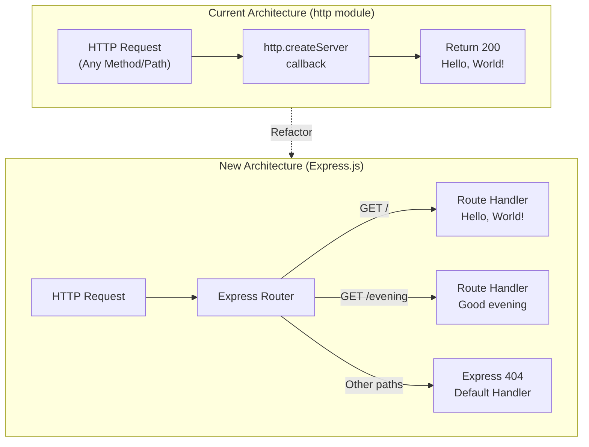

# Technical Specification

# 0. Agent Action Plan

## 0.1 Intent Clarification

### 0.1.1 Core Feature Objective

Based on the prompt, the Blitzy platform understands that the new feature requirement is to:

- **Integrate Express.js framework** into an existing minimal Node.js HTTP server project (`hello_world` v1.0.0) that currently uses only the built-in `http` module with zero external dependencies
- **Refactor the existing server** (`server.js`) to replace the raw `http.createServer` implementation with an Express.js application, introducing a proper routing layer where one did not previously exist
- **Preserve the existing "Hello World" endpoint** so that the current behavior of returning `"Hello, World!\n"` remains available through a dedicated Express route rather than being lost during the migration
- **Add a new endpoint** that returns the response `"Good evening"` as a distinct, separately routable HTTP endpoint accessible at its own URL path
- **Add Express.js as the project's first npm dependency**, transitioning the project from a zero-dependency architecture to one that leverages the Express.js web framework

Implicit requirements detected:
- The `package.json` must be updated with `express` as a production dependency, and the `package-lock.json` must be regenerated to reflect the new dependency tree
- The server's current universal request handling (all HTTP methods, all paths return the same response) must be replaced with explicit route definitions
- The existing localhost binding (`127.0.0.1`) and port (`3000`) should be preserved to maintain backward compatibility
- The `server - Copy.js` duplicate file (an exact copy of `server.js`) should also be updated to maintain consistency within the repository's test fixture structure

### 0.1.2 Special Instructions and Constraints

- **Backward Compatibility**: The existing `"Hello, World!\n"` response must remain accessible after the Express.js migration. The response behavior for the root endpoint should be functionally equivalent to the current implementation
- **Minimal Footprint Preservation**: The project is described as a tutorial-style "Hello World" Node.js server. The Express.js integration should remain simple and tutorial-appropriate, avoiding unnecessary complexity such as middleware stacks, error handlers, or advanced configuration
- **Repository Convention**: The repository contains duplicate files following a `" - Copy"` naming convention (e.g., `server - Copy.js`). The duplicate server file should be updated in parallel with the primary `server.js`

User Example (exact user request): *"this is a tutorial of node js server hosting one endpoint that returns the response 'Hello world'. Could you add expressjs into the project and add another endpoint that return the response of 'Good evening'?"*

### 0.1.3 Technical Interpretation

These feature requirements translate to the following technical implementation strategy:

- To **integrate Express.js**, we will install the `express` npm package (v5.2.1) as a production dependency, updating `package.json` and regenerating `package-lock.json`
- To **migrate the existing server**, we will modify `server.js` to replace `const http = require('http')` and `http.createServer(...)` with Express.js application initialization (`const express = require('express')` and `const app = express()`)
- To **preserve the Hello World endpoint**, we will create an explicit Express route `app.get('/', ...)` that returns the `"Hello, World!\n"` plain-text response with a 200 status code and `text/plain` content type
- To **add the Good Evening endpoint**, we will create a new Express route `app.get('/evening', ...)` that returns `"Good evening"` as a plain-text response
- To **maintain repository consistency**, we will update `server - Copy.js` to mirror the changes made to `server.js`
- To **document the changes**, we will update `README.md` with information about the new Express.js dependency and the available endpoints

## 0.2 Repository Scope Discovery

### 0.2.1 Comprehensive File Analysis

The repository follows a flat directory structure with no subdirectories. All 12 discoverable files reside at the repository root. The table below classifies every file by its relevance to the Express.js integration feature:

| File | Type | Modification Status | Reason |
|------|------|---------------------|--------|
| `server.js` | JavaScript source | **MODIFY** | Primary server file — replace `http` module with Express.js, add route definitions |
| `server - Copy.js` | JavaScript source | **MODIFY** | Duplicate of `server.js` — must mirror all Express.js changes for repository consistency |
| `package.json` | npm manifest | **MODIFY** | Add `express` as production dependency, update `"main"` entry if needed |
| `package-lock.json` | npm lockfile | **REGENERATE** | Will be regenerated automatically by `npm install express` to include Express.js dependency tree |
| `README.md` | Documentation | **MODIFY** | Document Express.js integration, available endpoints, and updated startup instructions |
| `LoginTest.java` | Java stub | NO CHANGE | Unrelated test fixture — intentionally non-functional Java placeholder |
| `LoginTest - Copy.java` | Java stub | NO CHANGE | Duplicate Java stub — unrelated to Node.js server changes |
| `industry.csv` | CSV data | NO CHANGE | Static reference data file — unrelated to server functionality |
| `industry - Copy.csv` | CSV data | NO CHANGE | Duplicate CSV — unrelated to server functionality |
| `test.py.txt` | Empty placeholder | NO CHANGE | Empty test fixture file — unrelated to server changes |
| `test.py - Copy.txt` | Empty placeholder | NO CHANGE | Duplicate empty placeholder — unrelated to server changes |
| `test.txt.txt` | Empty placeholder | NO CHANGE | Empty text placeholder — unrelated to server changes |

**Integration Point Discovery:**

- **API Endpoints**: The current `server.js` has no routing — all HTTP requests to any path receive the same `"Hello, World!\n"` response. Express.js will introduce explicit route definitions:
  - `GET /` — existing Hello World behavior
  - `GET /evening` — new Good Evening endpoint
- **Database Models/Migrations**: Not applicable — the project has no database layer
- **Service Classes**: Not applicable — the project has no service abstraction layer
- **Controllers/Handlers**: `server.js` is the sole request handler; it will be refactored to use Express route handler functions
- **Middleware/Interceptors**: Not applicable — no middleware currently exists, and none is required for this feature addition

### 0.2.2 Web Search Research Conducted

- **Express.js latest stable version**: Confirmed via npm registry that Express.js v5.2.1 is the latest published version. Express 5 was officially released after 10 years of development, dropping support for Node.js versions before v18, which is satisfied by the project's Node.js 20.20.0 runtime
- **Express 5 routing patterns**: Express 5 uses the same `app.get(path, handler)` pattern for defining GET routes, with native async/await support for middleware and route handlers
- **Express 5 compatibility**: Express 5 requires Node.js >= 18. The current environment (Node.js v20.20.0, npm 11.1.0) is fully compatible
- **Migration from raw http module**: Express.js wraps the built-in `http` module internally, so migrating from `http.createServer` to `express()` is a straightforward replacement with no behavioral side effects for basic use cases

### 0.2.3 New File Requirements

No new source files need to be created for this feature. The Express.js integration is accomplished entirely through modifications to existing files. The scope is intentionally minimal to match the tutorial nature of the project:

- **New source files**: None required — the Express app initialization and route definitions will be added directly within the existing `server.js`
- **New test files**: None required — the project currently has no test infrastructure (the `"test"` script in `package.json` is a placeholder that exits with error code 1)
- **New configuration files**: None required — Express.js requires no separate configuration files for a minimal two-endpoint setup
- **New directories**: None required — the flat repository structure is preserved

## 0.3 Dependency Inventory

### 0.3.1 Private and Public Packages

The project currently has **zero npm dependencies**. The Express.js integration introduces the project's first and only external dependency:

| Registry | Package Name | Version | Purpose |
|----------|-------------|---------|---------|
| npm (public) | `express` | 5.2.1 | Web framework providing routing, request/response handling, and HTTP server abstraction for defining the `/` and `/evening` endpoints |

**Version Justification:**
- Express.js v5.2.1 is the latest stable release published on npm, confirmed via `npm view express version`
- Express 5 requires Node.js >= 18 (`engines: { node: '>= 18' }`) — the project environment runs Node.js v20.20.0, which satisfies this requirement
- Express 5 is now the `latest` tagged release on npm as of the v5.1.0 release, which was promoted to the default

**Transitive Dependencies Note:** Installing `express@5.2.1` will introduce its internal dependency tree (body-parser, content-disposition, cookie, debug, finalhandler, path-to-regexp, etc.) into `node_modules/` and `package-lock.json`. These are managed automatically by npm and require no direct configuration.

### 0.3.2 Dependency Updates

**Import Updates:**

The following files require import statement changes:

| File Pattern | Current Import | New Import |
|-------------|----------------|------------|
| `server.js` | `const http = require('http');` | `const express = require('express');` |
| `server - Copy.js` | `const http = require('http');` | `const express = require('express');` |

**Import Transformation Rules:**
- Old: `const http = require('http');` — imports the Node.js built-in HTTP module
- New: `const express = require('express');` — imports the Express.js framework
- Apply to: `server.js` and `server - Copy.js`

**External Reference Updates:**

| File | Update Required |
|------|----------------|
| `package.json` | Add `"dependencies": { "express": "^5.2.1" }` block |
| `package-lock.json` | Fully regenerated by `npm install` to include Express.js and all transitive dependencies |
| `README.md` | Document Express.js as a project dependency with installation instructions |

**Build/Configuration Files:**
- No `Dockerfile`, `docker-compose`, `.github/workflows/`, `tsconfig.json`, or CI/CD configuration files exist in the repository
- No `setup.py`, `pyproject.toml`, or other non-Node.js build files require updating

## 0.4 Integration Analysis

### 0.4.1 Existing Code Touchpoints

**Direct Modifications Required:**

- **`server.js` (lines 1–14)**: Complete refactor of the server implementation
  - Remove the `http` module import (line 1) and replace with `express` import
  - Remove the `hostname` and `port` constant declarations (lines 3–4) — retain the `port` constant but the `hostname` constant becomes optional since `app.listen()` defaults to all interfaces unless explicitly bound
  - Remove the `http.createServer(...)` block (lines 6–10) and replace with Express app initialization and route definitions
  - Remove `server.listen(...)` (lines 12–14) and replace with `app.listen(...)` using the same port (3000) and a startup confirmation log
  - Add `GET /` route handler returning `"Hello, World!\n"` with `text/plain` content type
  - Add `GET /evening` route handler returning `"Good evening"` with `text/plain` content type

- **`server - Copy.js` (lines 1–14)**: Mirror all changes from `server.js` — this file is an exact duplicate and must remain synchronized

- **`package.json` (line 2–11)**: Add the `dependencies` field with the `express` package entry. The current file has no `dependencies` or `devDependencies` block

- **`package-lock.json` (line 1–13)**: Fully regenerated by npm during `express` installation — the current lockfile only contains the root package entry with no dependency tree

- **`README.md` (lines 1–2)**: Extend the minimal documentation to include Express.js setup instructions and endpoint documentation

**Dependency Injections:**
- Not applicable — the project has no dependency injection container, service registry, or IoC framework. Express.js is initialized directly in the server file

**Database/Schema Updates:**
- Not applicable — the project has no database, ORM, or migration framework

### 0.4.2 Integration Flow

The following diagram illustrates how the Express.js integration changes the request flow:



**Key Behavioral Changes:**

| Aspect | Before (http module) | After (Express.js) |
|--------|---------------------|---------------------|
| Request routing | No routing — all requests get same response | Explicit route matching via `app.get()` |
| `GET /` response | `"Hello, World!\n"` (200) | `"Hello, World!\n"` (200) — preserved |
| `GET /evening` response | `"Hello, World!\n"` (200) | `"Good evening"` (200) — **new** |
| Unmatched routes | `"Hello, World!\n"` (200) | Express default 404 response |
| HTTP methods on `/` | All methods return same response | Only `GET` explicitly handled |
| Content-Type header | Manually set to `text/plain` | Set via `res.type('text/plain')` or `res.send()` defaults |
| Server startup log | `Server running at http://127.0.0.1:3000/` | Similar log via `app.listen()` callback |

## 0.5 Technical Implementation

### 0.5.1 File-by-File Execution Plan

Every file listed below MUST be created or modified as specified:

**Group 1 — Core Feature Files:**

- **MODIFY: `server.js`** — Replace the raw `http` module server with an Express.js application. Define two GET routes: `/` returning `"Hello, World!\n"` and `/evening` returning `"Good evening"`. Bind to port 3000 with a startup confirmation log
- **MODIFY: `server - Copy.js`** — Mirror all changes from `server.js` to maintain the repository's duplicate-file convention used for Backprop test fixture validation

**Group 2 — Dependency and Configuration Files:**

- **MODIFY: `package.json`** — Add `"dependencies": { "express": "^5.2.1" }` to the npm manifest. Optionally update the `"main"` field from `"index.js"` to `"server.js"` to reflect the actual entry point, and add a `"start"` script (`"start": "node server.js"`) for convenience
- **REGENERATE: `package-lock.json`** — Automatically regenerated by running `npm install` after updating `package.json`. The lockfile will expand from 13 lines to include the full Express.js dependency tree

**Group 3 — Documentation:**

- **MODIFY: `README.md`** — Update project documentation to describe the Express.js-powered server, list the two available endpoints (`/` and `/evening`), include installation steps (`npm install`), and provide startup instructions (`node server.js`)

### 0.5.2 Implementation Approach per File

**Step 1: Establish Express.js dependency**

Install Express.js into the project, which updates `package.json` and regenerates `package-lock.json`:

```bash
npm install express@^5.2.1
```

**Step 2: Refactor `server.js` to use Express.js**

Replace the entire contents of `server.js` with an Express.js application. The refactored file will:

- Import `express` via CommonJS `require()`
- Create an Express application instance
- Define a `GET /` route returning `"Hello, World!\n"` with `text/plain` content type
- Define a `GET /evening` route returning `"Good evening"` with `text/plain` content type
- Start the server on port 3000 and log the startup URL

Reference implementation pattern:

```javascript
const express = require('express');
const app = express();
```

**Step 3: Update `server - Copy.js`**

Copy the refactored `server.js` contents into `server - Copy.js` to maintain the repository's duplicate-file pattern.

**Step 4: Update `README.md`**

Expand the documentation to cover:
- Project description reflecting Express.js usage
- Prerequisites (Node.js >= 18)
- Installation command (`npm install`)
- Startup command (`node server.js`)
- Endpoint reference table listing `GET /` and `GET /evening`

### 0.5.3 User Interface Design

Not applicable. This project is a backend-only Node.js HTTP server with no user interface components. All endpoints return plain-text responses consumed by HTTP clients (curl, browser, or Backprop integration tools).

## 0.6 Scope Boundaries

### 0.6.1 Exhaustively In Scope

**Server Source Files:**
- `server.js` — Primary Express.js application with route definitions for `GET /` and `GET /evening`
- `server - Copy.js` — Synchronized duplicate of `server.js` for test fixture consistency

**Dependency and Configuration Files:**
- `package.json` — Updated with `express` dependency, optional `"start"` script, and corrected `"main"` entry
- `package-lock.json` — Regenerated lockfile containing the full Express.js dependency tree

**Documentation:**
- `README.md` — Updated project description, setup instructions, and endpoint reference

**Generated Artifacts (via `npm install`):**
- `node_modules/` — Express.js and all transitive dependencies installed locally
- `node_modules/express/**` — Express.js framework source files
- `node_modules/.package-lock.json` — npm internal lockfile cache

### 0.6.2 Explicitly Out of Scope

- **Java stub files** (`LoginTest.java`, `LoginTest - Copy.java`) — Unrelated test fixture placeholders with intentionally invalid syntax; no modifications needed
- **CSV data files** (`industry.csv`, `industry - Copy.csv`) — Static reference data files unrelated to server functionality
- **Empty placeholder files** (`test.py.txt`, `test.py - Copy.txt`, `test.txt.txt`) — Zero-length sentinel files with no functional purpose
- **Test framework setup** — The project has no test infrastructure; adding test frameworks (Jest, Mocha, etc.) is not part of this feature request
- **Middleware or error handling** — Advanced Express.js features such as custom middleware stacks, error-handling middleware, logging middleware, or request validation are not requested
- **Environment variable configuration** — The port and hostname remain hardcoded as appropriate for a tutorial project; no `.env` file or environment-based configuration is required
- **TypeScript migration** — The project uses CommonJS JavaScript; no migration to TypeScript or ES Modules is requested
- **Docker or CI/CD** — No containerization or continuous integration configuration exists or is requested
- **Performance optimizations** — No caching, compression, or clustering is in scope for this minimal tutorial server
- **Authentication or security** — No auth middleware, CORS, helmet, or rate limiting is part of this feature request
- **Additional endpoints beyond the two specified** — Only `GET /` (Hello World) and `GET /evening` (Good Evening) are in scope

## 0.7 Rules for Feature Addition

### 0.7.1 Feature-Specific Rules

- **Tutorial Simplicity**: The project is explicitly described as a tutorial. All code changes must remain beginner-friendly, well-commented, and easy to understand. Avoid advanced patterns, abstractions, or over-engineering
- **Preserve Existing Response Behavior**: The `"Hello, World!\n"` response currently served at all paths must remain accessible at `GET /` after the Express.js migration. The response body, status code (200), and content type (`text/plain`) must be functionally equivalent
- **New Endpoint Response**: The new endpoint must return exactly `"Good evening"` as specified by the user. The response should use `text/plain` content type and a 200 status code to maintain consistency with the existing endpoint
- **Duplicate File Synchronization**: The repository maintains a `" - Copy"` naming convention for duplicate files. `server - Copy.js` must be updated to exactly match `server.js` after all changes are applied
- **CommonJS Module Format**: The project uses `require()` syntax (CommonJS). All new imports must follow this convention — do not introduce ES Module `import` statements
- **Localhost Binding**: The server must continue to bind to `127.0.0.1` on port `3000` to preserve the security-by-isolation architecture documented in the existing technical specification
- **Zero Additional Dependencies**: Only `express` should be added as a dependency. Do not introduce additional npm packages (e.g., `cors`, `helmet`, `dotenv`, `nodemon`) unless explicitly requested
- **MIT License Compliance**: Any added dependency must be compatible with the project's MIT license. Express.js is licensed under MIT, satisfying this requirement

## 0.8 References

### 0.8.1 Repository Files and Folders Searched

All files reside at the repository root (flat structure, no subdirectories). The following files were retrieved and analyzed to derive the conclusions in this Agent Action Plan:

| File Path | Type | Relevance | Analysis Outcome |
|-----------|------|-----------|------------------|
| `server.js` | JavaScript source | **Primary** | Current HTTP server implementation using `http` module — target for Express.js refactoring |
| `server - Copy.js` | JavaScript source | **Primary** | Exact duplicate of `server.js` — must be updated in parallel |
| `package.json` | npm manifest | **Primary** | Defines project metadata (name: `hello_world`, version: `1.0.0`, main: `index.js`); confirms zero dependencies |
| `package-lock.json` | npm lockfile | **Primary** | Confirms lockfileVersion 3 (npm 7+), no dependency tree present |
| `README.md` | Documentation | **Secondary** | Minimal documentation — project name and test warning only |
| `LoginTest.java` | Java stub | **Reviewed** | Non-functional Java placeholder — confirmed out of scope |
| `LoginTest - Copy.java` | Java stub | **Reviewed** | Duplicate Java stub — confirmed out of scope |
| `industry.csv` | CSV data | **Reviewed** | Static reference data — confirmed out of scope |
| `industry - Copy.csv` | CSV data | **Reviewed** | Duplicate CSV data — confirmed out of scope |
| `test.py.txt` | Empty placeholder | **Reviewed** | Zero-length file — confirmed out of scope |
| `test.py - Copy.txt` | Empty placeholder | **Reviewed** | Zero-length file — confirmed out of scope |
| `test.txt.txt` | Empty placeholder | **Reviewed** | Zero-length file — confirmed out of scope |

### 0.8.2 Technical Specification Sections Referenced

| Section | Purpose |
|---------|---------|
| 1.1 Executive Summary | Confirmed project identity, author, and test fixture purpose |
| 2.1 Feature Catalog | Reviewed existing features F-001 (HTTP server) and F-002 (test fixture structure) |
| 2.2 Functional Requirements | Reviewed acceptance criteria for current server behavior to ensure backward compatibility |
| 3.1 Programming Languages | Confirmed Node.js/CommonJS as sole runtime; Java stubs are non-functional |
| 3.2 Frameworks & Libraries | Confirmed zero external frameworks and the explicit exclusion of Express.js, Koa, and Fastify in the current design |
| 5.1 High-Level Architecture | Reviewed system boundaries, data flow, and integration points to guide Express.js migration |
| 5.2 Component Details | Reviewed `server.js` component responsibilities and API interface for refactoring |

### 0.8.3 External Research Conducted

| Research Topic | Source | Key Finding |
|----------------|--------|-------------|
| Express.js latest stable version | npm registry (`npm view express version`) | v5.2.1 is the latest published version |
| Express.js Node.js requirements | npm registry (`npm view express engines`) | Requires Node.js >= 18 |
| Express 5 release status | expressjs.com, GitHub Releases | Express 5.1.0 became the default `latest` tag on npm as of March 2025 |
| Express 5 breaking changes | GitHub Releases, InfoQ | Dropped Node.js < 18 support, updated path-to-regexp, native async/await middleware support |

### 0.8.4 Attachments and External Assets

- **Attachments provided**: None
- **Figma screens provided**: None
- **Environment files provided**: None (no files in `/tmp/environments_files/`)
- **Environment variables**: None specified
- **Secrets**: None specified

