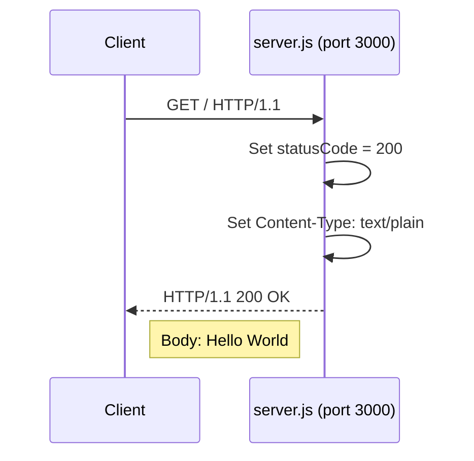
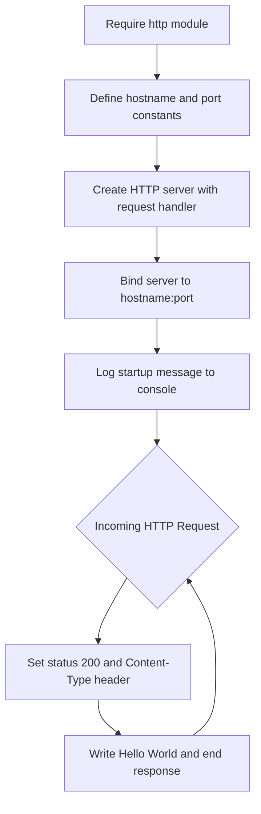

# Technical Specification

# 0. Agent Action Plan

## 0.1 Intent Clarification


### 0.1.1 Core Documentation Objective

Based on the provided requirements, the Blitzy platform understands that the documentation objective is to **comprehensively document the hao-backprop-test Node.js HTTP server project** through two complementary strategies: (1) embedding structured JSDoc comments directly into the `server.js` source file to annotate all code constructs with machine-readable documentation, and (2) creating a full-featured `README.md` that replaces the current minimal stub with a professional project landing page containing setup instructions, API documentation, a deployment guide, and inline code explanations.

**Request Categorization:**
- Primary category: **Create new documentation** (README overhaul, JSDoc annotations)
- Secondary category: **Update existing documentation** (README.md replacement)

**Documentation Types Involved:**
- JSDoc inline source code documentation (server.js)
- README project documentation (setup, API, deployment)
- Inline code explanations (annotated code walkthrough)

**Documented Requirements with Enhanced Clarity:**
- **JSDoc Comments on server.js**: Add `/** ... */` JSDoc annotation blocks to every documentable construct in `server.js`, including module-level documentation, constant declarations (`hostname`, `port`), the HTTP request handler callback passed to `http.createServer()`, and the server startup listener callback passed to `server.listen()`. Each block must use standard JSDoc tags (`@module`, `@const`, `@param`, `@callback`, `@description`, `@example`, `@type`, `@see`) as appropriate for the construct being documented.
- **Comprehensive README — Setup Instructions**: Provide step-by-step instructions for installing Node.js, cloning the repository, and starting the server, covering prerequisites, installation commands, and verification steps.
- **Comprehensive README — API Documentation**: Document the single HTTP endpoint exposed by the server, including request method, URL, expected response status, headers, and body, formatted as an API reference table.
- **Comprehensive README — Deployment Guide**: Document the local-only deployment model (the server binds exclusively to `127.0.0.1:3000`), noting that it is designed as a test fixture and is not intended for production deployment.
- **Comprehensive README — Inline Code Explanations**: Provide an annotated walkthrough of `server.js`, explaining each line or logical block of the source code within the README itself so that readers understand how the server operates without needing to read the raw source.

### 0.1.2 Special Instructions and Constraints

- The existing `README.md` is a minimal stub containing only the project name and a warning: *"test project for backprop integration. Do not touch!"*. The new README must replace this content entirely while preserving the project identity (`hao-backprop-test`).
- `server.js` currently contains **zero documentation comments**. All JSDoc annotations are new additions.
- The project has **zero external npm dependencies** — documentation tooling (e.g., `jsdoc`) may be referenced but the documentation itself must be written as inline comments and Markdown, not generated HTML.
- No user-provided templates, style guides, or examples were supplied — documentation should follow standard JSDoc conventions and conventional README structure for Node.js projects.
- No design system or UI library is relevant to this task.

### 0.1.3 Technical Interpretation

These documentation requirements translate to the following technical documentation strategy:

- To **document the server module**, we will add a `@module` JSDoc block at the top of `server.js` describing the module's purpose, author, version, and license.
- To **document server constants**, we will add `@const` JSDoc blocks above the `hostname` and `port` declarations with `@type` and `@default` tags.
- To **document the request handler**, we will add a `@callback` or function-level JSDoc block above the `http.createServer()` callback describing its `req` and `res` parameters using `@param` tags with types (`http.IncomingMessage`, `http.ServerResponse`).
- To **document the startup listener**, we will add a JSDoc block above the `server.listen()` callback describing its purpose.
- To **create the README**, we will rewrite `README.md` with structured Markdown sections covering overview, prerequisites, installation, running the server, API reference, code walkthrough, deployment notes, project structure, and license.
- To **provide inline code explanations**, we will include an annotated version of the `server.js` source within the README, using fenced code blocks with comment annotations that explain each logical section.

### 0.1.4 Inferred Documentation Needs

Based on code analysis:
- `server.js` uses the built-in `http` module via CommonJS `require()` — the JSDoc `@module` tag should reference this dependency.
- The `http.createServer()` callback is an anonymous arrow function — a `@callback` typedef or inline documentation is needed since it has no named function declaration.
- `package.json` declares `"main": "index.js"` but no `index.js` exists in the repository — the README should note this discrepancy and clarify that `server.js` is the entry point.
- `server - Copy.js` is a duplicate of `server.js` — the README should acknowledge duplicate files as part of the test fixture structure.

Based on user journey:
- A new developer encountering this project needs to understand: (a) that it is a test fixture, (b) how to run it, (c) what it does, and (d) how the code works line by line.
- The deployment guide should explicitly state the localhost-only constraint (`127.0.0.1`) and the test-fixture nature of the project to prevent misuse in production contexts.


## 0.2 Documentation Discovery and Analysis


### 0.2.1 Existing Documentation Infrastructure Assessment

Repository analysis reveals a **minimal documentation infrastructure** with effectively no structured documentation in place. The project contains no documentation generator configuration, no dedicated documentation directory, and no documentation beyond a single-line README stub.

**Documentation Files Found:**
- `README.md` — Single-line stub: project title and a "Do not touch!" warning. Contains no setup instructions, no API documentation, and no code explanation. This file requires a complete rewrite.

**Documentation Framework and Tooling Status:**
- Current documentation framework: **None** — no documentation generator is configured
- Documentation generator configuration: **Not present** — no `jsdoc.json`, `mkdocs.yml`, `docusaurus.config.js`, or `sphinx/conf.py` detected
- API documentation tools in use: **None** — no JSDoc annotations exist in any source file; no Swagger/OpenAPI specification is present
- Diagram tools detected: **None** — no Mermaid, PlantUML, or other diagram tooling is configured
- Documentation hosting/deployment setup: **None** — no GitHub Pages, ReadTheDocs, or other documentation hosting is configured

**Key Finding:** The repository has zero documentation infrastructure. All documentation deliverables for this task are net-new creations, aside from the README.md file which exists but must be fully replaced.

### 0.2.2 Repository Code Analysis for Documentation

Search patterns employed for identifying code constructs requiring documentation:

- **Public APIs / Exported constructs in server.js:**
  - `hostname` constant (line 3): `const hostname = '127.0.0.1';`
  - `port` constant (line 4): `const port = 3000;`
  - `http.createServer()` callback (lines 6–10): Anonymous request handler setting status code, content-type header, and writing "Hello, World!" response
  - `server.listen()` callback (lines 12–14): Startup notification logging to console

- **Module interfaces examined:**
  - `server.js` — the sole executable source file; uses CommonJS `require('http')` import
  - `package.json` — declares `"main": "index.js"` but no `index.js` exists; actual entry point is `server.js`

- **Configuration options examined:**
  - `package.json` — no `engines`, no `scripts` (empty default), no configuration beyond basic npm metadata
  - No environment variable files (`.env`, `.env.example`) found
  - No configuration files (`.rc`, `config/`) found

- **Non-functional files examined (for documentation completeness):**
  - `LoginTest.java` — Contains invalid Java syntax (bare `Web` token); intentionally broken test stub
  - `industry.csv` — 44-line CSV of industry categories; test data asset
  - Duplicate files (`server - Copy.js`, `LoginTest - Copy.java`, `industry - Copy.csv`, `test.py - Copy.txt`) — exact copies serving as test fixture inputs

**Key Directories Examined:** Root directory (flat structure; no subdirectories exist)

**Related Documentation Found:** None — the existing `README.md` contains no usable documentation content.

### 0.2.3 Web Search Research Conducted

- **JSDoc best practices for Node.js projects:** Research confirmed that JSDoc annotations should use `/** ... */` block syntax with standard tags (`@module`, `@const`, `@param`, `@returns`, `@callback`, `@type`, `@example`, `@description`). Comments should be placed immediately before the code construct being documented. Descriptions should be concise but thorough.
- **JSDoc version information:** The latest stable release is JSDoc **4.0.5** (published on npm). It supports Node.js 12.0.0 and later, making it fully compatible with the project's Node.js v20.20.0 runtime.
- **README structure conventions for Node.js projects:** A conventional Node.js README includes: project title, description, badges (optional), table of contents, prerequisites, installation, usage, API reference, configuration, deployment, contributing guidelines, and license.
- **Inline code explanation approaches:** Annotated code walkthroughs within README files use fenced code blocks with explanatory comments interspersed, or a side-by-side prose explanation referencing line numbers from the source.


## 0.3 Documentation Scope Analysis


### 0.3.1 Code-to-Documentation Mapping

**Modules Requiring Documentation:**

- **Module: `server.js` (Primary Application File)**
  - Public APIs / Documentable Constructs:
    - Module-level declaration (the file as a whole)
    - `const http = require('http')` — module import
    - `const hostname = '127.0.0.1'` — server bind address constant
    - `const port = 3000` — server listen port constant
    - Anonymous request handler callback passed to `http.createServer((req, res) => { ... })`
    - `server` — the `http.Server` instance returned by `http.createServer()`
    - Anonymous startup callback passed to `server.listen(port, hostname, () => { ... })`
  - Current documentation: **Missing** — the file contains zero comment lines of any kind
  - Documentation needed: JSDoc `@module` block, `@const` annotations with `@type` and `@default`, `@param` tags for callback parameters (`req`, `res`), `@callback` or inline function documentation, `@example` usage snippets, and inline explanatory comments for each logical code block

- **Module: `package.json` (Project Manifest)**
  - Documentable aspects: project name (`hello_world`), version (`1.0.0`), description, entry point discrepancy (`main: "index.js"` vs actual `server.js`), author, license
  - Current documentation: **N/A** — JSON file; documented through README
  - Documentation needed: Referenced and explained within README project overview and setup sections

**Configuration Options Requiring Documentation:**

- **Config: `package.json`**
  - Options documented: 0/6 key fields
  - Missing documentation: `name`, `version`, `main`, `scripts`, `author`, `license` are undocumented in any external reference

- **Config: Server bind address and port**
  - `hostname` and `port` constants in `server.js` act as configuration — they are not externalized to environment variables or config files
  - Documentation needed: README must explain how to modify these values and their defaults

**Features Requiring User Guides:**

- **Feature: HTTP Hello World Endpoint (GET /)**
  - Current coverage: Zero — no API documentation exists
  - Gaps: Request method, URL path, response status code, response headers, response body, error behavior — none documented

- **Feature: Server Startup and Operation**
  - Current coverage: Zero — no operational documentation exists
  - Gaps: How to start the server, how to verify it is running, how to stop the server, expected console output

### 0.3.2 Documentation Gap Analysis

Given the requirements and repository analysis, documentation gaps include:

**Undocumented Public APIs:**
- `server.js` module — no `@module` tag
- `hostname` constant — no `@const` tag
- `port` constant — no `@const` tag
- Request handler callback — no `@param` or `@callback` tag
- `server` instance — no `@type` tag
- Server listen callback — no documentation

**Missing User Guides:**
- Project overview and purpose description
- Prerequisites and system requirements
- Installation and setup walkthrough
- Server startup and verification procedure
- API endpoint reference
- Code explanation / walkthrough
- Deployment guide and constraints
- Project file structure reference

**Incomplete Architecture Documentation:**
- No explanation of the request-response lifecycle
- No description of the HTTP module's role
- No data flow documentation (request → handler → response)

**Outdated Documentation:**
- `README.md` contains outdated/misleading content: the title `hao-backprop-test` and the "Do not touch!" warning do not communicate the project's purpose, structure, or usage to a new developer

**Coverage Summary:**
- Inline source documentation: **0%** documented (0 of 7 constructs)
- External documentation: **0%** usable (README exists but contains no informative content)
- API documentation: **0%** (0 of 1 endpoints documented)
- Configuration documentation: **0%** (0 of 2 configurable values documented)


## 0.4 Documentation Implementation Design


### 0.4.1 Documentation Structure Planning

The documentation deliverables are organized into two categories: inline source documentation (JSDoc in `server.js`) and external project documentation (`README.md`). Given the project's flat file structure and minimal scope, a single comprehensive README serves all external documentation needs without requiring a dedicated `docs/` directory.

**Documentation Hierarchy:**

```
hao-backprop-test/
├── README.md                (comprehensive project documentation)
│   ├── Project Overview
│   ├── Table of Contents
│   ├── Prerequisites
│   ├── Installation and Setup
│   ├── Running the Server
│   ├── API Documentation
│   ├── Code Walkthrough (inline explanations)
│   ├── Project Structure
│   ├── Deployment Guide
│   └── License
└── server.js                (JSDoc-annotated source code)
    ├── @module block         (file-level documentation)
    ├── @const hostname       (bind address annotation)
    ├── @const port           (listen port annotation)
    ├── Request handler       (@callback / @param annotations)
    ├── server instance       (@type annotation)
    └── Listen callback       (startup documentation)
```

### 0.4.2 Content Generation Strategy

**Information Extraction Approach:**
- Extract API behavior from `server.js` source code (lines 6–10): the request handler sets `statusCode = 200`, header `Content-Type: text/plain`, and writes `Hello, World!`
- Extract configuration defaults from `server.js` constants (lines 3–4): `hostname = '127.0.0.1'`, `port = 3000`
- Extract project metadata from `package.json`: name `hello_world`, version `1.0.0`, license `ISC`
- Derive startup behavior from `server.listen()` callback (lines 12–14): logs the server URL
- Verify all documented behavior through live server testing (confirmed: curl to `http://127.0.0.1:3000/` returns `Hello, World!`)

**Documentation Standards:**
- Markdown formatting with hierarchical headers using `#`, `##`, `###`
- Mermaid diagram integration for request-response flow visualization
- Fenced code blocks with language identifiers (e.g., javascript, bash) for syntax highlighting
- Source citations as inline references: `Source: server.js:Line N`
- Tables for API parameter descriptions and project structure
- Consistent terminology: "server" (not "app"), "request handler" (not "route handler"), "endpoint" (not "route")

### 0.4.3 Diagram and Visual Strategy

**Mermaid Diagrams to Create:**

- **Request-Response Flow Diagram** (for README API Documentation section): A sequence diagram illustrating the HTTP request lifecycle from client to server and back, showing the `http.createServer()` callback invocation, header/status setting, and response writing.



- **Server Architecture Diagram** (for README Code Walkthrough section): A simple flowchart showing the server initialization and request handling pipeline.



No screenshot or image requirements exist — all visuals are Mermaid-based and embedded directly in Markdown.


## 0.5 Documentation File Transformation Mapping


### 0.5.1 File-by-File Documentation Plan

The following table maps every documentation file to be created, updated, or used as a reference. The target documentation file is listed first.

| Target Documentation File | Transformation | Source Code/Docs | Content/Changes |
|---------------------------|----------------|------------------|-----------------|
| `README.md` | UPDATE | `README.md`, `server.js`, `package.json` | Complete rewrite: replace single-line stub with comprehensive documentation including project overview, table of contents, prerequisites, installation and setup, running instructions, API reference, inline code walkthrough, project structure, deployment guide, and license |
| `server.js` | UPDATE | `server.js` | Add JSDoc comment blocks: `@module` file header, `@const` annotations for `hostname` and `port`, `@callback`/`@param` documentation for request handler, `@type` for server instance, inline explanatory comments for each logical code block |

### 0.5.2 Documentation Files to Update — Detail

**server.js — Add JSDoc Comments and Inline Explanations**

```
File: server.js
Type: Inline Source Documentation (JSDoc + Comments)
Source Code: server.js (self-documenting)
Annotations to Add:
    - @module hao-backprop-test (file header: purpose, version, author)
    - @const {string} hostname (Source: server.js:3) — server bind address
    - @const {number} port (Source: server.js:4) — server listen port
    - @callback requestHandler (Source: server.js:6-10)
        - @param {http.IncomingMessage} req — incoming request object
        - @param {http.ServerResponse} res — server response object
    - @type {http.Server} server (Source: server.js:6) — HTTP server instance
    - Startup listener (Source: server.js:12-14) — console log callback
    - Inline comments explaining: require statement, constant purpose,
      response construction logic, server binding
Key Citations: server.js (all lines), package.json (metadata)
```

**README.md — Complete Rewrite with Comprehensive Documentation**

```
File: README.md
Type: Project Documentation (Markdown)
Source Code: server.js, package.json
Sections to Create:
    - Project Title and Description (from package.json name/description + project purpose)
    - Table of Contents (linking to all major sections)
    - Prerequisites (Node.js version requirement, no external dependencies)
    - Installation and Setup (clone, verify Node.js, no npm install needed)
    - Running the Server (node server.js, expected console output)
    - API Documentation (GET / endpoint: method, URL, status, headers, body)
    - Code Walkthrough (line-by-line annotated explanation of server.js)
    - Project Structure (table of all 12 files with descriptions)
    - Deployment Guide (localhost-only, test fixture constraints, not for production)
    - License (ISC per package.json)
Diagrams to Include:
    - Request-response sequence diagram (Mermaid)
    - Server initialization flowchart (Mermaid)
Key Citations: server.js, package.json, README.md (original)
```

### 0.5.3 Documentation Configuration Updates

No documentation generator configuration files need to be created or modified because:
- The project does not use a documentation generator (no `jsdoc.json`, `mkdocs.yml`, or equivalent)
- JSDoc annotations are embedded directly in source code and do not require a separate build step to be useful
- The README is a standalone Markdown file rendered natively by GitHub and other platforms
- Should the project later adopt JSDoc HTML generation, a `jsdoc.json` configuration file would be needed, but this is out of scope for the current task

### 0.5.4 Cross-Documentation Dependencies

**Shared Content:**
- `server.js` source code is referenced by both documentation deliverables — the JSDoc annotations within `server.js` should be consistent with the API documentation and code walkthrough in `README.md`
- `package.json` metadata (name, version, license) is referenced in both the `@module` JSDoc block in `server.js` and the README header and license sections

**Navigation Links:**
- The README code walkthrough section should reference the JSDoc annotations as the canonical inline documentation
- No inter-file Markdown links are needed since all external documentation resides in a single `README.md`

**Consistency Requirements:**
- The API endpoint behavior documented in README (method: GET, path: /, status: 200, body: "Hello, World!") must exactly match the behavior described in the JSDoc `@callback` annotation in `server.js`
- The server bind address and port documented in README must match the `@const` JSDoc annotations and the actual values in source code (`127.0.0.1`, `3000`)


## 0.6 Dependency Inventory


### 0.6.1 Documentation Dependencies

The following tools and packages are relevant to this documentation exercise. Since the project has zero existing dependencies, all documentation tooling listed below serves as a reference for optional future adoption rather than current requirements. The primary deliverables (JSDoc comments in `server.js` and the Markdown `README.md`) do not require any additional packages to be installed.

| Registry | Package Name | Version | Purpose |
|----------|--------------|---------|---------|
| npm | jsdoc | 4.0.5 | JSDoc HTML documentation generator — optional for generating browsable HTML docs from JSDoc annotations in `server.js`; not required for inline JSDoc comments to function |
| npm | eslint-plugin-jsdoc | 62.5.4 | ESLint plugin for enforcing JSDoc comment quality and consistency — optional linting tool for validating JSDoc annotations |
| Built-in | node:http | N/A (Node.js v20.20.0) | Node.js built-in HTTP module used by `server.js`; documented via JSDoc `@see` and `@module` tags |

**Key Notes:**
- **No packages need to be installed** for this documentation task. The JSDoc comments are standard JavaScript block comments that provide value directly in source code and in IDE hover tooltips without requiring the `jsdoc` CLI.
- The `jsdoc` npm package (v4.0.5) is referenced for completeness — if the project later decides to generate HTML documentation from the annotated source, this package would be added as a `devDependency`.
- The project explicitly maintains a zero-dependency posture per `package.json` and `package-lock.json`.

### 0.6.2 Documentation Reference Updates

No documentation link updates are required because:
- The project currently contains no internal documentation links (the existing `README.md` is a single line with no hyperlinks)
- The new `README.md` will contain only internal anchor links (table of contents pointing to sections within the same file) and no cross-file documentation links
- No external documentation URLs require updating

Should the project later adopt JSDoc HTML generation, the README would need a link transformation to point to the generated docs:
- Future link: `[API Reference](./out/index.html)` — would point to JSDoc-generated HTML
- This is out of scope for the current task


## 0.7 Coverage and Quality Targets


### 0.7.1 Documentation Coverage Metrics

**Current Coverage Analysis:**

| Coverage Area | Current | Target | Gap |
|---------------|---------|--------|-----|
| Public APIs documented (JSDoc) | 0/7 constructs (0%) | 7/7 constructs (100%) | 7 constructs |
| User-facing features documented (README) | 0/1 endpoints (0%) | 1/1 endpoints (100%) | 1 endpoint |
| Configuration options documented | 0/2 values (0%) | 2/2 values (100%) | 2 values (`hostname`, `port`) |
| Setup/installation guide | 0% (no content) | 100% (complete guide) | Full section needed |
| Code walkthrough | 0% (no content) | 100% (all lines explained) | Full section needed |
| Deployment guide | 0% (no content) | 100% (constraints documented) | Full section needed |
| Project structure documentation | 0% (no content) | 100% (all 12 files listed) | Full section needed |

**Target Coverage:** 100% for all categories based on the user requirement for "comprehensive" documentation.

**Coverage Gaps to Address:**
- `server.js`: Currently 0% documented — target 100% with JSDoc annotations on every documentable construct (module, constants, callbacks, server instance) plus inline explanatory comments
- `README.md`: Currently 0% usable — target 100% with complete sections for overview, setup, API, walkthrough, structure, deployment, and license

### 0.7.2 Documentation Quality Criteria

**Completeness Requirements:**
- All JSDoc annotations include `@description`, relevant type tags (`@type`, `@param`, `@returns`, `@const`), and at least one `@example` where applicable
- The README setup guide includes every step from prerequisites through verification of a running server
- The API documentation section includes method, URL, request parameters (none), response status, response headers, and response body
- The code walkthrough covers every logical block in `server.js` with plain-language explanations
- The deployment guide explicitly states the localhost-only constraint and test-fixture purpose

**Accuracy Validation:**
- Code examples in the README must be tested and verified against the actual server behavior (confirmed: `GET /` returns `200 OK` with `text/plain` content type and body `Hello, World!`)
- JSDoc `@param` types must match the actual Node.js API types (`http.IncomingMessage`, `http.ServerResponse`)
- JSDoc `@const` default values must match the literal values in source code (`'127.0.0.1'`, `3000`)
- The project structure table must list all 12 files present in the repository root

**Clarity Standards:**
- Technical accuracy with accessible language — documentation should be understandable by developers new to Node.js
- Progressive disclosure: README starts with quick start (run in 30 seconds), then provides deeper API and code walkthrough sections
- Consistent terminology: use "server" (not "application" or "app"), "request handler" (not "route" or "controller"), "endpoint" (not "route")

**Maintainability:**
- JSDoc annotations are co-located with source code for easy updating when code changes
- README source citations reference specific line numbers in `server.js` for traceability
- All documentation follows standard conventions (JSDoc 4.x syntax, GitHub-flavored Markdown) requiring no specialized tooling to read or maintain

### 0.7.3 Example and Diagram Requirements

- **Minimum examples per documented construct:** 1 `@example` tag per JSDoc-annotated constant and callback where applicable
- **Diagram types required:**
  - 1 sequence diagram (request-response flow)
  - 1 flowchart (server initialization pipeline)
- **Code example testing:** All curl/bash examples in the README verified by running the server and executing the commands during context gathering
- **Visual content freshness:** Diagrams are Mermaid-based and version-controlled alongside Markdown — they update automatically when the source text is modified


## 0.8 Scope Boundaries


### 0.8.1 Exhaustively In Scope

**Source File Documentation Updates (JSDoc + Inline Comments):**
- `server.js` — Add JSDoc comment blocks and inline explanatory comments to every documentable construct

**External Documentation Files:**
- `README.md` — Complete rewrite with comprehensive project documentation including all sections specified by user requirements (setup instructions, API documentation, deployment guide, inline code explanations)

**Documentation Content Types:**
- JSDoc `@module` file-level documentation block
- JSDoc `@const` annotations for `hostname` and `port` constants
- JSDoc `@callback` / `@param` / `@returns` annotations for the HTTP request handler
- JSDoc `@type` annotation for the `http.Server` instance
- Inline JavaScript comments (`//`) explaining logical code blocks within `server.js`
- Markdown prose sections in `README.md` (overview, prerequisites, installation, usage, API, walkthrough, structure, deployment, license)
- Mermaid diagrams embedded in `README.md` (sequence diagram, flowchart)
- Fenced code blocks with syntax highlighting in `README.md`
- Tables for API reference and project structure in `README.md`

### 0.8.2 Explicitly Out of Scope

**Source Code Modifications (Non-Documentation):**
- No changes to the functional logic of `server.js` (no new routes, no refactoring, no dependency additions)
- No modifications to `package.json` beyond what is necessary for documentation (no adding `scripts.docs`, no adding `devDependencies`)
- No creation of `index.js` to resolve the `main` field discrepancy — this is a code concern, not documentation

**Non-Target Files:**
- `server - Copy.js` — duplicate file; not documented with JSDoc (it is a test fixture duplicate)
- `LoginTest.java` and `LoginTest - Copy.java` — Java stubs with intentional syntax errors; no Javadoc or documentation changes
- `industry.csv` and `industry - Copy.csv` — data files; no documentation changes
- `test.py.txt`, `test.py - Copy.txt`, `test.txt.txt` — empty placeholder files; no documentation changes
- `package-lock.json` — auto-generated lockfile; no documentation changes

**Documentation Infrastructure:**
- No documentation generator setup (no `jsdoc.json`, no `mkdocs.yml`, no CI pipeline for docs)
- No documentation hosting configuration (no GitHub Pages, no ReadTheDocs)
- No HTML documentation generation from JSDoc annotations

**Testing:**
- No test file modifications or test documentation updates (no test files exist in the project)

**Deployment:**
- No deployment configuration changes — the deployment guide in README documents existing constraints only

**Items Excluded by Project Constraints:**
- The repository serves as a Backprop integration test fixture — structural changes that would alter the test baseline are excluded
- No new files may be added beyond what is strictly required for documentation (only `README.md` and `server.js` are modified)


## 0.9 Execution Parameters


### 0.9.1 Documentation-Specific Instructions

- **Documentation build command:** Not applicable — documentation consists of inline JSDoc comments and a standalone `README.md` file, both of which require no build step. If JSDoc HTML generation were later adopted, the command would be `npx jsdoc server.js -d docs/`
- **Documentation preview command:** The README can be previewed with any Markdown renderer. For local preview: `npx marked README.md` or open directly in a Markdown-capable editor (VS Code, GitHub web interface)
- **Diagram generation command:** Mermaid diagrams are embedded inline in the README and render automatically on GitHub and other Mermaid-compatible renderers. For local rendering: `npx @mermaid-js/mermaid-cli -i README.md -o output/`
- **Documentation deployment command:** Not applicable — the README is served directly from the repository root by GitHub (or other Git hosting platforms) and requires no separate deployment
- **Default format:** Markdown (GitHub-flavored) with embedded Mermaid diagrams for external documentation; JSDoc block comments for inline source documentation
- **Citation requirement:** Every technical claim in the README must reference its source file and line number (e.g., `Source: server.js:3`)
- **Style guide:** Standard JSDoc 4.x tag conventions per jsdoc.app; GitHub-flavored Markdown conventions for README
- **Documentation validation:** JSDoc correctness can be validated with `npx jsdoc server.js --debug` (checks for parsing errors); Markdown linting can be performed with `npx markdownlint README.md`
- **Server verification command for testing documented instructions:** `node server.js &` followed by `curl -s http://127.0.0.1:3000/` and `kill %1`


## 0.10 Rules for Documentation


The following rules govern all documentation changes in this task:

- **JSDoc comments must use standard `/** ... */` block syntax** and be placed immediately before the construct they document, per JSDoc 4.x conventions. Comments using `/*`, `/***`, or `//` are not valid JSDoc and must not be used for structured annotations (single-line `//` comments may be used for brief inline explanations only).
- **Every documentable construct in `server.js` must receive a JSDoc annotation** — no public constant, callback, or module declaration may remain undocumented after this task is complete.
- **The README must be comprehensive and self-contained** — a developer should be able to understand the project purpose, set up the environment, run the server, understand the API, and read through the code without consulting any other source.
- **Inline code explanations in the README must cover every logical block** of `server.js`, explaining the "why" behind each code construct, not merely restating the "what."
- **Documented behavior must be verified against the live server** — all API response details (status code, headers, body) and startup behavior documented in README and JSDoc must match the actual observed behavior of `node server.js`.
- **No functional source code changes** — JSDoc annotations and inline comments are additive only. No line of functional JavaScript may be altered, moved, or deleted. The server must produce identical behavior before and after documentation changes.
- **Preserve test fixture integrity** — the project is a Backprop integration test fixture. Documentation must not add new files (beyond modifying `README.md` and `server.js`), rename existing files, or alter the repository structure in any way that would affect the test baseline.
- **Use consistent terminology** throughout all documentation: "server" (not "application"), "request handler" (not "controller"), "endpoint" (not "route"), "bind address" (not "host"), "listen port" (not "server port").
- **Include source citations** in the README for all technical claims, referencing the specific file and line number (e.g., `Source: server.js:3`).
- **Mermaid diagrams must render correctly** on GitHub and other standard Mermaid-compatible renderers. Avoid advanced Mermaid features that may not be widely supported.


## 0.11 References


### 0.11.1 Repository Files and Folders Searched

The following files and folders were searched and analyzed to derive the conclusions in this Agent Action Plan:

| File/Folder Path | Type | Purpose of Inspection |
|-------------------|------|----------------------|
| `/` (root) | Folder | Enumerate all repository contents; confirm flat file structure with 12 files and no subdirectories |
| `server.js` | File | Primary documentation target — analyzed all 14 lines of source code to identify documentable constructs (module import, constants, callbacks, server instance) |
| `server - Copy.js` | File | Confirmed as an exact duplicate of `server.js`; used to verify test fixture duplicate pattern |
| `package.json` | File | Extracted project metadata (name: `hello_world`, version: `1.0.0`, license: `ISC`, main: `index.js`); confirmed zero dependencies and no engine requirements |
| `package-lock.json` | File | Verified zero external dependency tree; confirmed lockfile consistency with `package.json` |
| `README.md` | File | Inspected existing documentation — confirmed single-line stub with project title and "Do not touch!" warning |
| `LoginTest.java` | File | Inspected Java stub — confirmed intentionally broken syntax (`Web` token); non-functional test fixture asset |
| `industry.csv` | File | Inspected CSV data file — confirmed 44-line industry category listing; test data asset |
| `test.py.txt` | File | Empty placeholder; part of test fixture file structure |
| `test.py - Copy.txt` | File | Empty placeholder duplicate; part of test fixture file structure |
| `test.txt.txt` | File | Empty placeholder; part of test fixture file structure |

### 0.11.2 Technical Specification Sections Retrieved

The following sections from the existing Technical Specification were retrieved and used for context:

| Section | Key Information Extracted |
|---------|--------------------------|
| 1.1 Executive Summary | Project is a test harness for Backprop integration testing; minimal HTTP server with zero external dependencies |
| 1.2 System Overview | System limitations confirmed: no production deployment, no external dependencies, localhost-only operation |
| 2.1 Feature Catalog | Two features cataloged: F-001 (HTTP Hello World Response Service) and F-002 (Test Fixture File Structure) |
| 3.1 Programming Languages | JavaScript/Node.js as primary language; Java as non-functional stubs with intentional syntax errors |
| 5.2 Component Details | Detailed the stateless HTTP server component: responsibilities, API surface, and single-endpoint behavior |
| 8.2 Deployment Environment | Confirmed "Local Development Only" environment type — no cloud, container, or production deployment |

### 0.11.3 External Research Sources

| Source | Information Used |
|--------|-----------------|
| jsdoc.app (official JSDoc documentation) | JSDoc comment syntax, tag reference, and placement conventions |
| npmjs.com/package/jsdoc | Confirmed latest JSDoc version: 4.0.5; Node.js compatibility: 12.0.0+ |
| npmjs.com/package/eslint-plugin-jsdoc | Confirmed latest version: 62.5.4; used as reference for optional linting tooling |
| HackerOne / PullRequest.com JSDoc best practices article | Best practices: document as you code, be descriptive but concise, use Markdown in JSDoc |
| Deno blog on documenting JavaScript packages | README vs JSDoc distinction: README answers "why use", docs answer "how to use" |
| Daily.dev JavaScript commenting guide | Comment type selection guidance: `//` for brief notes, `/** */` for structured JSDoc |

### 0.11.4 Attachments and External Metadata

- **Attachments provided:** None
- **Figma URLs provided:** None
- **Environment variables provided:** None
- **Secrets provided:** None
- **User-provided setup instructions:** None


